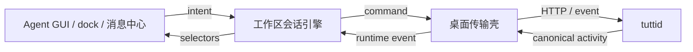

# Agent GUI 架构收敛方案（历史记录）

状态：已完成。2026-07-11 复核通过。

本文只保留这次重构的背景、关键决策、迁移切片和退出标准，不再充当现行架构规范。
原始规模快照、逐文件归属表和详细迁移清单可从 Git 历史读取。

现行规范：

- [Agent GUI Node](./agent-gui-node.md)：界面、会话引擎、宿主边界
- [Agent Extensions](./agent-extensions.md)：扩展目标、运行时安装、setup 生命周期
- [Provider-native Subagents](../specs/2026-07-15-provider-native-subagents.md)：child session 实体关系
- `packages/agent/gui/AGENTS.md`：包内编辑路由和硬规则

## 1. 为什么重构

原实现没有单个致命错误，而是多个局部合理选择累积成系统性偏移：

1. 数据模型没有独立 turn，session 同时承载会话、执行和交互状态
2. 工作区级编排依附 React 面板生命周期
3. daemon、桌面桥、多个 store 和组件各持有一份乐观状态
4. provider 差异以名称分支渗入界面
5. Agent GUI 以横向巨石文件组织，修改一个流程会横跨整棵组件树
6. dock、消息中心、通知等消费方各自推导 session 状态
7. 架构约束主要是散文禁令，缺少类型和自动检查

结果不是某个文件“太长”这么简单。文件过长只是职责、状态所有权和时序边界不清的可见症状。

## 2. 决策

### 2.1 实体边界

活动域分为三个实体：

| 实体        | 所有内容                                   | 不应包含              |
| ----------- | ------------------------------------------ | --------------------- |
| Session     | 目标、工作目录、标题、设置、当前 turn 引用 | turn 结果、待处理审批 |
| Turn        | 一次提交的阶段、结果、错误、文件变化       | 后续 turn 的状态      |
| Interaction | 审批、提问、计划确认及处理状态             | session 级展示状态    |

派生值不作为第二份事实保存：

- 展示状态由 turn 和 interaction 推导
- 提交可用性由 selector 推导
- session 只引用 active turn，不复制其 phase/outcome
- interaction 是否待处理由其自身状态表达，不使用三态 `null` 补丁协议

### 2.2 状态所有权

判定问题只有一个：关闭所有 Agent GUI 面板后，该状态是否仍应存在并继续工作？

- 是：属于 daemon 或工作区级会话引擎
- 否：属于组件本地状态

因此队列推进、乐观提交、运行时事件对账、当前 session/turn 投影属于引擎；滚动位置、输入焦点、临时展开状态属于组件。

### 2.3 单向数据流



约束：

- daemon 是业务规则和持久状态权威
- 引擎是客户端时序、乐观状态和对账的唯一所有者
- 桌面层只做传输和宿主集成，不形成第二业务核心
- React 读取快照、派发意图、渲染；不以 effect 编排业务生命周期
- 所有消费方共享 selector，不自行重建状态词汇表

### 2.4 Provider 差异

传输协议不是稳定边界，归一化活动契约才是。

- provider 身份、运行时策略、能力和目标元数据由 descriptor/target 下发
- UI 按 capability 渲染，不按 provider 名称猜行为
- 标准 ACP、专属协议和 SDK 边车都投影为同一活动契约
- 新 provider 不得要求在 Agent GUI 内新增行为分支

### 2.5 类型与协议

- OpenAPI 是跨 daemon 边界传输类型的事实源
- Go/TypeScript 传输类型从契约生成
- 内部域类型允许存在，但只能通过显式投影跨层
- 时间、状态和身份字段使用单一表示
- 未知枚举必须有显式处理路径，不能用宽字符串绕开检查

## 3. 目标模块

```text
packages/agent/
├── activity-core/            # 规范化活动状态、reducer、selectors
└── gui/
    ├── agent-gui/            # 功能模块装配
    ├── shared/               # 有明确领域名的复用能力
    └── host/                 # 最小宿主接口

apps/desktop/
└── workspace-agent/          # 传输适配、桌面集成、工作区实例装配

services/tuttid/
├── service/agent/            # 会话、turn、interaction 业务规则
└── api/                      # OpenAPI 投影和路由
```

Agent GUI 纵向拆分为：

- session list：选择、分组、固定、未读
- timeline：活动投影、消息记录、文件变化
- composer：输入、附件、提交能力
- interactions：审批、提问、计划确认
- readiness/setup：目标就绪状态和安装入口

模块可共享域模型和 selector；不得共享“万能 controller”“万能 utils”或扁平大 view model。

## 4. 迁移切片

迁移按可独立验证的切片完成，不做一次性重写。

### 切片 1：建立机械护栏

- 记录文件尺寸、effect/ref、provider 分支和公共 props 基线
- 加入 renderer/provider/activity 边界检查
- 规则使用“只降不升”的过渡预算

退出标准：新增代码不能继续扩大已知偏移。

### 切片 2：生成契约成为唯一跨层类型源

- 先改 OpenAPI，再生成 Go/TypeScript 类型
- 删除手写传输镜像
- 保留内部域类型与生成类型间的显式投影

退出标准：跨边界字段改动由生成检查发现遗漏。

### 切片 3：Session、Turn、Interaction 实体化

- turn 与 interaction 成为持久实体
- session 只保留 active turn 引用
- daemon 启动时将未结束且不可恢复的 turn 收敛为 interrupted
- 取消操作归 turn 且保持幂等

退出标准：重启后不靠 session 字符串猜 turn 状态。

### 切片 4：工作区会话引擎

- 用户 intent 与运行时 event 进入同一 reducer
- 乐观提交声明确认、拒绝和超时条件
- 所有对账逻辑集中到一处
- selectors 服务 Agent GUI、dock、通知、消息中心

退出标准：面板卸载不影响队列、运行状态或对账。

### 切片 5：桌面桥变薄

- 移除桌面层的独立乐观状态和业务判断
- 只保留客户端调用、事件订阅、生命周期装配

退出标准：相同规则不在 desktop 与 engine 各实现一次。

### 切片 6：Agent GUI 纵向拆分

- 按 list/timeline/composer/interactions/readiness 拆模块
- controller 只装配模块
- 组件不持有工作区业务状态

退出标准：业务文件不超过仓库 800 行限制；新增功能只触及所属纵向模块。

### 切片 7：清理过渡代码

- 删除旧 store、双写、兼容 reader 和旧 selector
- 删除已归零的过渡预算
- 将仍有效的规则合并进耐久架构文档

退出标准：生产路径只有一个事实源和一个对账路径。

## 5. 关键状态机

### 5.1 Turn

```text
submitted -> running -> waiting -> running -> settling -> settled
                    \------------------------------/
```

终态 outcome：`completed | failed | canceled | interrupted`。

规则：

- outcome 只在 settled 时存在
- interaction 必须归属具体 turn
- cancel 与自然结束并发时，重复终结是幂等空操作
- daemon 重启不能把未知的旧 turn 当作仍在运行

### 5.2 乐观 intent

```text
pending -> confirmed
        -> rejected
        -> expired
```

每种 intent 必须声明：

- 稳定身份
- 预期变化
- daemon 确认条件
- 拒绝或超时后的回滚/重拉动作

禁止用多个组件 `useEffect` 共同推断同一个 intent 是否完成。

## 6. 验证矩阵

| 风险          | 必须覆盖                                           |
| ------------- | -------------------------------------------------- |
| reducer 时序  | 事件乱序、重复、确认前后交错、断线重连             |
| turn 生命周期 | 正常结束、失败、取消竞态、daemon 重启 interrupted  |
| interaction   | 审批/提问到达、回答、过期、turn 终结清理           |
| 乐观状态      | 成功确认、拒绝、超时、全量重拉                     |
| 多消费方      | Agent GUI、dock、通知对同一快照给出一致结果        |
| provider 边界 | 新目标只依赖 descriptor/capability，无 UI 名称分支 |
| 协议          | OpenAPI 生成产物无漂移，Go/TS 投影一致             |
| 生命周期      | 面板卸载不停止工作区任务；工作区关闭释放订阅       |

常用检查以根 `AGENTS.md` 为准。架构相关最小集合：

```bash
pnpm check:agent-activity-runtime-boundaries
pnpm check:agent-provider-strategy-boundaries
pnpm check:renderer-boundaries
pnpm check:api-generated
pnpm typecheck
```

## 7. 防回退规则

以下约束应由类型、测试或静态检查执行，不继续扩写成逐缺陷散文：

1. 跨层传输类型不得手写镜像
2. React effect 不承担工作区业务编排
3. UI 不按 provider 名称决定行为
4. 同一事实不得存在多个可写 store
5. selector 必须纯；事件交错必须能用 reducer 单测表达
6. 新公共 props 和 view-model 字段需要明确模块所有者
7. 超过 800 行先拆职责，再加功能
8. 过渡双写、双读和预算必须带删除条件

## 8. 风险决策

| 风险                     | 决策                                            |
| ------------------------ | ----------------------------------------------- |
| 协议切换导致多层同时变化 | schema 先行，按生成类型逐层迁移                 |
| 双写期形成永久兼容层     | 每个过渡 seam 写明单一删除门槛                  |
| 引擎变成新巨石           | reducer、effect runner、selector、功能域分文件  |
| 纵向模块复制规则         | 共享域 reducer/selector，不共享大 controller    |
| 测试数量继续膨胀         | 优先状态表和边界测试，删除 provider/UI 重复矩阵 |
| 文档再次膨胀             | 计划文档保留决策；现行规则只维护在耐久文档      |

## 9. 完成记录

重构完成后的结构性结果：

- 工作区会话编排脱离 React 生命周期
- Agent GUI 控制器降到仓库业务文件上限内，仅负责模块装配
- Session/Turn/Interaction 的职责不再混载
- 活动读取逻辑可供多个界面复用
- provider 行为差异由 capability/descriptor 表达
- 类型、边界检查和状态机测试承接原散文规则

仍可能存在的后续工作不写进本历史计划。新工作应进入对应架构文档、spec 或独立实施计划，并带自己的退出标准。
