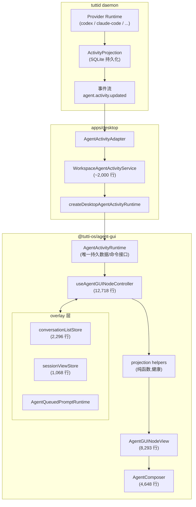
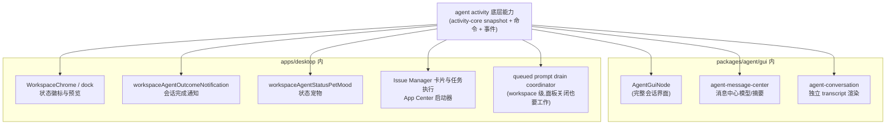
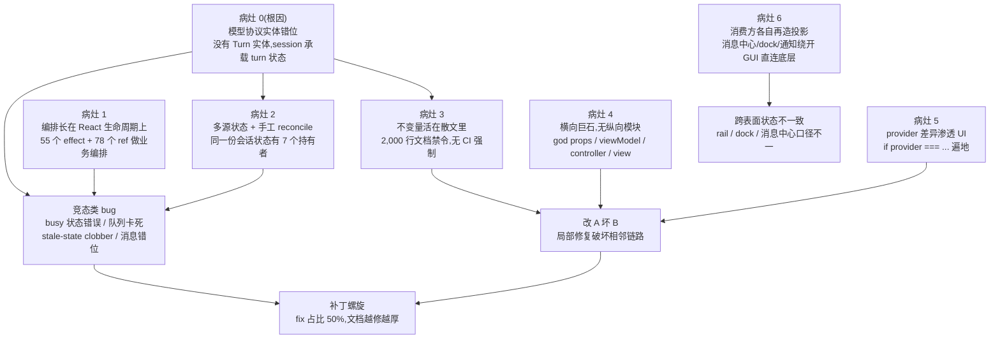
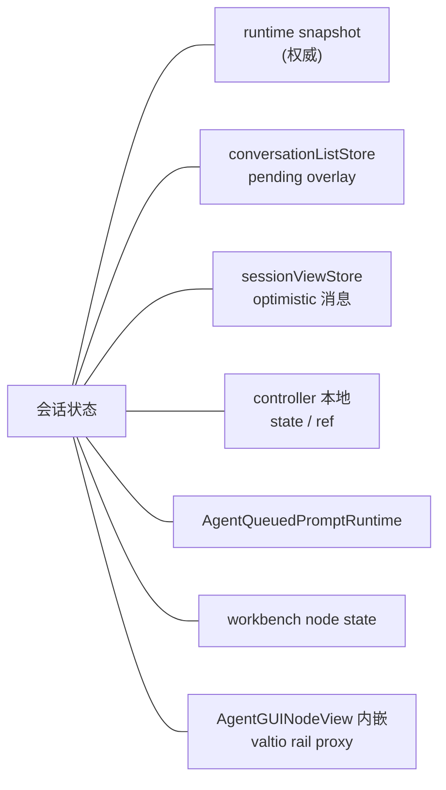
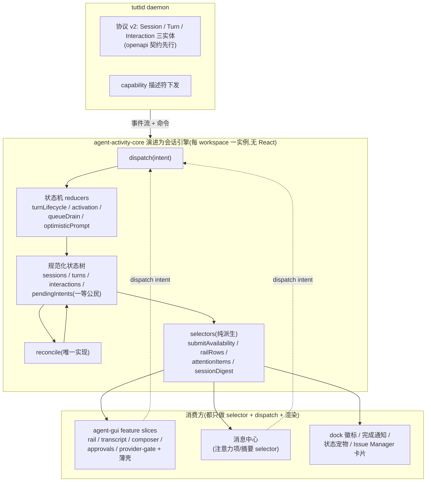
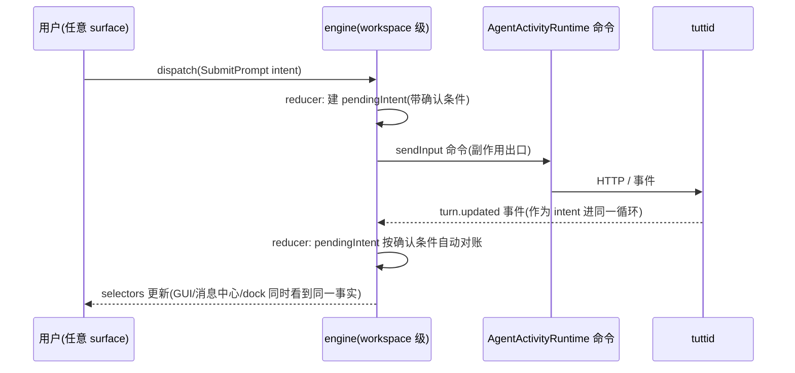
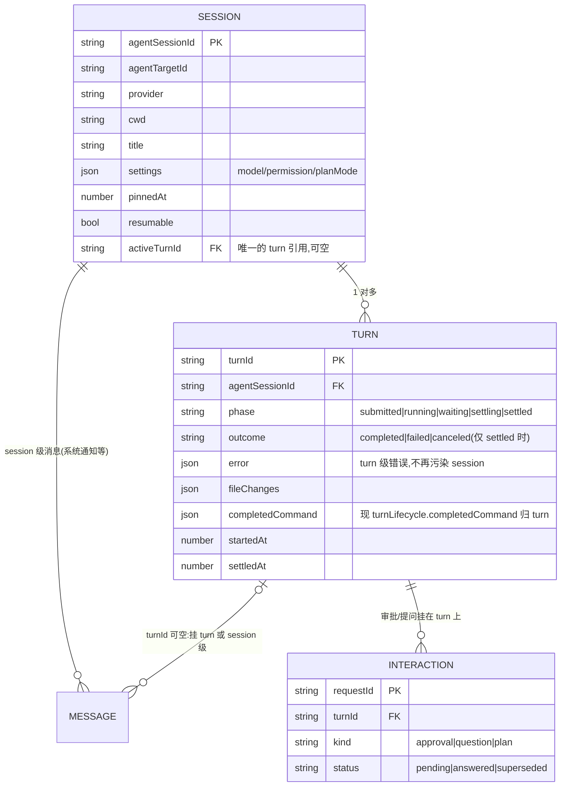
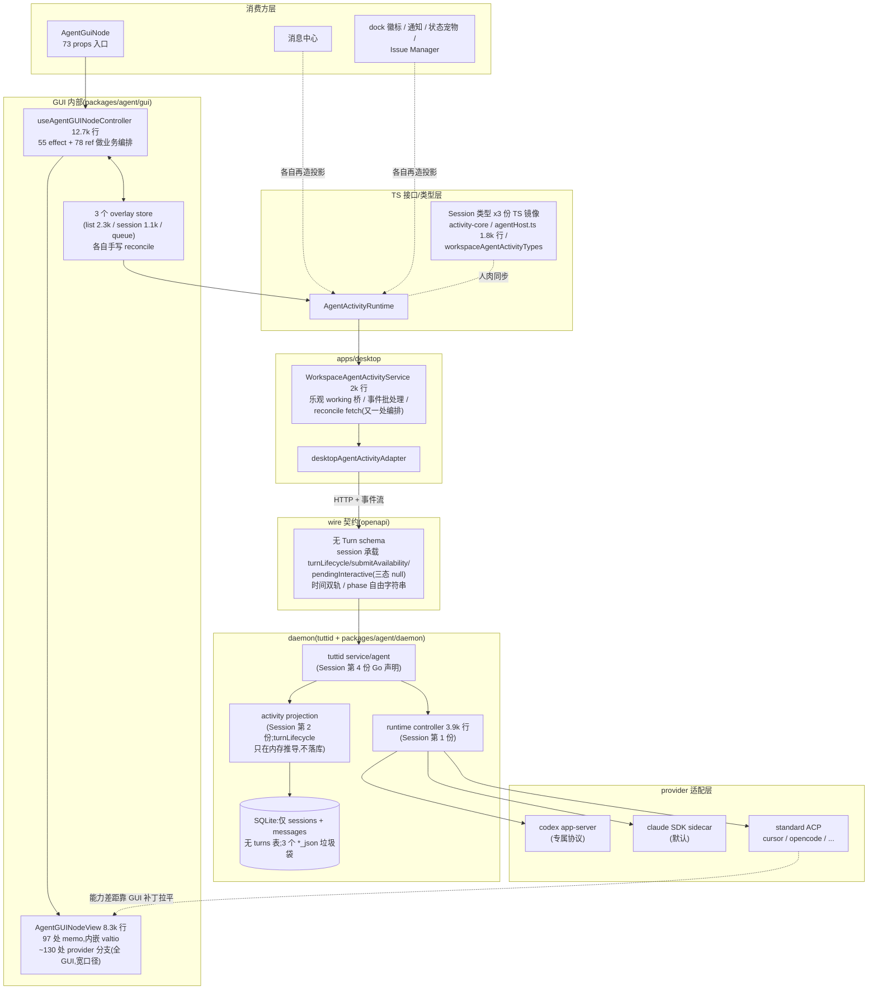
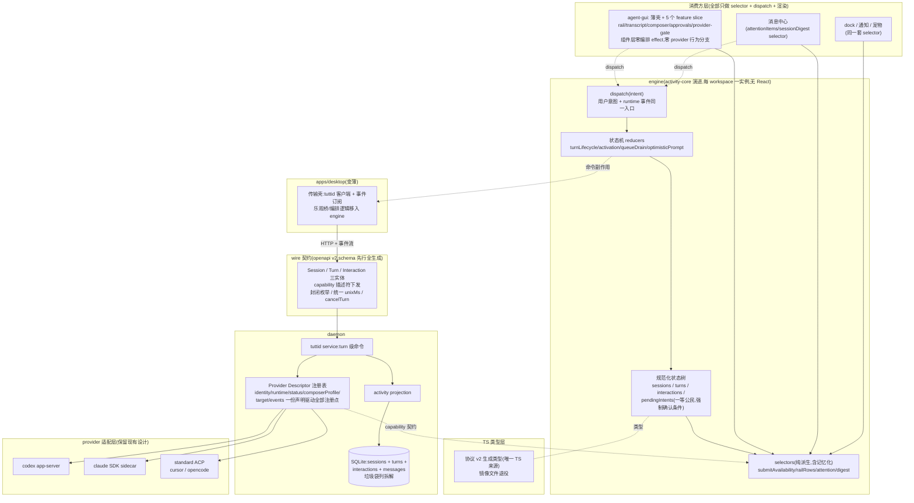
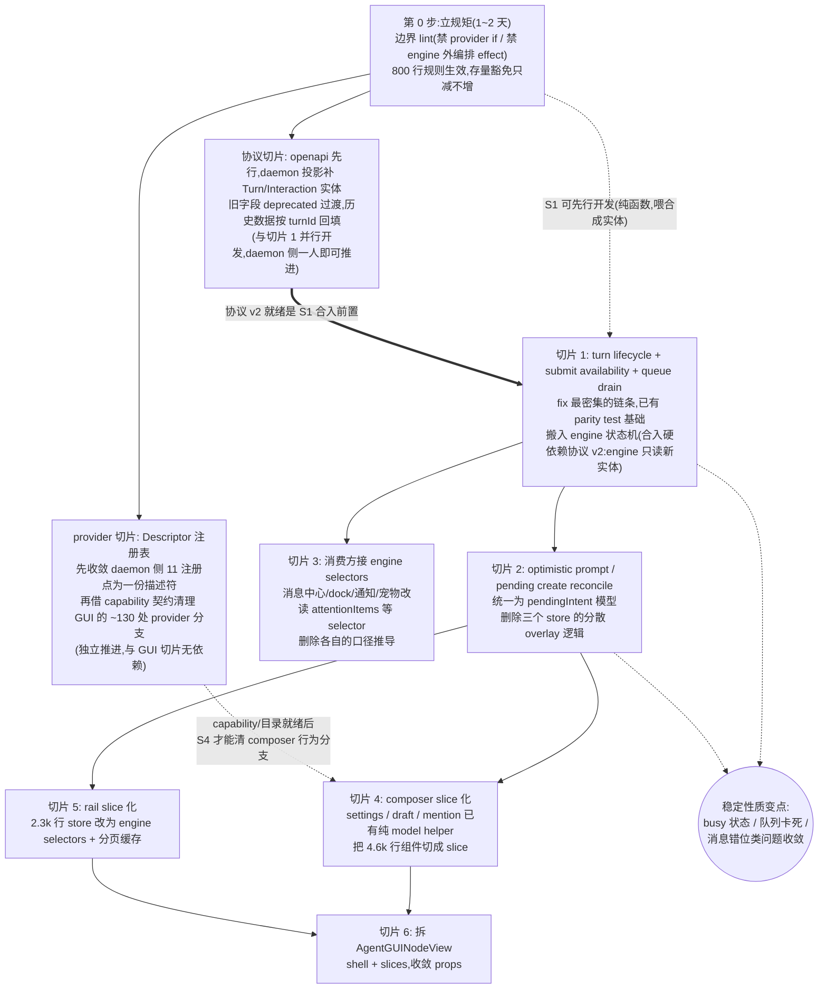

# Agent GUI 架构收敛 RFC（草案 v9）

状态：讨论稿，用于架构对齐会
范围：agent activity 模型协议、`packages/agent/activity-core`、
`packages/agent/gui` 及其全部消费方
不在本文范围：daemon 内部 provider adapter 实现细节

v2 变更：新增「模型协议实体错位」诊断与协议重设计（第 3.2 / 4.3 节）；
新增外部消费方地图，engine 层级从 GUI 内部上移到 workspace 作用域，
让消息中心等所有消费方共享（第 2.3 / 4.2 节）。
v3 变更：协议诊断下探到全部五层（wire / SQLite / daemon 内存 / TS / GUI），
确认 turn 运行态不持久化；新增 turn 之外五类协议问题（类型镜像、状态词汇表、
垃圾袋列、时间双轨、消息身份三元），协议规则从 5 条扩到 8 条（第 3.2 /
3.2.1 / 4.3 节）。
v4 变更：新增 provider 侧诊断——runtime 适配层健康无需重构，但接入注册面
碎片化（11 注册点 / ~80 文件 / 3 个静默失败点）且 GUI 有 ~80 处 provider
分支；新增 D4b Provider Descriptor 注册表与独立 provider 演进切片
（第 3.7 / 4.4 / 5 节）。
v5 变更：新增第 6 章「防劣化机制」——针对 AI-native 开发的三层护栏
（结构性防御 / 熵指标棘轮 + 劣化 lint + 渲染预算测试 / AI 工作流 hook），
量化两个高频劣化模式的现存密度。
v6 变更：4.5 节重写为全栈 before/after 对比——两张自消费方（agent-gui /
消息中心 / dock）贯穿到 provider runtime 的分层架构图 + 逐层对照表，
明确"分层重设计"是职责归属迁移而非增加层数。
v7 变更：新增 4.0 设计原则——直面"目标架构与原设计同构"的事实：现状是
正确设计被合法动作累积改歪的结果，本方案的本质是把不变量载体从散文迁移
到结构（类型 / 纯度 / CI），防劣化机制因此是架构本身而非附件。
v8 变更：新增 4.6 外部宿主兼容——TSH 的双 runtime（local + shared）
runtime map 用法取证；engine 实例身份定为 `(workspaceId, origin)`、禁止
模块单例、工厂开放 adapter；新增外部宿主升级风险行与"包公共 API 禁新增
模块级可变全局"的防劣化规则。
v9 变更：按部署形态修正协议落地策略——Tutti 已上线，DB 变更走
`agent_store_schema_migrations` 版本化迁移（只加不删、降级安全、回填有
V8 先例）；TSH 未上线可直接 v2 起步，deprecated 过渡导出仅服务 Tutti
自身切片节奏。
v10 变更：按代码实测校准统计口径——provider 分支改为双口径（严格等值
~50 / 含 `!==` 与 `case` 宽口径 ~130）、fix 占比标注统计口径、props 数
更新为实测 79；view 内嵌 valtio proxy 计入状态持有者（3.4）；棘轮基线
标注"以检查脚本首跑实测为准"（6.2）；补 `settling`/`completedCommand`
在协议 v2 中的去向（4.3）；D4b 的 openapi 枚举从"生成"改为"一致性
校验"以避免与 R6 schema 先行冲突；风险表新增切片过渡期跨表面口径漂移
及仲裁规则（7）。
v11 变更：切片 1 与协议切片改为"并行开发、串行合入"，engine 从第一天
只读 v2 新实体，明确不做旧协议合成层（5）；D4 按承载内容三分——布尔
能力 / 结构化目录（daemon 下发数据、GUI 保留交互效果映射）/ 身份展示
（合法保留 + lint 豁免），验收改为"零行为分支"（4.4 / 6.2）；新增第 9
节附录：desktop `workspaceAgentActivityService`（2,010 行）逐块归属
清单（engine / 传输壳 / 宿主特有），其中 turn 反猜与 legacy DTO 投影
两块随协议 v2 直接退役。
v12 变更：R8 消息归属按代码取证修正——当前逻辑持续产生合法的 turn 外
消息（系统通知显式空 turn id、TTL 过期尾包、导入历史），"turn_id 非空
约束"不可行；改为显式二选一（挂真实 turn 或 session 级 NULL，空串被
CHECK 禁止），存量空串归一为 NULL，拒绝 synthetic turn 兜底方案
（4.3 / 7）。
v13 变更：第 5 节演进图改为真实依赖图并补并行度说明——S0 后 SP/SR/S1
开发三线并发，S2 ∥ S3、S4 ∥ S5，SR ⇢ S4 为软依赖，最小 2 人跑满；
新增第 10 节附录：god controller（12,718 行）逐块落层清单
（engine / daemon / slice / 直接退役），含 view、overlay stores、
composer 的同型映射。

---

## 1. TL;DR

Agent GUI 的分层设计方向是对的，但有一个被低估的根因和三个实现病灶：

- **根因：模型协议缺少 Turn 实体——wire 契约、SQLite、daemon 内存、TS 类型
  五层皆然，且 turn 运行态不持久化（daemon 重启靠字符串猜）。** session 上挂
  着一堆本属于 turn 的状态（`status`、`turnLifecycle`、`submitAvailability`、
  `pendingInteractive`、`currentPhase`），`cancelSession` 实际语义是 cancel
  turn。同一实体还有 7+ 份手写类型镜像和 5 套状态词汇表。字段错位迫使每一层
  用散文规则和手工对账来弥补，是竞态类 bug 的共同源头。
- 编排逻辑长在 React 生命周期上（12.7k 行 god hook、55 个 effect）；
- 同一份状态有 7 个持有者，reconcile 每处手写；
- 五个功能域挤在 god props / viewModel / view 里，不变量靠 2000 行散文文档。

提案核心四句话：

1. **修协议**：引入 Session / Turn / Interaction 三实体模型，turn 状态归 turn，
   派生值只在客户端推导；
2. **把编排从 React 里拿出来**：workspace 作用域的会话引擎
   （intent -> reducer -> state 单循环），**所有消费方共享**——AgentGuiNode、
   消息中心、dock、通知走同一套 selectors；
3. **把不变量从文档里拿出来**：类型 + 状态机测试 + parity test，CI 守护;
4. **把巨石切成纵向 feature slice**。

演进采用 strangler 模式，协议先行、按 bug 密度逐链搬迁，每切片独立可合可回滚。

---

## 2. 现状架构

### 2.1 设计意图（是清晰的）



持久状态归 runtime、UI-local 状态归节点、投影纯函数化 —— 方向没有问题。
`shared/agentConversation`（transcript 投影与渲染）也是健康的，可整体保留。

### 2.2 关键数据

| 指标                           | 数值                                      | 备注                                                                                                                   |
| ------------------------------ | ----------------------------------------- | ---------------------------------------------------------------------------------------------------------------------- |
| `useAgentGUINodeController.ts` | **12,718 行**                             | 55 个 `useEffect`、81 个 `useCallback`、78 个 `useRef`、30 个 `useState`                                               |
| `AgentGUINodeView.tsx`         | **8,293 行**                              | 单个视图组件，内部自带 valtio proxy                                                                                    |
| `AgentComposer.tsx`            | 4,648 行                                  |                                                                                                                        |
| 对应 spec                      | 20,463 / 5,875 / 5,416 行                 | 测试同样巨石化，fixture 全局耦合                                                                                       |
| `AgentGUINodeProps`            | 79 个 props                               | 包的公共入口（顶层字段数实测；本 RFC 早期版本记 ~73，写作期间仍在上涨——本身就是病灶 4 的追加证据）                     |
| `AgentGUINodeViewModel`        | ~56 个字段                                | 一个扁平大对象喂给整个 view                                                                                            |
| 架构文档 `agent-gui-node.md`   | 1,993 行                                  | 绝大部分是历次 bug 沉淀的"禁令"                                                                                        |
| 近两月提交（本包）             | 894 个，其中 423 个 subject 含 fix（47%） | 口径：`git log --since='2026-05-01' --pretty='%s'` 中 subject 含 "fix"；若只算 conventional `fix:` 前缀则为 340（38%） |

仓库硬规则"业务文件 ≤ 800 行"在这里超出 10~16 倍。

### 2.3 容易被忽略的事实：activity 底层能力有 8 类消费方

AgentGuiNode 只是 agent activity 数据的消费方之一。检索
`@tutti-os/agent-activity-core` 与 activity runtime 的实际引用：



两个直接的架构含义：

1. **会话域状态天然是 workspace 作用域的，不是 GUI 面板作用域的。**
   队列 drain 已经被迫做成 workspace 级协调器（面板全关时队列也要继续发），
   这是现实给出的裁决：把编排放进 GUI 面板的生命周期里本来就是错位。
2. **engine 不能是 agent-gui 的私有实现。** 消息中心、dock、通知需要的
   "哪些会话在跑 / 哪个 turn 在等审批 / 完成了什么" 与 AgentGuiNode 是同
   一套语义，今天它们各自从 snapshot + 散装 projection 里再推一遍。

---

## 3. 问题诊断

### 3.1 病灶因果链



### 3.2 病灶 0（根因）：模型协议实体错位 —— 五层都没有 Turn

对全链路五层逐层取证（openapi wire 契约、SQLite 表结构、daemon Go 运行时、
activity-core TS 类型、GUI 投影类型），**Turn 在任何一层都不是实体**：

| 层            | 位置                                                 | Turn 的存在形式                                                                                                          |
| ------------- | ---------------------------------------------------- | ------------------------------------------------------------------------------------------------------------------------ |
| wire 契约     | `services/tuttid/api/openapi/tuttid.v1.yaml`         | 无 Turn schema；只有内嵌 session 的 `AgentActivityTurnLifecycle`，`phase`/`outcome` 是 `minLength: 1` 自由字符串         |
| SQLite        | `packages/agent/store-sqlite/migrations_activity.go` | **无 turns 表**；仅 messages 上有 `turn_id TEXT DEFAULT ''`（允许空串，文档要求的"消息必须带 turnId"在 schema 层不设防） |
| daemon 运行时 | `packages/agent/daemon/runtime` + `daemon/activity`  | `TurnLifecycle` 结构体**只活在内存**，由事件即时推导（`applyExplicitTurnLifecycleToPatch`），不落库                      |
| activity-core | `packages/agent/activity-core/src/types.ts`          | session 内嵌 `turnLifecycle` + 分散字段                                                                                  |
| GUI           | conversation summary / 各 store                      | 从 session 状态再推导                                                                                                    |

**turn 运行态不持久化是被低估的一条**：daemon 重启后只能靠 sessions 表的
`status`/`current_phase` 两个字符串猜之前的 turn 状态。cancel 的 reason 值域
里存在 `stale_turn_reconciled`，就是这个缺陷的制度化——"stale persisted
turn reconcile"一族 bug 有结构性来源。

session 实体承载 turn 状态的错位（以 activity-core 为例，wire 与 Go 侧同构）：

```ts
// 现状:session 一个实体承载三种生命周期
export interface AgentActivitySession {
  // ---- 真正的 session 身份/设置(合理) ----
  workspaceId; agentSessionId; agentTargetId; provider; cwd; title;
  pinnedAtUnixMs; resumable; visible; model; ...
  // ---- 实际属于"当前 turn"的状态(错位) ----
  status;              // 值域 working/waiting/completed/canceled/failed
                       //   —— 这些是 turn 的结果,不是 session 的状态
  turnLifecycle;       // 内嵌的 activeTurnId + phase + outcome
  submitAvailability;  // 由 turn lifecycle 派生,却作为字段存储
  pendingInteractive;  // 属于某个 turn 的交互请求,被迫用"三态 null"表达
  currentPhase;        // 与 status / turnLifecycle.phase 三处冗余
  lastError;           // turn 失败与 session 失败混在一个字段
  // ---- 无类型垃圾袋 ----
  runtimeContext?: Record<string, unknown>;  // capabilities / backgroundAgents
                                             //   / goal / imported 全塞这里
}
```

三个直接证据说明 cancel/status 语义错位不是猜测：

1. `cancelSession(workspaceId, agentSessionId)` 的返回 reason 值域是
   `active_turn_canceled | no_active_turn | stale_turn_reconciled` ——
   **API 自己承认这是 turn 操作**，session 层面根本没有"取消"这个概念。
2. 架构文档要求 daemon 终结 turn 时"**原子地**清 `turn.activeTurnId` 和
   `turnLifecycle.activeTurnId`、把 `turnLifecycle.phase` 置 settled、
   `currentPhase` 置 idle、替换 submit block"——四个字段必须手工同步，
   因为它们是**同一个事实（turn 结束了）的四份非规范化拷贝**。
3. 文档规定"session 级 `failed` 在后续 turn 开始后是历史状态，外层徽标要让
   最新 turn 的消息状态去澄清它"——这是 turn 结果污染 session 状态后，
   在 UI 层打的语义补丁。

后果传导：因为 turn 不是实体，乐观 prompt 没有可归属的 turn 记录（衍生出
"pending client-submit turnId 重定向"一族 bug）；`pendingInteractive` 只能
用"缺席=不变、对象=展示、显式 null=清除"的三态协议在多层 patch 类型间小心
传递；`submitAvailability` 的 wire 值和本地推导会打架。**病灶 2、3 大部分
内容是在为病灶 0 还债。**

### 3.2.1 病灶 0 的另外五个协议问题（turn 之外）

**(a) 同一实体 7+ 份平行声明，patch 类型 4 份镜像。**

Session 的独立类型声明分布：

| 侧  | 声明位置                                                                           |
| --- | ---------------------------------------------------------------------------------- |
| Go  | `packages/agent/daemon/runtime/types.go` `Session`                                 |
| Go  | `packages/agent/daemon/activity/types.go` `WorkspaceAgentSession`                  |
| Go  | `packages/agent/store-sqlite/repository.go` `Session`                              |
| Go  | `services/tuttid/service/agent/session_types.go` `Session`                         |
| Go  | `services/tuttid/api/generated/types.gen.go`（openapi 生成 wire 类型）             |
| TS  | `packages/agent/activity-core/src/types.ts` `AgentActivitySession`                 |
| TS  | `packages/agent/gui/shared/contracts/dto/agentHost.ts`（1,802 行 legacy DTO 镜像） |
| TS  | `packages/agent/gui/shared/workspaceAgentActivityTypes.ts`（451 行又一份镜像）     |

StatePatch 同样至少 4 份（Go `WorkspaceAgentStatePatch`、TS
`AgentActivityStatePatch`、`AgentHostWorkspaceAgentStatePatch`、
`WorkspaceAgentActivityStatePatch`）。文档中"`pendingInteractive` 三态必须
穿过这三层 patch 类型被保留"这条规则，就是镜像地狱的直接受害者：**加一个
字段要人肉同步 4~8 处，漏一处就是一个静默丢字段 bug**（每层 clone/映射函数
都是丢失点）。

**(b) 至少 5 套状态词汇表互相映射。**
DB 自由字符串 -> `AgentActivitySessionStatus`（多出 `queued`/`unknown`）->
`AgentActivityDisplayStatus`（多出 `idle`）-> GUI
`AgentGUIConversationStatus`（多出 `ready`）；再叠加 `currentPhase` 与
`turnLifecycle.phase` 两条独立轴。文档要求"status / currentPhase /
turnLifecycle.phase 三元组必须一起归一化"，就是在为词汇表分歧买单。

**(c) JSON 垃圾袋列 + 弱类型逃逸。**
`settings_json`、`runtime_context_json`、`payload_json` 全是无 schema 约束的
TEXT；`role`/`kind`/`status` 无枚举约束；TS 侧用 `(string & {})` 把值域检查
系统性地关掉。每个消费方对 `runtimeContext` 的解读只能靠约定。

**(d) 时间表示双轨。**
同一个 wire schema 里 `createdAt`/`updatedAt`/`endedAt` 是 RFC3339 字符串，
`pinnedAtUnixMs`/`occurredAtUnixMs` 是 int64 毫秒；TS 侧再统一转回 unixMs。
两种表示 + 一次转换层 = 时区/精度/空值语义的长期 bug 面。

**(e) 消息身份三元 + 版本双轨。**
自增 `id`、业务 `messageId`、`version`（部分链路又叫 `seq`）并存，merge/
dedupe 规则复杂到需要专门文档章节，乐观消息版本号能压过权威消息就是这里的
产物。

### 3.3 病灶 1：编排逻辑长在 React 生命周期上

`useAgentGUINodeController` 用 effect 触发顺序 + ref 缓存 + cleanup guard 实现
本质上是**异步状态机**的东西：激活、会话切换、submit 路由、乐观消息 reconcile、
队列 drain、prompt 重定向。后果：

- 竞态是结构性的。近期 fix 标题直接印证：`stale-state clobber, queue/send race`、
  `preserve active turn busy state`、`drain queued prompts past stale
active-turn submit blocks`、`derive submit availability from the turn
lifecycle` —— 全是同一类病：**时序不由任何人显式拥有**。
- 架构文档里出现大量这样的句子："active-session refs 是 controller 缓存，不是
  source of truth"、"React effect cleanup 可能临时扰动 UI-local refs，但不能把
  用户的 prompt 重定向到新会话"。**需要用散文警告开发者的地方，就是架构没兜住
  的地方。**

### 3.4 病灶 2：多源状态 + 手工 reconcile

同一份"会话状态"至少有 7 个持有者：



文档规定"每个 overlay 都必须有回到 runtime snapshot 的 reconcile 路径"，
但 reconcile 是**每处手写**的，于是 每个 overlay × 每种事件顺序 = 一个潜在
bug。乐观 prompt 的本地版本号压过 daemon 权威消息、submit availability 的
wire 值和本地推导打架，都是这个病灶的具体案例。

### 3.5 病灶 3：不变量活在散文里，不在类型和结构里

那份 2,000 行架构文档本质是"补丁日志的规则化"：turn 终结四字段原子性、
`pendingInteractive` 三态、optimistic prompt 不能进 durable message base……
这些都可以用判别联合、状态机、parity test 强制，现在靠"改代码前先读文档"
维持。已有一个好样板 —— `submitAvailability` 的 Go/TS parity test ——
但只覆盖了一个点。

### 3.6 病灶 4：没有纵向模块，只有横向巨石

rail、transcript、composer、approvals、provider readiness 是五个耦合度不高的
功能域，但它们共享同一个 73-prop 入口、同一个 56 字段 viewModel、同一个 12k 行
controller、同一个 8k 行 view。**任何一个域的改动都在 god type 和 god file 里
做手术**，这是"改 A 坏 B"和多人互踩的直接原因。
（附带问题：包内状态技术栈混用 valtio / zustand / 自研 store / React state，
无统一订阅规则。）

### 3.7 病灶 5：provider 差异渗透 UI + 接入面碎片化

先说健康的部分：**runtime 适配层不需要重构**。`standard_acp_adapter.go` 是
共享引擎，每个 ACP provider 只是一份 86~160 行的声明式配置（如
`acp_provider_opencode.go` 仅 86 行），这是教科书级的 deep module。

问题在适配层之外的两处：

**(a) provider 能力差异渗透 UI。**
近期 fix 里大量 `show opencode review picker`、`hide opencode goal fallback`、
`limit model image gating providers`、`sync Cursor plan mode` —— 能力差异
没有在 daemon 边界收敛成 capability 契约。量化（agent-gui 非测试代码，
双口径）：严格 `provider === "..."` 等值比较约 **50 处**；加上 `provider
!==` 与 provider 值的 `case` 分支约 **130 处**（宽口径分布：controller
36、composer helpers 11、slash command policy 10、view 10、title
projection 10、icon urls 10、其余散布）。背景放大器：实际存在三种接入
风格（标准 ACP、Codex 专属 app-server 协议 + codexproto 代码生成、Claude SDK
sidecar），`acp_providers.go` 注释明确说"Codex 不是新 provider 的模板"，
但它是功能最全的参照物，能力差距只能靠 GUI 补丁拉平——这正是 opencode 系列
fix 的来源。

当前各 provider 的实际运行时（`controller.go` 接线）：

| Provider                    | 当前运行时          | 备注                                    |
| --------------------------- | ------------------- | --------------------------------------- |
| Cursor                      | 标准 ACP            | `cursor-agent` ACP 模式                 |
| OpenCode                    | 标准 ACP            | `opencode acp`，声明式配置 86 行        |
| Codex                       | 专属 app-server     | 已迁出 ACP，codexproto 代码生成         |
| Claude Code                 | SDK sidecar（默认） | ACP bridge 仅为环境变量可切回的遗留路径 |
| Tutti Agent                 | app-server 家族     |                                         |
| nexight / hermes / openclaw | 标准 ACP            |                                         |

Codex 与 Claude Code 都是从 ACP 迁出的。**这不是历史偶然而是能力驱动的必然
趋势**：ACP 是最小公分母协议，provider 需要更深能力（review/goal/steer、
background agents/compact/结构化 patch）就会迁向原生协议。架构结论：传输
协议不是稳定边界，**归一化的 activity 契约才是**；必须假设每个 provider
最终都可能拥有专属 runtime（Claude 从 ACP 切 SDK 时的那批对齐 fix 是迁移
成本的实证），因此 capability 必须由 daemon 下发而不是 GUI 按 provider id
猜测，descriptor 的 runtime 字段也要同时容纳 ACP 配置与专属 adapter 工厂。

**(b) 接入注册面碎片化，加一个 provider 动 ~80 个文件。**
`acp_providers.go` 自己维护着一份"加新 provider 的 11 步清单"：runtime 侧
5 步（常量、adapter 配置、controller 注册、permission mode 映射、事件
NormalizeProvider）+ tuttid 侧 6 步（`biz/agentprovider` 常量、`agentstatus`
registry、`composer_profiles`、`agenttarget` 种子、model catalog、openapi
枚举 + 事件 schema 再生成），外加 GUI union 类型、**不做类型检查的 icon
映射表**、三处 locale 文件。实测 OpenCode 触点约 80 个非测试文件，横跨
daemon runtime、tuttid service、agent-gui、desktop 四个 surface。

清单注释里自带三个**静默失败点**，等于承认这是布雷区：

- 漏 `NormalizeProvider`：该 provider 的所有 activity 事件被静默丢弃；
- 漏 `agenttarget` 种子：GUI 磁贴存在，但启动会话失败；
- 漏 icon 表：不报错，静默回退 Tutti 图标。

"每次加新 provider 都容易出问题"的根因就在这里：**接入是 11 个分散注册点
的人肉一致性问题，而不是一份声明**。

### 3.8 病灶 6：消费方各自再造投影

消息中心、dock 徽标、完成通知、状态宠物各自从 snapshot 推导"这个会话现在
怎么样了"。submit availability、unread、"还在跑吗" 的口径已经出现过跨表面
不一致的 fix。病灶 0 放大了这个问题：底层字段语义含混，每个消费方只能各猜
一遍。

---

## 4. 理想形态：目标架构

一句话：**修协议、把编排上移出 React 且让所有消费方共享、把不变量变成 CI、
把巨石切成纵向 slice。**

### 4.0 设计原则：目标架构为什么"看起来像原设计"

一个必须直面的事实：目标架构与原始设计意图高度同构——runtime 唯一事实源、
投影纯函数化、controller 收编排、UI 只留局部状态，这些原则
`agent-gui-node.md` 从第一天就写着，其"Architecture Verdict"一节至今认定
"方向正确"。**现状不是设计错了，而是 AI-native 开发把正确的设计逐步改歪了。**

复盘劣化路径，关键发现是：**没有任何一步是违规的**——

- "controller 收编排"没有规定尺寸与纯度上限，55 个 effect 每个单独看都合法；
- "overlay 允许存在，只要有 reconcile 路径"是许可而非预算，3 个 overlay
  store 每个都有 reconcile 路径；
- "viewModel 是唯一出口"允许字段一次加一个，56 个字段各有当时的理由；
- 协议缺 Turn 实体，每个 provider 接入时"把 turn 状态塞进 session"都是
  当时的最小改动；
- 每次修完 bug 往架构文档加一条禁令——文档在替架构记录它自己无法执行的
  规则，长到 2,000 行。

**熵不是来自违规，而是合法动作的累积。** 散文架构对人类团队勉强有效
（review 中有人守护意图），对 AI-native 开发失效：AI 只看局部，完美执行
字面规则，同时完美侵蚀架构意图。

因此本方案的自我定位是：**分层哲学不变，把不变量的载体从散文迁移到结构**——
从"AI 读了会忘的文档"变成"AI 无法违反的类型、纯度和 CI"：

| 原架构的散文规则                | 目标架构的结构等价物                  |
| ------------------------------- | ------------------------------------- |
| "编排尽量用纯 helper"           | reducer 纯函数，effect 编排不可表达   |
| "overlay 必须有 reconcile 路径" | pendingIntent 无确认条件不过编译      |
| "turn 终结四字段原子更新"       | Turn 是一条记录，没有四份拷贝可失同步 |
| "改前先追全链路"                | 事件交错是 reducer 单测，CI 替你追    |
| "文件别太大 / 别乱加字段"       | 熵指标棘轮只降不升，越界即红          |

推论：第 6 章防劣化机制不是本方案的附件，而是架构本身的一部分。AI-native
时代的架构正确性不由框图定义，由**非法状态与非法动作是否不可表达**定义；
框图画得再对，只要劣化是合法的，劣化就必然发生。

### 4.1 目标分层总览



关键决策：**engine 不放在 agent-gui 里，而是 `agent-activity-core` 的演进**，
由 desktop 的 `WorkspaceAgentActivityService` 按 workspace 托管一个实例。
理由：

- 会话域语义（turn 在跑吗、谁在等审批、队列里有什么）是 workspace 级事实，
  8 类消费方都需要；队列 drain 已经被现实逼到 workspace 级，证明了这个作用域。
- 消息中心等消费方**直接拿 engine selectors**，不再各自从 snapshot 再推一遍，
  跨表面口径天然一致。
- agent-gui 保留的只剩**界面局部状态**：草稿、选中态、面板布局、滚动位置。

状态归属的判定规则从此只有一条：

> 关掉所有面板后这个状态还应该存在/工作吗？
> 是 -> engine（workspace 作用域）；否 -> surface 本地。

### 4.2 目标数据流



React 组件只剩 `useSelector` + `dispatch`，不再有编排性 `useEffect`。竞态从
"effect 时序玄学"变成"reducer 里可枚举、可单测的事件交错"。

### 4.3 模型协议 v2：Session / Turn / Interaction



协议修订的八条规则：

| #   | 规则                                                                                                                                                                                                                                                        | 消灭的现状问题                                                                                                                      |
| --- | ----------------------------------------------------------------------------------------------------------------------------------------------------------------------------------------------------------------------------------------------------------- | ----------------------------------------------------------------------------------------------------------------------------------- |
| R1  | **Turn 成为一等实体并持久化**（新增 turns 表），`phase/outcome/error/fileChanges` 归 turn；session 只保留 `activeTurnId` 一个引用                                                                                                                           | turn 终结"四字段原子更新"的散文要求消失；**turn 运行态只在内存、重启靠猜的缺陷消失**，`stale_turn_reconciled` 这个制度化补丁可退役  |
| R2  | **cancel 归 turn**：`cancelTurn(turnId)`；session 层没有 cancel                                                                                                                                                                                             | `cancelSession` 返回 `no_active_turn` 这种自相矛盾的 API                                                                            |
| R3  | **派生值不上行为契约**：session 展示状态、`submitAvailability` 一律由 engine selector 从 turn + interactions 推导；wire 值最多是显示提示                                                                                                                    | wire 值与本地推导打架；"session failed 是历史状态"的 UI 补丁                                                                        |
| R4  | **Interaction 成为集合实体**：pending = 存在于集合且 status=pending                                                                                                                                                                                         | `pendingInteractive` 的"缺席/对象/显式 null"三态协议在多层 patch 间的小心传递                                                       |
| R5  | **`runtimeContext` 垃圾袋拆解**为显式字段：`capabilities`、`backgroundAgents`、`goal`、`imported`；杂项一律 `(string & {})` 收紧为封闭联合 + 显式 unknown 分支                                                                                              | 每个消费方对 `Record<unknown>` 的各自解读                                                                                           |
| R6  | **schema 先行 + 全链路生成，消灭手写镜像**：openapi 为唯一事实源，Go/TS 类型（含 patch）全部生成；层间只允许"生成类型 + 窄投影"，禁止手抄结构体                                                                                                             | Session 7+ 份声明、StatePatch 4 份镜像、clone/映射函数逐字段丢失点                                                                  |
| R7  | **状态词汇表收敛为两套**：turn 的机器状态（`phase` + `outcome` 封闭枚举）和 selector 推导的展示状态；`status`/`currentPhase` 字段废弃                                                                                                                       | 5 套词汇表互映；`unknown`/`idle`/`ready` 各层私自扩词                                                                               |
| R8  | **表示法统一**：时间一律 int64 unixMs；消息身份收敛为 `messageId` + `version` 两元（自增 `id` 降级为存储实现细节，不出 wire）；消息归属显式二选一——挂 turn（`turnId` 非空，外键指向真实 turn）或 session 级消息（`turnId` NULL），**空串被 CHECK 约束禁止** | 时间双轨转换层；身份三元 merge/dedupe 复杂度；现状空串三义性（历史脏数据 / 真 turn 外消息 / adapter 忘填共享同一个 `''`，无法区分） |

现有 `AgentActivityTurnLifecycle` 的两个附属字段随 v2 各有明确去向：
布尔 `settling` 被 `phase` 封闭枚举吸收（作为独立 phase 值，不再是与
phase 并行的布尔）；`completedCommand` 属于某次 turn 的产物，归入 Turn
实体（见上图），不再挂 session。

**Session 级消息（turn 外消息）是一等概念，不是数据缺陷。**代码取证确认
当前逻辑持续产生不属于任何 turn 的消息，且这是语义正确的行为，共三类：

1. **系统通知**：`acpSystemNoticeEvent(session, "", ...)` 显式传空 turn
   id——历史无法恢复警告、compaction/goal/transport 通知本来就是会话级
   事件，不是任何一次提交的产物；
2. **turn 结束后迟到的 agent 尾包**：ACP adapter 用 10 分钟 TTL 的
   `sessionRecentTurnID` 找归属，超时/重启后为空；
3. **导入的外部历史对话**：源数据没有 Tutti turn 概念。

因此消息归属**不采用**"全部合成 synthetic turn"的做法——synthetic turn
没有 submit、没有 phase 变迁、没有 outcome，会迫使所有消费方在 turn 分支
里特判假实体，等于在封闭枚举里开后门。方案：第 1、3 类正名为 session 级
消息（`turnId = NULL`）；第 2 类按策略归属（TTL 内归上一 turn，超时归
session 级）；audit 语义上必须有 turn 的交互（permission）保留现有
synthetic turn 合成。turn 的一等实体地位由 R1/R2（持久化、状态归属、
cancelTurn）定义，不由"每条消息必须挂 turn"定义。

落地注意：按仓库硬规则，daemon HTTP 契约变更需**先改
`services/tuttid/api/openapi/tuttid.v1.yaml`**。历史数据无 turn 记录，daemon
投影层做一次性回填：有非空 `turnId` 的消息按 turnId 分组生成 turn 记录
（消息侧字段已具备）；**存量空串统一归一为 NULL**——"归属不可考"被诚实
表达为 session 级，而不是伪装成某种归属，transcript 按序渲染不受影响，
turn 分组特性对旧数据优雅降级。wire 层可保留旧字段一个过渡期，标注
deprecated，客户端一律读新实体。R6 的生成链是其余规则的放大器：词汇表、
实体、patch 改一处即全链路生效。

部署形态差异（Tutti 已上线，TSH 未上线）：

- **Tutti 线上库必须走版本化迁移。** `packages/agent/store-sqlite` 已有
  独立迁移台账 `agent_store_schema_migrations`（当前演进到 V8），turns /
  interactions 表作为下一版本号的常规增量迁移落地；turn 回填有现成先例
  （V8 的 `backfillSystemAgentTargetIDs` 就是对历史 session 的列回填）。
  过渡期内**只做加法**（新表、新列），旧列（`status`/`current_phase` 等）
  保留不删，待客户端全部切读新实体后再出清理版本——这同时保证用户把
  App 回滚到旧版本时旧代码仍能读库（降级安全）。
- **TSH 未上线，无迁移与兼容负担。** TSH 可直接采用协议 v2 schema 与新
  engine API 起步，不需要 deprecated 过渡导出；npm 包的过渡期导出只服务
  Tutti 自身的切片节奏，不是对外承诺。这也意味着协议切片的破坏性成本
  比通常的"已发布协议改版"低一档：唯一的存量数据在 Tutti 本地
  SQLite，而它有成熟的迁移台账。

### 4.4 其余核心设计决策

**D1 会话引擎取代 god controller。**
所有异步编排变成 `dispatch(intent) -> reducer -> new state` 的纯函数循环，
runtime 事件作为 intent 进入同一个循环。时序由引擎显式拥有。

**D2 乐观状态一等公民化。**
不再是三个 store 各自的 ad-hoc overlay，而是状态树里显式的
`pendingIntents: Map<clientSubmitId, PendingIntent>`。每种 intent 类型声明
自己的确认条件（durable turnId / messageId / clientSubmitId）和超时策略，
reconcile 由引擎统一执行。协议 v2 后乐观 prompt 有真正的 turn 可归属，
"prompt 重定向"一族补丁随之消失。

**D3 不变量可执行化。**
把文档核心不变量翻译成状态机测试和 parity test，扩展现有
`submit_availability_parity_test` 的成功模式。目标：**文档从"改前必读的
禁令集"退化为"引擎设计说明"，禁令由 CI 守。**

**D4 capability 契约收敛 provider 差异。**
现存约 130 处（宽口径）GUI provider 分支按承载内容分三类，处置不同：

| 类别       | 现状样本                                                                                            | 处置                                                                                                                                                                                                                 |
| ---------- | --------------------------------------------------------------------------------------------------- | -------------------------------------------------------------------------------------------------------------------------------------------------------------------------------------------------------------------- |
| 布尔能力   | planMode、imageInput、liveModelSwitch、reviewPicker、goalPause、compact……                           | daemon 下发能力描述符，UI 一律 `if (capabilities.x)`。slash policy 已部分示范（`planSupported`/`compactSupported`/`browserSupported` 均为协商入参）                                                                  |
| 结构化目录 | slash 命令可用性（`immediateCommands`/`fallbackCommands`/palette 白名单四张表）、model catalog 来源 | 布尔开关表达不了，由 daemon `composer_profiles` 系的 profile 下发**结构化数据**；命令名到 GUI 交互效果（fillDraft/immediate/picker）的映射保留在 GUI 一张与 provider 无关的表里（daemon 下发能力，GUI 拥有交互语义） |
| 身份展示   | icon 映射、provider label、title projection（合计约 30 处）                                         | **合法保留**——按 provider 身份选图标/文案不是能力错位；随 D4b descriptor 的 identity 字段收敛为生成物                                                                                                                |

验收标准相应为"GUI 零**行为**分支"而非字面零分支：`provider === "..."`
的行为判断（能力、目录）清零，身份展示分支进 lint 豁免类别（豁免清单
只减不增，随 D4b 生成化递减）。边界 lint 强制（仓库已有
`check:agent-activity-runtime-boundaries` 先例）。

**D4b Provider Descriptor 注册表收敛接入面。**
保留 `standard_acp_adapter` 的声明式配置设计（它是健康的），把它之外的
11 个分散注册点收敛为一份 provider 描述符：

```text
ProviderDescriptor
├── identity        id / label / icon 资源引用(生成 GUI 图标表与 locale 键)
├── runtime         adapter 构造(ACP 配置 或 专属 adapter 工厂)
├── status          安装/登录/探测 spec(现 agentstatus registry 条目)
├── composerProfile 能力、permission modes、model catalog 来源
├── target          local:<provider> 系统 target 种子
└── events          NormalizeProvider 归一化条目
```

registry 成为唯一注册动作：controller 注册、事件归一化、agenttarget 种子
由 registry 驱动。openapi/事件 schema 的 provider 枚举例外——它们受 R6
"schema 先行"约束，仍以 openapi 为唯一事实源手工维护，registry 与枚举
之间做**生成期/CI 一致性校验**（registry 有而枚举缺、或反之，即红），
而不是由 Go 侧反向生成 yaml。三个静默失败点（事件丢弃、target 缺失、
icon 回退）变成编译期/校验期错误。目标验收：
**加一个标准 ACP provider = 一份描述符文件 + 图标资源 + locale 文案**。

**D5 feature slice 取代 god props / viewModel。**
73 个 props 收敛为 `workspaceId` + engine 句柄 + host capabilities + 少量
render slots。每个 slice 用 selector 直接取自己那份状态，56 字段 viewModel
拆解消失。状态技术栈统一为"engine store + 一种订阅方式"，valtio / zustand
逐步退役。

### 4.5 全栈新旧对比：从消费方到 provider runtime

重构方案可以总结为三件事，各自对应图中的一段：

1. **协议重构**（wire / 存储 / 类型层）：Session-Turn-Interaction 实体化 +
   全链路生成，消灭镜像；
2. **逻辑从 UI 抽出来**（消费方 / GUI 层）：编排下沉到无 React 的 engine，
   组件只剩 selector + dispatch；
3. **分层重设计**：**层数没有增加，变化的是每层的职责归属**——GUI 的
   controller/stores、desktop service 的乐观桥合并成一个 engine；daemon
   新增 turns 持久化与 descriptor 注册表；类型镜像收敛为生成物。

#### Before：现状全栈



Before 的要害：**编排散在三处**（GUI controller、overlay stores、desktop
service 乐观桥），**同一 Session 实体 7+ 份声明**贯穿全栈人肉同步，turn
状态在 wire/存储层缺位、在内存易失，消费方各自绕过 GUI 再造投影。

#### After：目标全栈



#### 逐层 before -> after

| 层            | Before                                                     | After                                                          |
| ------------- | ---------------------------------------------------------- | -------------------------------------------------------------- |
| 消费方        | AgentGuiNode 走 god controller；消息中心/dock 各自再造投影 | 全部消费方共享 engine selectors，只做渲染 + dispatch           |
| GUI 内部      | 12.7k controller + 3 store + 8.3k view，编排在 effect      | 薄壳 + 5 slice；编排归 engine；组件层零 memo 军备              |
| 编排归属      | 散在 GUI controller / stores / desktop 乐观桥三处          | **合并为一个 workspace 级 engine**（新增层，吸收三处旧职责）   |
| TS 类型       | 3 份手写镜像 + activity-core                               | 协议 v2 生成类型唯一来源                                       |
| desktop       | 2k 行 service（传输 + 乐观桥 + reconcile 编排）            | 变薄为纯传输壳（逐块归属见第 9 节附录）                        |
| wire          | 无 Turn；session 混载；枚举/时间/身份混乱                  | Session/Turn/Interaction；capability 下发；全生成              |
| daemon 存储   | sessions + messages；turn 态内存易失                       | + turns / interactions 表，turn 持久化                         |
| provider 接入 | 11 注册点 / ~80 文件 / 3 静默失败点                        | Descriptor 注册表一份声明；适配器引擎保留不动                  |
| provider 差异 | 上浮到 GUI ~130 处分支（宽口径）                           | daemon capability/目录契约下发，GUI 零行为分支（身份展示豁免） |

补充几个不落在具体层上的横切维度：编排作用域从"GUI 面板生命周期"变为
"workspace 级（面板全关也工作）"；不变量载体从 2,000 行散文文档变为
类型 + 状态机测试 + parity test + lint；状态技术栈从
valtio + zustand + 自研 + React state 四种收敛为 engine store 一种；
派生值（展示状态、submitAvailability）从"wire 存储 + 本地推导并存打架"
变为只在 engine selector 推导。

### 4.6 外部宿主与多 runtime 兼容（TSH runtime map）

`@tutti-os/agent-gui` 与 `@tutti-os/agent-activity-core` 通过 npm 发包给
外部宿主 TSH 使用。TSH 有一个本仓库内不存在的用法：**同一个 workspace
同时挂两个 runtime**——本地 tuttid runtime + TSH 自己的 shared/room
runtime（各自有独立的 activity service 实现）。

现状机制：agent-gui 的 conversation-list/session-view store 是模块级单例，
两个 runtime 会争抢同一个 module-global 槽位，因此 0.0.67 引入
`runtimesByOrigin: Map<origin, AgentActivityRuntime>` 注册表，store 按查询
的 `origin` 解析 runtime；非默认 origin 未注册时返回 null 而不是回落到
本地 runtime（防止 shared 查询静默读本地数据）。

两点判断：

1. **runtime map 是"合法劣化"的又一样本**（呼应 4.0）：根因是 store 的
   模块级全局单例，修法是给全局槽位加键控 Map，而不是移除全局。源码注释
   自证："the single slot two runtimes used to fight over"。
2. **目标架构天然兼容且更干净，但有一条硬设计约束**：

| 约束             | 内容                                                                                                                                    |
| ---------------- | --------------------------------------------------------------------------------------------------------------------------------------- |
| engine 实例身份  | `(workspaceId, origin)`，origin 是一等身份而非补丁字段                                                                                  |
| 禁止模块单例     | engine 只能显式实例注入（provider / 句柄传递）；module-global 与 origin Map 随 store 退役                                               |
| 工厂开放 adapter | engine 工厂接受任意 transport adapter；TSH 的 `TshWorkspaceAgentActivityService` / `TshSharedAgentActivityService` 各喂一个 engine 实例 |
| adapter 特性透传 | `projectPathIsRemote`、prompt 上传能力等继续作为 adapter 属性由 engine 消费                                                             |
| 包边界           | engine 落在 TSH 已依赖的 `@tutti-os/agent-activity-core`；宿主"如何组合多个 engine"（如聚合两侧注意力项）属宿主接线，不进包             |

即"runtime map"从包内全局 hack 上移为宿主接线代码：TSH 创建两个 engine
实例，把各 surface 挂到对应实例上，包内不再存在跨实例共享的可变全局。
这也是发包边界的防劣化规则：**包公共 API 中禁止新的模块级可变全局**（可
纳入 6.2 的 lint 清单）。

### 4.7 病灶 -> 解法映射

| 病灶                      | 解法                                                      |
| ------------------------- | --------------------------------------------------------- |
| 0. 协议实体错位           | 4.3 协议 v2：Turn/Interaction 实体化，派生值下放 selector |
| 1. effect 时序竞态        | D1：引擎单循环，事件交错可枚举可测                        |
| 2. 多源状态手工 reconcile | D2：pendingIntent 一等公民 + 唯一 reconcile 实现          |
| 3. 不变量靠文档           | D3：状态机测试 + parity test + 边界 lint                  |
| 4. 巨石文件 / god type    | D5：纵向 slice + 统一状态栈                               |
| 5a. provider if 渗透 UI   | D4：capability 契约 + lint 禁令                           |
| 5b. provider 接入面碎片化 | D4b：Provider Descriptor 注册表，11 注册点归一            |
| 6. 消费方各自再造投影     | engine 上移 workspace 级，selectors 共享（4.1）           |

---

## 5. 演进路径：小范围逐步重构

约束：不重写。采用 strangler 模式，**引擎先落地，老 controller 逐步变成引擎的
薄代理**。每个切片独立可合、可回滚；同一条链只能有一个 owner，切片切换是原子
的（feature flag 只用于回滚，不用于长期并行双写）。



并行度（实线为硬依赖，虚线为软依赖）：

- **S0 后三线并发**：SP、SR、S1 开发同时开跑。SP/SR 都在 daemon 侧且
  互相独立；S1 的 reducer 是纯函数，可喂合成 turn 实体先写先测，仅合入
  等 SP（"并行开发、串行合入"）。
- **S2 ∥ S3**：S3 只需要 S1 产出的 selectors（attentionItems / digest
  来自 turn + interaction 状态），不依赖乐观层；这段并行期由第 7 章的
  "跨表面口径以旧投影为准"仲裁规则兜底。
- **S4 ∥ S5**：composer 与 rail 是独立功能域，都只依赖 S2（各自最脏的
  乐观 overlay 先被 pendingIntent 统一，否则 slice 化等于散装 reconcile
  原样搬家），互不相碰。
- **必须串行**：S1 -> S2（pendingIntent 挂在 engine 循环上）；
  S2 -> S4/S5（先统一乐观层）；S4 + S5 -> S6（slices 不齐收不了 props）。
- **软依赖 SR ⇢ S4**：composer helpers 的 11 处 provider 行为分支要靠
  capability/目录契约清理。SR 不阻塞 S4 开工（可先拆结构、分支暂留并进
  棘轮），但 SR 晚于 S4 完成时，S4 的"零行为分支"验收延后兑现。
- **人力形状**：最小 2 人跑满（1 daemon：SP -> SR；1 GUI：S1 -> S2 ->
  S4/S5 -> S6）；第 3 人的最优插入点是 S3（与 S2 并行）或提前接手 SR。

| 步骤     | 内容                                                                                                      | 退出标准                                                                       |
| -------- | --------------------------------------------------------------------------------------------------------- | ------------------------------------------------------------------------------ |
| 0        | 边界 lint + 行数规则                                                                                      | CI 生效，重构期间不长新债                                                      |
| 协议     | openapi + daemon 投影出 Turn/Interaction                                                                  | 新实体可读；`cancelTurn` 可用；旧字段标 deprecated                             |
| provider | Descriptor 注册表 + capability 下发                                                                       | 加一个 ACP provider = 一份描述符 + 图标 + 文案；三个静默失败点变编译期错误     |
| 1        | turn lifecycle / submit availability / queue drain 入 engine（合入前置：协议 v2 可读，engine 只读新实体） | 状态机测试覆盖事件交错；相关链路 fix 停止增长；engine 内不存在旧协议字段合成层 |
| 2        | optimistic 状态统一为 pendingIntent                                                                       | 三个 store 的 overlay 逻辑删除；reconcile 只有一处实现                         |
| 3        | 消费方接 selectors                                                                                        | 消息中心等不再自持口径推导；跨表面状态一致                                     |
| 4        | composer slice 化                                                                                         | `AgentComposer` 拆解，settings/draft 归属清晰                                  |
| 5        | rail slice 化                                                                                             | `conversationListStore` 退役                                                   |
| 6        | shell 替代 god view                                                                                       | `AgentGUINodeView` / god props / god viewModel 退役                            |

每个切片完成即回归：`pnpm check:agent-activity-runtime-boundaries` +
`pnpm --filter @tutti-os/agent-gui test`（协议切片另加 daemon 测试）。

**切片 1、2 完成后，线上最痛的稳定性问题（busy 状态、消息丢失/错位、队列
卡死）应有质变**；切片 3 完成后跨表面口径统一。

协议切片与切片 1 的关系是**并行开发、串行合入**：engine 状态机可以在协议
v2 落地前开发和测试（reducer 是纯函数，测试喂合成的 turn 实体即可），但
**合入以协议 v2 可读为前置**，engine 从第一天就只读 turns / interactions
新实体。刻意不做"先基于旧协议字段、v2 就绪后切数据源"的两步走——那需要
在 engine 内部造一个从 session 混载字段合成伪 turn 的临时投影层，这层本身
就是新的 reconcile 代码且注定要删，是"合法劣化"的温床。代价是切片 1 的
稳定性收益等待协议切片先行，按 daemon 侧一人推进的评估这个等待是可接受的。

---

## 6. 防劣化机制：面向 AI-native 开发的护栏

重构解决存量债，防劣化解决增量债。AI 辅助开发有两个高频劣化模式，都已在
现状代码中量化实锤：

- **模式 A：delay / 外层兜底式修复。** 问题本可在底层一行修掉，AI 倾向在
  外层加 timer、try-catch 吞错、防御性 overlay，一个 fix +2000 行。现状：
  三个 god file 里 12 处 `setTimeout`，controller 里 11 处吞错 `catch {}`。
- **模式 B：memo 军备竞赛式性能优化。** 渲染慢 -> 加 memo/缓存 -> 新增数据
  源与身份不稳定 -> 稳定性变差 -> 再加缓存。现状：`AgentGUINodeView.tsx`
  单文件 97 处 `useMemo/useCallback/memo`，`AgentComposer.tsx` 57 处。

防线分三层，重要性递减：**结构性防御 > 机械护栏 > 流程护栏**。原则是优先
让劣化"无处可写"，其次让劣化"提交不进去"，最后才靠约定。

### 6.1 第一层：结构性防御——让劣化模式不可表达

新架构本身是最强的防劣化手段，两个模式在 engine 架构下失去生存空间：

- **delay 修复在 reducer 里写不出来。** reducer 是纯函数，没有地方塞
  `setTimeout`；时序问题必须被命名为状态机转移（"等待哪个事件到达哪个
  状态"）。兜底 overlay 也创建不出来：`pendingIntent` 的类型强制要求声明
  确认条件与超时策略，没有确认条件的"临时防御状态"无法通过编译。
- **memo 失去必要性。** 军备竞赛的根因是宽订阅：56 字段 viewModel 从单个
  12.7k 行 controller 灌进 8.3k 行 view，任何字段变化全树重渲，于是只能
  逐点加 memo 止血。selector 细粒度订阅后，组件天然只在自己那份数据变化时
  渲染；必要的记忆化集中在 selector 层（可单测、身份稳定），**feature
  slice 组件层原则上零 `useMemo`**。

### 6.2 第二层：机械护栏——ratchet + lint + 预算，挂现有 hook

全部挂在已有基建上：pre-commit（lint-staged / staged 检查）、
`check:changed` 泳道、pre-push（`check:full`）、CI。按仓库惯例新增
`tools/scripts/check-agent-gui-degradation.mjs`（参照
`check-agent-activity-runtime-boundaries.mjs` 的模式）。

**(a) 熵指标棘轮（ratchet）——防"改偏"的核心机制。**
把关键熵指标基线写进版本库 JSON，CI 校验**只降不升**：

```jsonc
// tools/degradation-baseline/agent-gui.json(示意)
{
  "fileLines": { "AgentGUINodeView.tsx": 8293, "...": 0 },
  "effectCount": { "useAgentGUINodeController.ts": 55 },
  "memoCount": { "AgentGUINodeView.tsx": 97, "AgentComposer.tsx": 57 },
  "providerBranches": 130,
  "setTimeoutCount": 12,
  "swallowedCatch": 11,
  "overlayStores": 4
}
```

以上数字是写作期实测**示意**，各指标的统计口径（正则、glob、是否含
`!==`/`case` 等）由检查脚本定义；**落地 PR 以脚本首跑输出为准生成基线**，
不得照抄本文数字，否则口径差一处棘轮首日即误报。`providerBranches` 用
宽口径（等值 + 不等 + case 分支）；`overlayStores` 含
`AgentGUINodeView` 内嵌的 valtio rail proxy（list / session / queue /
view 内嵌，共 4 处）。

改坏（任一指标上升）CI 红；改好则同一 PR 更新基线。存量既往不咎、增量零
容忍，重构切片每完成一个，基线自然下降并锁死成果——**这就是"重构不被
AI 改回去"的保证**。

**(b) 劣化模式 lint（增量、staged 级，pre-commit 即拦截）：**

| 规则                   | 内容                                                                                                            |
| ---------------------- | --------------------------------------------------------------------------------------------------------------- |
| no-sync-timer          | engine / reducer / selector 内禁止 `setTimeout`；其余位置数值字面量 timer 必须带 `// timing: <原因>` 注释才放行 |
| no-swallowed-catch     | catch 块必须 `reportDiagnostic` 或 rethrow；静默吞错报错                                                        |
| memo-budget            | feature slice 组件文件 `useMemo/useCallback` 上限（建议 5）；selector 层不限                                    |
| no-store-in-view       | 组件文件禁止创建 valtio/zustand store（现状 `AgentGUINodeView` 内嵌 proxy 即反例）                              |
| provider-branch-freeze | `provider === "..."` 行为分支新增即报错（存量在棘轮里递减）；身份展示分支走豁免清单，清单只减不增               |

**(c) 渲染性能回归测试——用预算取代 memo 直觉。**
React Profiler `onRender` 断言典型交互的组件渲染次数预算，进
`pnpm --filter @tutti-os/agent-gui test`：

- 流式消息更新一次：transcript 相关组件渲染 ≤ N，composer/rail 渲染 = 0
- rail 滚动/hover：composer 与 transcript 渲染 = 0
- composer 打字：rail 与 transcript 渲染 = 0

性能优化的定义从"加了多少 memo"变成"让预算测试变绿"。预算数字本身也进
棘轮，只紧不松。

**(d) fix diff 预算（软门禁）。**
fix 类分支 diff 超过阈值（建议 +300 行）时，CI 要求 PR 描述回答两个问题：
root cause 是什么；为什么不能在更底层修。不硬拦，但把"+2000 行修一个
bug"从默认路径变成需要显式辩护的例外。

### 6.3 第三层：流程护栏——hook 进 AI 工作流本身

- **agent 编辑时即时反馈**：通过 Cursor hooks 在文件编辑后跑劣化 lint 的
  增量版，AI 改出违规代码当场被打回，不等 pre-commit。这比事后 review
  有效得多——AI 对即时 lint 错误的服从性远高于对文档规约的记忆。
- **fix 必须先有复现测试**：修复竞态/状态类 bug 的 PR 必须包含一个先失败
  的 reducer 事件交错测试（engine 架构下这类测试是纯函数级的，编写成本
  低）。没有复现测试的 fix 视为未定位 root cause。
- **兜底三问**：PR 模板中，凡新增 timer / 重试 / 缓存 / 防御分支，必须
  回答：源头是哪个事件或状态？为什么不能在源头修？这个兜底的清除条件是
  什么？——把 AGENTS.md 已有的"改前追链"要求从散文变成表单。

落地说明：新增检查脚本与 hook 行为按仓库规则需同步更新
`docs/conventions/static-analysis.md` 与 `docs/conventions/local-git-hooks.md`
（实施 PR 内完成，本 RFC 不展开）。

### 6.4 与两个高频问题的对应

| 高频劣化            | 结构性                                                 | 机械                                                     | 流程                         |
| ------------------- | ------------------------------------------------------ | -------------------------------------------------------- | ---------------------------- |
| delay/兜底 +2000 行 | reducer 纯函数写不进 timer；pendingIntent 强制确认条件 | no-sync-timer / no-swallowed-catch / diff 预算 / 棘轮    | 复现测试先行；兜底三问       |
| memo 军备竞赛       | selector 细订阅让组件层 memo 失去必要性                | memo-budget / no-store-in-view / 渲染次数预算测试 / 棘轮 | 性能 PR 以预算测试变绿为验收 |

## 7. 主要风险

| 风险                                                                                                                                                                 | 缓解                                                                                                                                                                                                 |
| -------------------------------------------------------------------------------------------------------------------------------------------------------------------- | ---------------------------------------------------------------------------------------------------------------------------------------------------------------------------------------------------- |
| 协议改动波及 Tutti 线上库与历史数据                                                                                                                                  | openapi 先行；`agent_store_schema_migrations` 版本化增量迁移（现成台账，已到 V8）；过渡期只加不删保证降级安全；turn 回填只依赖消息已有的非空 `turnId`，存量空串归一为 NULL（session 级），不伪造归属 |
| npm 外部宿主（TSH）破坏性升级                                                                                                                                        | TSH 未上线，可直接采用 v2 起步，无迁移/兼容负担；engine 落在 TSH 已依赖的 activity-core；多 runtime 场景按 4.6 约束设计为一等能力                                                                    |
| 引擎与老 controller 并存期双写冲突                                                                                                                                   | 同一条链只有一个 owner；切换原子化；flag 仅回滚用                                                                                                                                                    |
| engine 上移后消费方接口破坏                                                                                                                                          | selectors 作为唯一公共读接口先行冻结；消费方逐个迁移（切片 3），迁移前旧投影保留                                                                                                                     |
| 切片过渡期跨表面口径漂移：切片 1/2 完成后、切片 3 前，engine（GUI 用）与旧投影（消息中心/dock 用）对同一事件可能给出不同展示状态——恰是要消灭的 S4 症状在过渡期的复现 | 明确仲裁规则：切片 3 完成前，跨表面展示口径以旧投影为准，engine 口径仅在已迁移链路生效；期间新增的口径类 bug 归属旧投影修，不在 engine 侧打补丁                                                      |
| 巨石 spec 迁移成本                                                                                                                                                   | 按切片重写为聚焦测试；老 spec 在对应链路退役时删除，不做一比一翻译                                                                                                                                   |
| 引擎过度设计                                                                                                                                                         | 不引入通用框架；machines 就是判别联合 + 纯函数 reducer，无新依赖                                                                                                                                     |
| capability 契约需要 daemon 配合                                                                                                                                      | 描述符可先在 desktop adapter 层拼装过渡，daemon 契约就绪后下沉                                                                                                                                       |

---

## 8. 附：现状证据来源

- 代码规模与 hooks 密度：对 `packages/agent/gui` 的静态统计
- fix 占比：`git log --since='2026-05-01' -- packages/agent/gui`（894 提交 / ~440 fix）
- 竞态类 fix 标题样本：`stabilize agent activity updates`、`preserve active
turn busy state`、`stale-state clobber, queue/send race`、`drain queued
prompts past stale active-turn submit blocks`、`derive submit availability
from the turn lifecycle`
- 协议实体错位（五层取证）：
  - wire：`services/tuttid/api/openapi/tuttid.v1.yaml`（无 Turn schema、
    cancel reason 值域、时间双轨、`phase` 自由字符串）
  - SQLite：`packages/agent/store-sqlite/migrations_activity.go`（无 turns
    表、`turn_id TEXT DEFAULT ''`、三个 `*_json` 垃圾袋列）
  - daemon：`packages/agent/daemon/activity/service.go`
    （`applyExplicitTurnLifecycleToPatch` 内存推导、不落库）
  - TS：`packages/agent/activity-core/src/types.ts`（session 承载 turn 状态、
    `AgentActivityStatePatch` 顶层与 `turn` 片段的 `submitAvailability` 双写）
- 平行类型镜像：Session 7+ 份（daemon runtime / daemon activity /
  store-sqlite / tuttid service / 生成 wire 类型 / activity-core /
  `agentHost.ts` 1,802 行 / `workspaceAgentActivityTypes.ts` 451 行）；
  StatePatch 4 份
- 状态词汇表分歧：`AgentActivitySessionStatus`(queued/unknown) /
  `AgentActivityDisplayStatus`(idle) / `AgentGUIConversationStatus`(ready)
  / `currentPhase` / `turnLifecycle.phase`
- provider 接入面：`packages/agent/daemon/runtime/acp_providers.go` 的
  11 步接入清单注释（含三个静默失败点原文）；OpenCode 触点 ~80 个非测试
  文件；agent-gui 非测试代码 provider 分支双口径——严格 `provider ===
"..."` 约 50 处，含 `!==` 与 `case` 宽口径约 130 处（controller 36 /
  composer helpers 11 / slash policy 10 / view 10 / title projection 10 /
  icon urls 10）；三种接入风格
  （standard ACP / codex app-server / claude SDK sidecar）
- 消费方清单：对 `@tutti-os/agent-activity-core` / activity runtime 引用的
  全仓检索（agent-message-center、agent-conversation、WorkspaceChrome、
  dock 状态源、outcome notification、status pet、Issue Manager、App Center、
  workspace 级 drain coordinator）
- 不变量散文化：`docs/architecture/agent-gui-node.md`（1,993 行）
- 既有健康样板：`shared/agentConversation` 投影层、`submitAvailability`
  Go/TS parity test

---

## 9. 附录：desktop service 逐块归属清单

4.5 逐层表中 "desktop 变薄为纯传输壳" 的具体拆分依据。对
`apps/desktop/.../internal/workspaceAgentActivityService.ts`（2,010 行）
逐块标注三类目标归属：**engine**（编排/状态语义，迁入会话引擎）、
**传输壳**（留在 desktop，纯 tuttid 客户端与事件订阅）、
**宿主特有**（Electron 能力或 legacy 投影，各有独立去处）。

| 现状代码块                                                                                                                                                                                                                                                                                | 现状职责                                                     | 目标归属 | 处置                                                                                      |
| ----------------------------------------------------------------------------------------------------------------------------------------------------------------------------------------------------------------------------------------------------------------------------------------- | ------------------------------------------------------------ | -------- | ----------------------------------------------------------------------------------------- |
| `sendInput` 的乐观快照/回滚 + `optimisticWorkingAgentActivitySession` / `shouldPreserveOptimisticWorkingAfterSend`                                                                                                                                                                        | 乐观 working 桥：发送前置乐观态、失败回滚、结果择优          | engine   | 被 D2 pendingIntent 吸收（切片 2）                                                        |
| `inferActiveTurnState` / `latestMessageWithTurn` / `hostStatePatchEventFromSession` 的 turn 推断                                                                                                                                                                                          | **从消息列表反猜 turn phase**——turn 不持久化缺陷的客户端补丁 | 无       | 协议 v2 后 turns 实体直接提供，整块退役（协议切片）                                       |
| `reconcileAgentActivityUpdate` 的 needsMessages/needsState 合并 + do-while pending 循环                                                                                                                                                                                                   | reconcile 决策与串行化                                       | engine   | 改写为 reconcile intent + reducer（切片 1）                                               |
| `scheduleAgentActivityUpdate` / `flushPendingActivityUpdateBatch` + 33ms 批处理 timer                                                                                                                                                                                                     | 事件合帧/批处理                                              | engine   | engine 入口的 intent 批处理，时序由引擎显式拥有（切片 1）                                 |
| `deletedSessionTombstones` / `markSessionDeleted` / `isSessionTombstoned`                                                                                                                                                                                                                 | 删除会话墓碑，挡住迟到事件                                   | engine   | 删除态是会话域事实，进状态树（切片 1）                                                    |
| `subscribeConnectionState` 的断线/重连状态机 + `reconcileLoadedWorkspaces`                                                                                                                                                                                                                | 重连后全量对账决策                                           | engine   | 连接状态作为 intent 进引擎，全量 reconcile 是 reducer 决策；socket 本身留传输壳（切片 1） |
| `applyInlineActivityUpdatedEvent`（调 core `applyActivityUpdatedEvent`）                                                                                                                                                                                                                  | inline 事件快路径                                            | engine   | 已在 activity-core，engine 化后自然归位                                                   |
| `activateSession` 的 create-or-attach 编排 + `withNoProjectRuntimeContext`                                                                                                                                                                                                                | 激活语义、无项目会话标记                                     | engine   | activate intent；noProject 规则随 R5 的 runtimeContext 拆解显式化                         |
| list/query 直通（`listSessionsPage` / `listSessionSections` / `listPinnedSessionsPage` / `readSessionAttachment` / `scanExternalSessionImports` / `importExternalSessions` / `setSessionPinned` / `renameSession` / `deleteSession` / `getComposerOptions` / `updateSessionSettings` 等） | tuttid HTTP 直通                                             | 传输壳   | 保留为 transport adapter 方法                                                             |
| `subscribeWorkspaceEventStream` / `startEventStreamConnection` 的订阅与连接                                                                                                                                                                                                               | 事件流接线                                                   | 传输壳   | 保留；事件转 intent 喂 engine                                                             |
| `setAgentActivityStoreDiagnosticSink` / `reportAgentSubmitTraceDiagnostic` / `reportReconcileTrace`                                                                                                                                                                                       | 诊断落盘（`logTerminalDiagnostic`）                          | 宿主特有 | engine 暴露诊断事件接口，desktop 接 sink；TSH 可接自己的                                  |
| `resolveWorkspaceAgentCwd` 中 `hostFilesApi.createUserDocumentsProjectDirectory`                                                                                                                                                                                                          | 宿主文件能力                                                 | 宿主特有 | 经 adapter/host capability 注入（4.6 adapter 特性透传）                                   |
| `desktopAgentHostWorkspaceState` / `rememberAgentSessionStateDefaults`                                                                                                                                                                                                                    | composer 默认值记忆                                          | 宿主特有 | 宿主偏好存储，留 desktop                                                                  |
| `toAgentHostAgentSessionFromCore` / `hostMessageEventFromCore` / `hostStatePatchEventFromSession` 的 DTO 转换                                                                                                                                                                             | core 类型 -> legacy AgentHost DTO 投影                       | 无       | 随 R6 镜像退役整块删除（消费方切到 engine selectors 后）                                  |

粗略体量：engine 迁入约四成、传输壳保留约三成半、宿主特有/待退役约两成半。
两块"目标归属：无"的代码（turn 反猜、legacy DTO 投影）合计约 300 行，
是协议 v2 与镜像退役的直接红利，不需要迁移到任何地方。

---

## 10. 附录：god controller 逐块落层清单

`useAgentGUINodeController.ts`（12,718 行）的职责块与目标层的映射，
是切片 1/2/4/5 工作量拆解的依据。整体图景：**编排与会话域状态（约六成）
沉入 engine 变成纯函数 reducer/selector；provider 行为分支（约 36 处）被
daemon 契约消化；真正留在 React 里的只有界面局部状态；相当一部分防御性
代码直接退役**——它们防的竞态在 engine 拥有时序后不存在了。

### 10.1 归 engine（workspace 级会话引擎，无 React）

| controller 现状                                                                               | 目标形态                                                                     | 切片 |
| --------------------------------------------------------------------------------------------- | ---------------------------------------------------------------------------- | ---- |
| 会话激活/切换编排（`useAgentGUIActivation`、create-or-attach、`pendingCreateConversationId`） | activation reducer + intent；"激活中"是 pendingIntent                        | 1/2  |
| submit 路由（直发 vs 入队、`isPendingSubmit` / `localIsSubmitting`）                          | submit intent + `submitAvailability` selector（从 turn + interactions 推导） | 1    |
| 乐观消息 reconcile、prompt 重定向                                                             | pendingIntent 确认条件 + 唯一 reconcile 实现                                 | 2    |
| queue drain 协调                                                                              | queueDrain reducer（本来就是 workspace 级事实）                              | 1    |
| 打断/取消（`interruptingSessionIds` / `pendingInterruptSessionIds`、`pendingInterrupt.ts`）   | `cancelTurn` intent + 在途状态，协议 v2 后语义干净                           | 1    |
| 会话域错误（`statePatchErrorBySessionId`、list/detail error 的数据部分）                      | turn.error / 加载失败进状态树，消费方读 selector                             | 1    |
| plan 卡片 dismiss（`dismissedPlanTurnIdBySessionId`）                                         | Interaction 状态转移（answered/superseded），跨表面一致                      | 1/3  |
| "某操作在途"布尔（`isRespondingApproval`、`isDeletingConversation` 等）                       | 不再单独存，一律由 `pendingIntents` selector 派生                            | 2    |

### 10.2 归 daemon（协议 v2 + descriptor）

- 约 36 处 provider 行为分支 -> capability/目录契约下发，GUI 改读
  `capabilities.x`（D4，SR 切片）；
- provider readiness、`openclawGateway` 探测类 -> agentstatus registry /
  descriptor 的 status 字段（D4b）；
- review 目标、model catalog 等数据来源 -> composer profile 结构化下发。

### 10.3 留 GUI feature slice（surface 本地，唯一留在 React 的部分）

判定标准即 4.1 的作用域规则："关掉所有面板后这个状态还应该存在吗？"

- 草稿：`draftBySessionId` / `draftSettingsBySessionId` -> composer slice；
- 视图偏好与导航：`conversationFilter`、`isComposerHome`、
  `homeComposerTargetOverride`、`selectedProjectPath`、每面板的
  "当前选中会话" -> rail/home slice；
- 瞬时交互态：删除确认对话框（`pendingDeleteConversation`）、
  mention/slash palette 的开合与高亮 -> 对应 slice。

### 10.4 直接退役（不迁移）

- 78 个 ref 的大部分："active-session ref 缓存"、effect cleanup guard、
  时序护栏——存在的唯一理由是 React effect 时序不可控，engine 拥有时序
  后无物可防；
- `isLoadingMessages` 等可从 engine 加载状态派生的中间布尔；
- 55 个 effect 本身：事件订阅收敛为"engine 事件进 dispatch"一条通道，
  组件层只剩 `useSelector` + `dispatch`。

### 10.5 另外两个巨石的同型映射

- `AgentGUINodeView`（8,293 行）：5 个 slice 组件 + 薄壳；内嵌 valtio
  rail proxy 退役；97 处 memo 因 selector 细粒度订阅失去必要性（6.1）；
- 三个 overlay store（list 2,296 / session 1,068 / queue）：职责被
  engine 状态树 + selectors 吸收，整体退役（切片 2/5）；
- `AgentComposer`（4,648 行）：交互留 composer slice，settings/目录数据
  改读 engine selector（数据源自 daemon profile，切片 4 + SR）。
