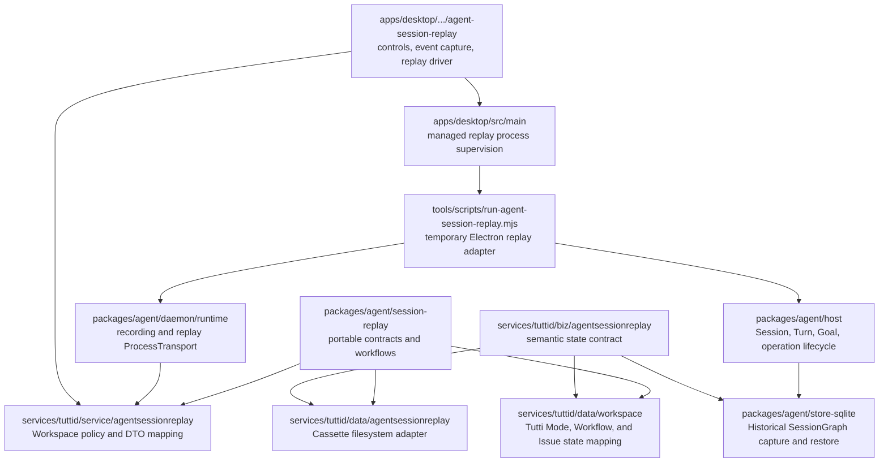
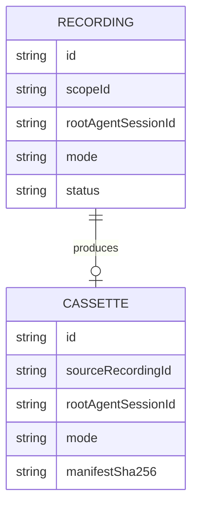
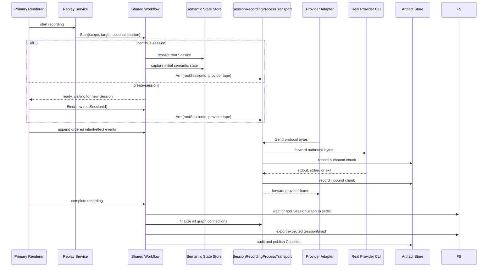
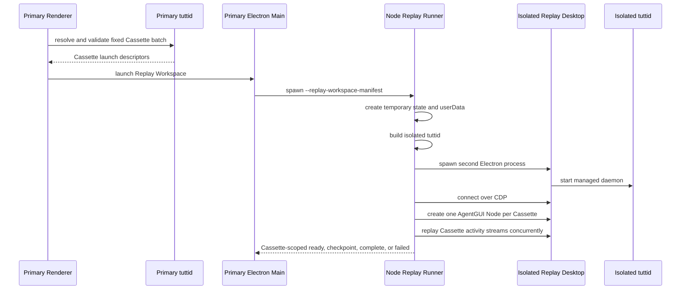
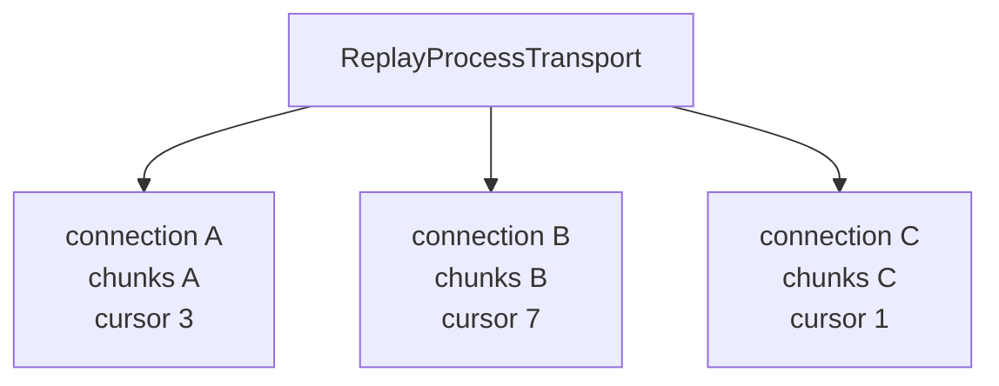
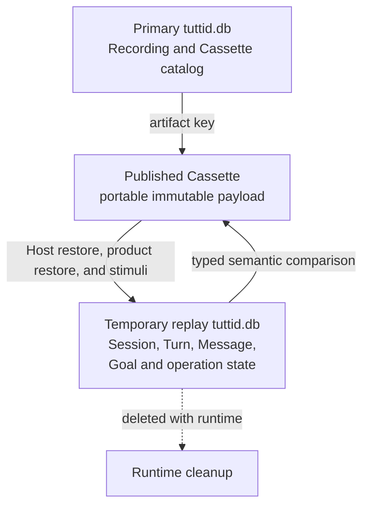

# Agent Session Replay

Agent Session Replay records one root Agent Session graph and re-executes it in
an isolated Desktop runtime. Replay keeps the real renderer activity engine,
daemon HTTP handlers, Agent Host, runtime controller, and provider adapter. It
replaces only the provider process transport with a deterministic cassette
transport.

This makes Replay a deterministic regression harness for recorded Session
graphs. One Replay Workspace may execute a fixed batch of distinct Cassettes
concurrently while preserving one transient Replay Surface per root Session.
It is not a semantic provider mock or a prompt-to-response lookup table.

## Architecture review

The current boundary is sound for its developer-testing purpose:

- Replay crosses the real UI, HTTP, Host, runtime, and provider-adapter
  boundaries. It catches regressions that an adapter-level fake would hide.
- Provider traffic is intercepted below the adapter. The adapter must emit the
  same outbound protocol before recorded inbound frames are released.
- The Cassette is portable and immutable. Explicit inventory, hashes, and size
  limits prevent accidental inclusion of a database, logs, credentials, or an
  entire Workspace.
- The replayed Desktop, daemon, SQLite database, and Electron `userData` are
  isolated from the primary Desktop.
- Verification has three independent layers: renderer command effects,
  provider protocol traffic, and final durable SessionGraph state.
- Recording is mutable; Cassette is the only persistent Replay artifact.
  Playback and verification state exist only in the transient runtime.

The main constraints are also explicit:

- One Cassette describes exactly one root Session graph. One Replay Surface
  executes exactly one Cassette. One Replay Workspace may contain multiple
  Surfaces.
- The JavaScript runner is a temporary, development-checkout-only Electron
  adapter. It builds an isolated daemon and drives the replay surface through
  CDP.
- Screenshot evidence is interaction-driven: replay scenarios use CDP to click
  the real disclosure buttons in the rendered AgentGUI. Shared transcript
  components do not receive replay-only expansion state or default-open tool
  cards, so ordinary sessions retain their local disclosure state and cost.
- Protocol matching is intentionally strict. Benign changes in startup probes,
  message ordering, or serialized protocol shape can invalidate existing
  Cassettes.
- Cassette corruption and tampering are detected with hashes, but Cassette
  contents are not signed or encrypted. Recording projects known structural
  account and path fields before persistence; prompts, provider output, and
  referenced attachments remain user-authored content and may contain private
  data.
- Replay verifies deterministic behavior, not live provider availability,
  credentials, model service behavior, capability discovery, usage counters, or
  visual pixel output.

If Replay becomes a packaged product capability, the temporary runner and its
CDP/process handshake should be replaced with a supported Desktop-owned replay
runtime adapter. Multiple Sessions do not require a multi-root Cassette:
Replay Workspace composes multiple existing single-root Cassettes and keeps
their checkpoints, playback, verification, and failure outcomes independent.

## Ownership



The shared core owns:

- `Recording` and `Cassette` identities and transitions
- one-active-Recording workflow
- Cassette schema, file allowlist, integrity checks, and size policy
- ordered Activity Event validation, Replay Checkpoints, vector cursors,
  logical subjects, triggers, readiness predicates, and fingerprints
- provider-neutral ports for semantic state, artifacts, process capture, and metadata
- fixed-batch Cassette validation and artifact resolution for product runtimes

Tutti owns:

- Workspace scope and the controlled `local:codex` / `local:claude-code`
  recording target policy
- exclusive creation of the transient Replay Workspace during semantic runtime
  preparation; the developer runner supplies identity and artifacts but does
  not pre-create that Workspace in SQLite
- typed Tutti Replay State capture, merge, restore, and comparison
- candidate and published Cassette directories
- daemon HTTP APIs and runtime composition
- Electron launch, supervision, controls, status, and product UI

The Tutti repository owns only the generic developer runner. QA case metadata,
external scenario modules, scenario fixtures, qualified Cassettes, and evidence
live together in the `tutti-agent-session-replay-cases` repository. Record mode
loads the selected case module through `--scenario-file`; adding a case must not
change a Tutti-owned scenario registry.

Agent Host continues to own Session, Turn, Goal, and runtime-operation
lifecycle. Replay changes the runtime composition; it does not add alternate
lifecycle semantics to the Desktop or replay service.

## Domain model



A `Recording` is mutable and produces zero or one Cassette. Canceling removes
its candidate and metadata. An interrupted Recording becomes `incomplete`.
Deleting an inactive Recording removes both its metadata and its candidate or
published Cassette; active Recording deletion fails closed.

A `Cassette` is a portable artifact. Its replay payload is immutable. Renaming
changes only its user-visible name and the corresponding manifest hash.
The primary Desktop recording list may reveal a completed Cassette in Finder.
Desktop main resolves the validated Cassette directory through tuttid; the
renderer never constructs or submits an arbitrary filesystem path.

A `Replay Workspace` is one isolated Electron window, renderer, daemon, and
SQLite database containing one transient Replay Surface per Cassette. It is runtime
composition, not another durable product Workspace and not a multi-root
Cassette.

Replay Workspace aligns every cassette's Activity clock to the earliest first
Activity timestamp in the batch. This preserves the wall-clock offset between
cassettes that were recorded concurrently. Realtime playback therefore keeps
cross-Session ordering scenarios deterministic; fast-forward may intentionally
skip elapsed waits while retaining each cassette's Activity order.

Scenario screenshot settling remains limited to stable checkpoints by default.
A scenario may opt into immediate `turn.working` settling with
`settleForWorkingScreenshot: true` when it performs bounded DOM assertions for
a transient cross-Session state; tool-start checkpoints remain excluded.

After a Replay Workspace creates its Replay Surfaces, Desktop applies the
Workbench balanced layout to exactly those AgentGUI Nodes. A single Surface
receives the Workbench safe-area frame without locking the layout. A batch with
multiple Surfaces locks the balanced layout so the existing Workbench engine
keeps them non-overlapping and recomputes their frames when the available
surface changes; unrelated Workbench Nodes are not included.

Cassette schema v7 is a direct breaking artifact contract and rejects older
Cassettes. SQLite migration IDs remain immutable: replay catalog changes still
use ordered forward migrations and must upgrade existing databases.
The manifest `stateFormat` identifies the product semantic codec; Tutti accepts
only `tutti.agent-session-replay-state.v1`.

The manifest also owns `replayPrerequisites.composerDefaults`: model,
permission mode, reasoning effort, and speed. Replay restores these portable
values into each `create-session` Cassette's Session-creation input before it
starts Electron. This keeps concurrent Replay Surfaces independent when
Cassettes for the same Agent Target recorded different defaults. Replay never
uses a recording scenario file or a Cassette name to recover composer
defaults.

## Recording flow

Recording captures two related timelines:

1. renderer activity events that reproduce external user and UI-driven actions;
2. provider process frames that reproduce the provider protocol.

The expected Tutti Replay State is a third artifact used as the final oracle.
The deterministic scenario runner may prepare a settled existing Session before
arming recording. That setup is excluded from both captured timelines; selecting
the prepared Session makes the recording `continue-session`, and its settled
graph becomes `initial-state.json`.



### Activity events

Schema v7 stores one ordered `activity-events.jsonl` stream:

- `intent` is dispatched into the real isolated renderer activity engine.
- `effect` verifies the command result produced by that engine. It references
  its causing intent by stable event ID.
- `direct-stimulus` calls the isolated daemon for a recorded API/CLI caller
  path that did not traverse the activity engine. Engine-origin requests carry
  provenance and suppress the duplicate direct event.

The renderer recorder observes the Workspace `AgentSessionEngine` boundary.
Reducer-generated follow-up intents are not recorded again. The
per-interaction-type behavior contract — allowed effects, requiresEffect,
correlation extraction, alternate correlation rules, stable effect fields,
replay commandId materialization, timestamp rebase, and readiness predicates —
lives in one renderer registry
(`agentSessionReplayInteractionContract.ts`) kept in sync with
`packages/agent/session-replay/activity-contract.json`. Recording is
fail-closed: a replayable command whose cause cannot be resolved from recorded
intents, or that is still awaiting its result, accumulates a recording defect
and seal fails with an actionable error instead of publishing a broken
Cassette. Only registry-declared engine-internal continuations (for example
activation and prompt-precondition settings commands) are deliberately skipped.

`submit/requested` records queue admission on
`payload.submitDiagnostics.queued` before the intent is observed: auto submits
that remain in the composer queue stamp `queued: true`, while immediate drains
stamp `false`. The temporary Electron runner waits for session idle before a
submit only when that submit caused a send/activate effect (or is otherwise an
immediate drain). Busy-queue submits must not wait for idle — the active turn
is why they were queued, and idle arrives only after later tape actions such as
edit, remove, or send-now.

### Provider frames

`SessionRecordingProcessTransport` wraps the normal local process transport.
It can attach to existing connections and future connections belonging to the
selected root Session graph. Completing a Recording detaches capture without
closing the live provider processes.

Each process connection is recorded as an ordered chunk stream:

```text
outbound -> stdout -> stdout -> outbound -> stderr -> exit
```

Each chunk carries:

- `connectionId`
- per-connection `chunkSeq`
- tape-wide `globalSeq`
- elapsed time from that connection's capture start
- kind and encoded bytes

Replay keeps causal provider traffic strict, but declared observer-only RPCs
such as `thread/read` and `thread/goal/get` may be absent because renderer
observation timing is not part of Agent behavior. Their paired responses are
suppressed, and a causal outbound frame may immediately preempt an expected
observer RPC. All other frame order and payload matching remains fail-closed.

The connection manifest records provider, Agent Session identity, root Session
identity, launch ordinal, a portable working-directory token, and an explicit
`captureOrigin`:

- `process-start` means capture began with a newly launched provider process;
  replay performs the normal initialize and session/thread bootstrap.
- `attached-live-connection` means capture attached after that provider
  connection was already initialized; the semantic initial state carries only
  the Session's portable `providerResumeCheckpoint`, replay restores it into
  the canonical runtime context, and the adapter begins with the first
  captured business request.

Provider tape schema v4 requires this field and rejects older tapes. Replay
does not infer connection state from the first frame because an outbound
business request cannot prove which initialization state produced it.
The checkpoint is part of Host historical-state capture/restore so every Host
consumer resumes with the same provider-neutral recovery contract. Full
provider runtime context remains excluded because it contains diagnostics,
account state, quotas, and machine-local paths.

Claude SDK input-unit buffering is enabled only for process connections that
provide the recording/replay completion barrier. A normal live connection
continues to decode complete NDJSON messages directly from its bounded byte
buffer without allocating the Replay input-unit queue.

### Recording portability projection

Recording forwards the original Provider frame to the live adapter, but writes
a projected copy to `provider/frames.jsonl`. Provider tape schema v4 requires
`projectionVersion: 1`; replay and publication reject an older or unprojected
tape.

Projection is protocol-aware and stateful:

- Codex uses the `json-rpc` tape codec. Claude Code uses the distinct
  `claude-sidecar-ndjson-v7` codec for versioned sidecar envelopes; both retain
  the original process chunk boundaries and decode complete protocol messages
  before matching or checkpointing;
- a correlated `account/read` response replaces only
  `result.account.email` with `replay-user@example.invalid`;
- recognized path fields equal to or below the recorded working directory use
  the connection's portable CWD token;
- recognized path fields below the Provider-managed home (for Codex,
  `CODEX_HOME`, before the process HOME) use `${REPLAY_HOME}` and resolve
  against the matching isolated replay Provider home; this includes native
  image-generation `savedPath` and `savedPaths` output;
- a `turn/start` generated by a Plan decision projects its runtime-derived
  `clientUserMessageId` to `plan-decision:<runtime-operation>`; replay applies
  the same projection before matching, while ordinary submit identities remain
  exact;
- Claude `start.payload.env` is excluded as a whole. It contains credentials
  and machine-local launch preparation, while isolated Replay replaces the
  process transport and must not compare or restore those values. The replay
  runtime supplies a per-Session `CLAUDE_CONFIG_DIR` under `${REPLAY_HOME}`;
- Claude envelope IDs and runtime-generated Session, Turn, prompt-correlation,
  and goal-operation identities are matched structurally. Recorded inbound
  values are rewritten only when the product creates the corresponding replay
  identity. `providerSessionId` is match-only on the outbound `start` request:
  the recorded `session_started` value remains the Provider-owned semantic
  Session identity;
- credential-bearing login/token-refresh methods, remaining structured
  credentials/account identifiers, and unclassified absolute paths fail
  recording closed;
- protocol messages split across transport chunks are decoded as one message,
  then anchored back to the original completion frame so v7 Provider Input Unit
  cursors do not move.

Activity Event recording applies the same rule at its product boundary.
The renderer-origin `activation/requested` intent and the Engine-origin
`session/activate` effect project `payload.cwd` to `${REPLAY_CWD}`, an
in-tree `railPlacement.projectPath` to a token-relative path, and the
`project:<path>` forms of `railPlacement.sectionKey` and `railSectionKey` to
`project:${REPLAY_CWD}...`. API-origin `session.create` direct stimuli use
the same structural projection. Activation image blocks in `content`,
`runtimeContent`, and `initialContent` replace only their state-owned
temporary asset path with inline bytes. Replay resolves only these explicit
structural fields against its isolated Workspace. Ordinary prompt, display,
and Provider text is never searched or rewritten by a global regular
expression.

Replay resolves every portable anchor against one directory. The runner
resolves activity-event payloads against the repository workspace root and
passes the same root to the daemon through `TUTTI_AGENT_SESSION_REPLAY_CWD`;
the daemon uses it both to restore portable initial-state Session bindings
and to resolve the expected Session binding (cwd, rail project path, rail
section key) that `project.binding` checkpoint readiness compares against
canonical Sessions. Without the override the daemon falls back to its process
cwd, which desktop launchers may set to `apps/desktop` rather than the
workspace root.

## Cassette layout

```text
cassette/
├── cassette.json
├── activity-events.jsonl
├── initial-state.json           # continue-session only
├── provider/
│   ├── manifest.json
│   └── frames.jsonl
├── expected-state.json
└── blobs/
    ├── manifest.json
    └── sha256/
        └── <digest>
```

The allowlist and limits come from
`packages/agent/session-replay/cassette-policy.json`. Current limits are:

| Item                        |   Limit |
| --------------------------- | ------: |
| Decoded provider frame      |   8 MiB |
| Stored provider tape        | 256 MiB |
| Referenced blob             |  20 MiB |
| Complete Cassette inventory | 384 MiB |

Publication rejects every unrecognized file. `cassette.json` inventories the
portable files with their role, size, and SHA-256. It does not contain an
absolute local artifact path or depend on the source database.

The blob manifest has two explicit kinds. `agent-prompt-attachment` restores a
prompt image under `agent/attachments/<session>/`.
`agent-generated-image` restores a native generated-image output under the
same Session's isolated Provider home using a safe
`generated_images/...` relative path. Expected semantic state and Provider
frames retain only `${REPLAY_HOME}/generated_images/...`; the content-addressed
blob supplies the actual bytes before replay starts.

## Managed replay launch

The primary window does not create another `BrowserWindow` inside its Electron
process. It launches a second complete Desktop process.



The primary Renderer creates one opaque `launchId` and one fresh transient
Replay `workspaceId` for this prepared batch.
Main uses `launchId`, not the product `workspaceId`, as the runtime supervision
identity. Separate Replay batches for the same product Workspace therefore do
not share admission or process state. Main keeps launch and playback state only
for the lifetime of the managed runtime.

The isolated runtime lives under:

```text
.tmp/agent-session-replay-*/
├── state/
│   └── tuttid.db
├── electron-user-data/
├── tuttid
├── replay-control.json
├── replay-status.json
├── artifacts/
└── logs/
```

The runner supplies separate `TUTTI_STATE_DIR`,
`TUTTI_DESKTOP_USER_DATA_DIR`, daemon address, access token, and remote
debugging port. It also enables replay transport with
`TUTTI_AGENT_CASSETTE_MODE=replay` and passes the fixed Cassette/root Session
bindings through
`TUTTI_AGENT_SESSION_REPLAY_REGISTRATIONS`.
Before a Replay Workspace starts, the runner migrates its empty database
without creating the transient Workspace, reconstructs each portable Project
placement from the Cassette's expected Session state, and seeds the deduplicated
`user_projects` rows. The semantic runtime remains the exclusive Workspace
creator; the project rows only make the canonical project Rail sections
queryable when their Sessions are restored or created.
The developer runner also copies a valid Tutti account session from
`~/.tutti-dev/account/auth.json` into the isolated state directory. This keeps
authenticated host and connector-market paths available without sharing the
primary daemon database. `TUTTI_AGENT_SESSION_REPLAY_HOST_ACCOUNT_AUTH` selects
a different source file, and `TUTTI_AGENT_SESSION_REPLAY_SKIP_HOST_ACCOUNT_AUTH`
disables the copy. A missing or invalid source is a soft skip for CI and
machines without a login. The temporary copy is written with owner-only
permissions, is never included in a Cassette, and is removed with the runtime.
Provider preparation, auth watching, availability probes, provider CLIs, and
provider network requests remain disabled during Replay.
For a managed multi-Surface launch, Main passes one temporary Surface-status
handoff to the isolated Desktop. Single-Surface developer replay uses the same
Cassette identity without creating durable execution metadata.

Startup failures cross the nested process boundaries as a structured
`{code, message}` cause. The isolated Desktop attaches bounded daemon stderr to
its startup error, the runner forwards that cause in each Cassette-scoped
`failed` event, and primary Main stores it with the Surface status. Product UI
shows the cause message while retaining the outer error as diagnostic context;
it does not parse a preferred line from combined process logs.

The temporary runtime is removed after its process closes unless the CLI runner
was invoked with `--keep-runtime`.

## Replay execution

Replay Workspace starts with one new migrated database. Before normal Host
recovery, the daemon validates and merges every `continue-session`
`initial-state.json`; `create-session` Cassettes have no initial state.
Identical shared semantic objects are idempotent. Conflicting content rejects
the whole batch before playback.

Each launch creates a new transient Workspace ID. Activity Events, semantic
states, and Cassette manifests contain no source Workspace ID. Daemon restore
binds the transient identity at persistence boundaries, and Activity execution
injects it only into the product event envelope. Replay never searches and
replaces UUID strings inside prompts,
payload JSON, tool output, or other user content. Cassettes recorded in
different source Workspaces may therefore share one Replay Workspace.

```mermaid
flowchart LR
  Tape["Cassette activity event"]
  Engine["Real renderer<br/>Activity Engine"]
  Command["session/activate, queue/sendPrompt,<br/>or another engine command"]
  HTTP["Isolated daemon HTTP"]
  Host["Real Agent Host"]
  Controller["Real runtime controller"]
  Adapter["Real Codex adapter"]
  ReplayTransport["SessionReplayProcessTransport"]
  Players["N ReplayProcessTransport players"]
  ProviderTape["N provider/frames.jsonl tapes"]

  Tape -->|intent| Engine
  Engine --> Command
  Command --> HTTP
  Tape -->|direct-stimulus| HTTP
  HTTP --> Host
  Host --> Controller
  Controller --> Adapter
  Adapter --> ReplayTransport
  ReplayTransport --> Players
  Players <--> ProviderTape
```



The isolated composition injects exactly one top-level
`SessionReplayProcessTransport`. It routes by `RootAgentSessionID` to one
existing `ReplayProcessTransport` per Cassette. An unregistered root fails closed.
The isolated composition disables real provider preparation, command
resolution, auth watching, and availability probing. No provider CLI is
started, and no provider network request is made.

### Connection selection and cursor matching

Replay is not `prompt -> response`. It is a deterministic protocol state
machine.

When an adapter starts a process connection, `ReplayProcessTransport` selects a
recorded connection using:

```text
AgentSessionID + Provider + LaunchOrdinal
```

The newly replayed root Session may map to the single unconsumed recorded root
connection with the same provider and launch ordinal. Root ownership is then
checked for every selected connection.

Each selected `replayProcessConnection` owns its own chunks and cursor:



`Send` may advance only an `outbound` chunk. The actual bytes must equal the
recorded bytes. JSON protocol messages may compare after the explicit
recorded-CWD to replay-CWD mapping. A mismatch fails the connection.

`Recv` may release only an inbound or exit chunk. If the cursor points at an
unconsumed outbound chunk, `Recv` waits for the adapter to send it. Inbound
frames are released according to recorded elapsed time, playback speed, pause,
and fast-forward state.

Therefore:

- Session identity selects a connection tape at process start.
- The per-connection cursor selects the next frame after start.
- Protocol bytes prove that the real adapter reached the same state.
- Recorded ordering, not prompt semantics, determines which output follows.

For Codex, one root Tutti Session owns at most one live app-server process at a
time, and one app-server process has one `ProcessConnection`. Restarting it
creates another connection distinguished by launch ordinal. Provider-native
child Sessions may share the root app-server connection.

## Storage boundaries



The primary database stores Recording and Cassette catalog metadata. It stores
no playback execution, checkpoint, status, or verification history. Cassette
rows are rebuildable catalog entries for published artifacts.

The isolated database stores the real replayed canonical state. It never reads
or mutates the source user database.

The root Session ID is currently preserved:

- `create-session` passes the recorded root ID explicitly to the isolated
  create API.
- `continue-session` restores `initial-state.json` through Host and
  product-owned semantic state adapters.

Replay-generated child Session, Turn, Message, and operation identities may
differ. Final verification alpha-normalizes structural identities while
preserving their relationships, then reports the first mismatching typed
semantic path.

Turn-scoped direct stimuli must also use the identities generated by the
current Replay runtime. The runner derives recorded Turn order from
`expected-state.json`, excludes Turns already present in `initial-state.json`,
and binds each newly observed active or latest Turn to that order. Cancel,
interactive-response, and plan-decision stimuli rebase only through this
explicit mapping. An unresolved mapping fails closed instead of targeting an
arbitrary active Turn or weakening Host's exact Turn lifecycle semantics.

For provider-native children, the runner reads the canonical root detail and
binds each recorded child to a Replay child only when kind, root, parent
Session, parent Turn, and parent tool-call lineage agree. Child Turn and
Interaction stimuli then rebase through that child binding. A root-only list or
an active-Session heuristic is not sufficient evidence to target a child.

## Checkpoints and controls

Schema v7 requires `checkpoint-plan.json`. Checkpoint zero is the bootstrap
semantic state. Later checkpoints use an Activity-boundary or
Provider-observation Trigger and a vector Replay Cursor over the Activity lane
and every recorded Provider connection.

A checkpoint is reached only after all lanes equal that cursor, its trigger
position and fingerprint match, the complete opening Provider Input Unit batch
has committed, and every canonical Readiness Predicate holds. A correlated
Activity intent and effects remain indivisible.

Provider-observation checkpoints take their provider cursor from the
observation lane: the last unit that carried checkpoint observation events.
Activity-boundary checkpoints must instead cover every Provider Input Unit the
daemon had already handled when the activity effect committed, because units
can settle canonical state without emitting observations (a canceled
compaction turn's interrupted completion is the known case). The recorder
therefore merges the transport-reported handled lane into activity-boundary
cursors; a cursor that stops short would make the checkpoint's own readiness
unsatisfiable and deadlock the replay input barrier against the daemon's next
recorded outbound send.

Readiness predicates compare in the canonical store vocabulary. Provider
observations describe turns and calls in the activity-layer vocabulary
(`working`, `waiting_approval`, `waiting_input`, ...), while canonical turns
persist the closed phase set and an approval-waiting call is still a running
call. Recording folds `turn.phase` predicate values to the canonical set when
it writes the plan, and replay readiness folds both sides again so plans
recorded before that fold stay replayable.

Provider observations never publish runtime Session, Message, Turn, Call, or
attachment IDs as portable identity. Replay instead assigns every checkpoint
subject an Entity Address from the immutable Cassette fact that introduced it:
the recording root, a structural path in `initial-state.json`, an ordered
Activity Event, or an exact Provider observation position. Runtime and
canonical IDs are process-local bindings to those addresses and never require
child-Session or Message ordinal columns in the product database. The recorder
waits for the matching canonical commit before confirming a Provider
observation. Replay rebuilds the same address bindings from the Cassette start
and uses exact Host queries plus the recorded observation fingerprint before a
checkpoint can become ready. When a turn's terminal observation is the first
observation available to a replay binding, its address still uses the turn's
recorded birth observation so started and terminal fingerprints remain stable.

Compaction notices normalize to provider-neutral `compaction.updated`
observations using the canonical system-notice command and status. Attachment
observations expose only the attachment count; a multi-attachment checkpoint
contains one exact logical attachment subject and readiness predicate per
canonical content attachment. Their commit correlations require the matching
canonical Message mutation and sanitized attachment count.

Desktop reports the stronger runtime-only Inspectable Checkpoint after the
exact AgentGUI Surface is mounted, its logical Session is selected, current
detail is hydrated, and the renderer has observed the canonical version that
satisfied readiness. Scenario-owned Inspection Steps may inspect presentation
but never repeat a recorded business stimulus.

The temporary Surface checkpoint moves only forward while its runtime is open.
Pause, resume, speed, and forward checkpoint movement are Cassette-scoped
within that runtime.
Next-checkpoint temporarily fast-forwards but still consumes every activity
event and provider frame that the target cursor authorizes. When that target
lands in manual mode, both provider frames and future Activity stimuli pause
again—including a recorded approval or interactive response that shares the
same activity cursor as the pending Interaction checkpoint. The next stimulus
waits for another next-checkpoint or resume. Duplicate next-checkpoint while a
seek is already in flight only acknowledges the control revision. The temporary
runner's `--screenshot-checkpoints` flag captures a PNG under the isolated
runtime `artifacts/` directory after each inspectable checkpoint (one Cassette
uses `checkpoint-NNNN.png`; a Replay Workspace nests files as
`<cassetteId>/checkpoint-NNNN.png`). Screenshots remain diagnostic and are not
Cassette success oracles.

Replay launch chooses one transient playback mode for the fixed batch.
Automatic mode starts every Cassette normally. Manual mode advances each
Cassette only to its first inspectable checkpoint, pauses provider frames and
future Activity stimuli there, then reports the Surface ready. This is a launch
parameter carried into the isolated runtime, not a renderer-issued Pause after
the window opens.

Replay controls are forward-only. Previous-checkpoint and restart are not
exposed because moving backward would require replacing the isolated runtime
or mutating restored SessionGraph state behind Host.

The two replay timelines share daemon-owned playback time. The runner uses
`replay-control.json` and `replay-status.json` so pausing stops both provider
frames and future business stimuli. The Surface's total duration is the maximum
of the provider tape elapsed time and the final activity-event offset from
Recording creation; it is derived while loading the Cassette and is not a new
durable Cassette field.

The Replay Surface may mount before its provider transport or Cassette-scoped
Surface status has started. A transport error or inactive status read is
therefore transient while the Node remains bound to its Cassette; the renderer
keeps polling and publishes controls once both Surface status and transport
playback are available.

Replay renderer machinery is replay-runtime-only. Desktop preload exposes a
synchronous replay-runtime flag derived from `TUTTI_AGENT_CASSETTE_MODE=replay`,
and `WorkspaceWorkbench` mounts the replay driver binding, workspace bridge
binding, coordinator, and coordinator context only when that flag is set. A
normal workspace window constructs no replay coordinator and installs nothing
on `globalThis`; its renderer activity-event recorder tap exists only between
recording start and the matching seal or discard.

In an OS-mode Replay child renderer, `WorkspaceWorkbench` owns one transient
Workspace coordinator instance. Child binding remounts reuse that
window-lifecycle instance; no `globalThis` registry retains coordinators after
the window is released. The installed Replay bridge owns one run: disposal
unregisters its Cassettes and resets bindings before another batch may
bootstrap. Canonical hydration observations live only on those Cassette
bindings, so a later replay of the same Session ID starts at version zero and
cannot satisfy readiness from an earlier run.

Replay Workspace chrome does not mount the automatic external Agent-history
import prompt. Normal Workspace and standalone Agent windows keep their
existing prompt behavior, and manual import remains available from settings.

## Verification

Replay succeeds only after all of these checks pass:

1. **Cassette validation** verifies schema v7, replay prerequisites, checkpoint-plan structure,
   allowlisted inventory, sizes, and
   SHA-256 evidence.
2. **Renderer effect verification** confirms that dispatched intents produce
   the recorded command result.
3. **Outbound protocol verification** confirms that the real provider adapter
   writes the recorded bytes in order.
4. **Transport completion** confirms that every recorded connection was
   selected and every connection cursor drained without mismatch.
5. **Durable state verification** asks the daemon to capture actual typed
   semantic state and compare it with `expected-state.json` at an exact path.

The semantic contract never includes database rows or columns, Workspace IDs,
timestamps, local paths, provider-discovered runtime context, capability
catalogs, usage counters, worker bookkeeping, or opaque runtime-operation IDs
derived while confirming a plan. Plan-decision Message provenance remains
visible through a stable portable marker; ordinary user `clientSubmitId`
values remain exact. A canceled Turn also excludes its final-assistant
completion watermark because provider tail frames can race cancellation
settlement; its Messages and any remaining completed-command kind/status stay
strict.

Screenshots and logs are diagnostic artifacts. They are not success oracles and
do not enter the published Cassette.

## Failure and recovery behavior

- Any provider outbound mismatch fails closed; Replay never falls through to a
  local provider process.
- Replay rejects a Session process launch that has no matching recorded
  connection.
- A non-Session process launch is rejected in replay composition rather than
  escaping to the normal local transport.
- If recording is interrupted, the candidate is discarded and the Recording
  becomes `incomplete`.
- A Surface failure after its target Session becomes visible keeps the shared
  Replay Workspace open while other Surfaces continue.
- Multi-Surface replay stimuli remain concurrent, but final Surface activation
  and readiness reporting are serialized because only one AgentGUI Surface can
  remain active while its mounted and hydrated state is confirmed.
- Main supervises the runner and keeps Cassette-scoped runtime milestones in
  memory and temporary status files only.
- A Cassette-scoped child failure is logged by Main with the child diagnostic,
  launch ID, Cassette ID, and Workspace ID even when the shared child process
  exits successfully after reporting that failure.
- Closing the Replay Workspace discards all playback state before the primary
  daemon stops.
- The primary renderer treats `surface-ready` as launch success. Later
  completion or failure is diagnostic runtime state, not durable metadata.

## Current extension limits

### Replay Workspace batch

The initial batch is fixed before the isolated daemon starts. Cassettes and
root Session IDs must be unique within the batch. Adding a Cassette online is
deferred because
`continue-session` import changes canonical Session creation and recovery and
must first gain an explicit Agent Host capability.

Each Cassette keeps one `rootAgentSessionId`, activity timeline, expected
SessionGraph closure, and checkpoint sequence. Multiple roots are composed as
multiple Cassettes and Surfaces; they are never merged into one scenario contract.

### Provider support

The shared core is provider-neutral. Tutti accepts `local:codex` and
`local:claude-code` for developer recording. Codex is replayed through its
JSON-RPC adapter; Claude Code is replayed through the version-7 sidecar NDJSON
adapter. Both require projected-tape publication audit, exact outbound
verification, decoded Provider Input Unit barriers, isolated Provider homes,
and no fallback to a live Provider after a mismatch.

Claude permission mode, model, reasoning effort, and speed remain strict
composer prerequisites or sidecar request fields. Resume cursors remain strict
Provider data. Tool calls, approval requests, cancel, and background-task
events use the same ordered NDJSON tape, but each new qualified scenario must
still prove its own semantic checkpoints before its Cassette is accepted.
Adding any further provider requires equivalent capture, portability, audit,
input-unit, and deterministic fail-closed playback evidence.

### Productization

The current managed launcher requires a repository checkout, Node runner,
daemon build toolchain, CDP, and a second Electron process. It is suitable for
development and regression diagnosis. It is not yet a packaged end-user
runtime.

## Related documents

- [ADR 0010: Agent Session Replay boundary](../adr/0010-agent-session-replay-boundary.md)
- [Agent GUI Node](./agent-gui-node.md)
- [Agent Host contracts](../../packages/agent/host/README.md)
- [Agent Session Replay core](../../packages/agent/session-replay/README.md)
- [Local State Storage](../conventions/local-state-storage.md#developer-agent-session-cassettes)
- [Testing](../conventions/testing.md#25-developer-cassette-replay)
