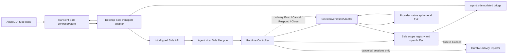

# Agent Side Conversations

Side is a runtime-only branch of a live Agent session. It is deliberately not
Session Fork:

| Property | Session Fork                                | Side                                             |
| -------- | ------------------------------------------- | ------------------------------------------------ |
| Identity | canonical child Session                     | runtime-scoped side id                           |
| Storage  | durable history and lineage                 | no canonical writes                              |
| Boundary | full session or settled Turn                | live provider snapshot, including an active Turn |
| Recovery | saga recovery and provider resume           | expires when its provider process is lost        |
| Events   | optimistic stream plus committed projection | transient stream only                            |

## Standard provider contract

A provider integrates Side by implementing `SideConversationAdapter` together
with `LiveSessionProbeAdapter`:

1. `SideCapabilities` attests support for the exact selected runtime.
2. `OpenSide` creates the provider-native ephemeral branch and returns its
   provider session id.
3. `OpenSide` quiesces callbacks and releases any child it created before
   returning an error.
4. The ordinary `Adapter` methods provide Exec, Cancel, and Close after open;
   interactive Side flows additionally use `InteractiveAdapter`.

The Controller owns scope isolation, open reservation/buffering, idempotency,
transient event routing, lifecycle reuse, cleanup, and the prohibition on
durable reporting or automatic resume. Agent Host owns the product lifecycle
entry points and keeps Side separate from canonical submit/cancel sagas.
Open holds the source and Side lifecycle identities in stable order until the
provider snapshot is committed or rolled back, so source close cannot overtake
the live fork.
In particular, Side never consumes or repairs the durable
canonical-Turn-to-provider-Turn binding used by Session Fork. Its
`clientSubmitId` is transient provider/event correlation only and must not be
paired with a canonical submit occurrence.

The Side runtime is an optional, provider-neutral AgentGUI port. Desktop
injects a factory, and each mounted embedded or detached AgentGUI surface owns
and disposes one runtime instance. AgentGUI does not branch on provider names:
it probes the selected live session and exposes `/side` only when the runtime
reports support. The Side pane and its messages live in a separate external
store; they are never dispatched to
`AgentSessionEngine`, never appear in the conversation rail, and are discarded
on explicit close, owning-surface disposal, or event-stream disconnect. A
typed `/side` remains an isolated Side intent even while capability resolution
is pending or unsupported; it must never fall through to the canonical main
conversation submit path.
Once capability discovery has enabled the command, AgentGUI enters the local
`opening` state and renders the Side shell immediately; it does not repeat the
capability RPC before opening. An empty Side renders a dedicated temporary-
conversation explanation while the provider fork completes and before the
first local Turn.

The service boundary is generated from OpenAPI and exposes resolve, open,
send, exact-turn cancel, interactive response, and close operations. Live
events use the workspace-scoped `agent.side.updated` topic with source/Side
identity and a Side-local monotonic sequence. AgentGUI consumes the generated
discriminated payload union directly, and transport adapters must expose
current connection state plus connection-state subscription. The canonical
`agent.activity.updated` bridge is not registered as the Side observer.

## Codex reference adapter

Codex uses the source-owned app-server connection and sends:

1. `thread/fork` with `ephemeral: true`, `excludeTurns: true`, no
   `lastTurnId`, and Side-specific developer instructions composed with the
   source thread's latest Tutti-owned host context.
2. `thread/inject_items` on the returned child thread to insert a model-visible
   Side boundary.

`excludeTurns` hides inherited Turns from the Side-local response and UI; it
does not remove them from the provider fork's model context. Subsequent Side
Turns keep both the inherited Tutti host context and the Side-specific
instructions in their collaboration settings.

The connection has a thread-aware router and is referenced by both runtime
sessions. Notifications for a new child that arrive before `thread/fork`
responds are buffered in a provisional route and replayed only after lineage
validation and Side registration. Closing Side unsubscribes the ephemeral
child and drops only the Side reference; it does not issue `thread/delete` and
cannot close the live parent connection. Losing the shared connection produces
`ErrSideConversationExpired`; Side is never resumed as a canonical thread.

This change establishes the infrastructure, Codex reference vertical slice,
typed daemon API, and AgentGUI Side pane.
