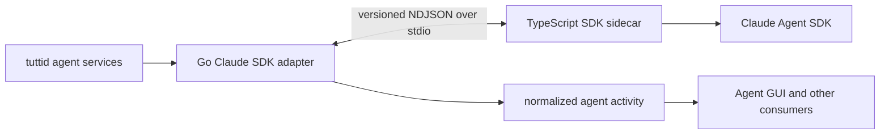

# Claude Code SDK Runtime

Claude Code has one supported runtime path: the daemon starts the
`@tutti-os/claude-sdk-sidecar` package, and the sidecar talks to the Claude Agent
SDK.

The product-fidelity and acceptance contract is maintained in
[Claude Code SDK Refactor Fidelity Requirements](./claude-code-sdk-requirements.md).

## Boundary



The public boundary is normalized agent activity and capability data. The GUI
must branch on capabilities or event semantics, not on the Claude Code provider
name. Claude-specific SDK messages, tool shapes, session cursors, and transport
details stay behind the daemon adapter and sidecar.

## Daemon ownership

The Go runtime under `packages/agent/daemon/runtime` is split by responsibility:

| Module                         | Ownership                                                |
| ------------------------------ | -------------------------------------------------------- |
| `claude_sdk_adapter.go`        | Adapter construction, shared state, and sink wiring      |
| `claude_sdk_lifecycle.go`      | Session start, resume, close, and live-session release   |
| `claude_sdk_execution.go`      | Prompt validation, execution, guidance, and cancellation |
| `claude_sdk_settings.go`       | Live settings and permission-mode application            |
| `claude_sdk_transport.go`      | Sidecar process and NDJSON transport                     |
| `claude_sdk_protocol.go`       | Protocol version and envelope validation                 |
| `claude_sdk_session.go`        | Session storage, command/env helpers, and state payloads |
| `claude_sdk_events.go`         | Sidecar event dispatch and lifecycle routing             |
| `claude_sdk_turn.go`           | Per-turn event lifecycle via shared `acpTurnNormalizer`  |
| `claude_sdk_activity.go`       | Conversion into normalized activity events               |
| `claude_sdk_live_state.go`     | Live message, task, and usage state reconciliation       |
| `claude_sdk_interactive.go`    | Approval and interactive prompt handling                 |
| `claude_sdk_goal.go`           | Goal and plan lifecycle projection                       |
| `normalized_session_events.go` | Protocol-neutral session activity projection             |

The descriptor selects the SDK runtime kind; these adapter modules own the
process/session lifecycle and normalization behind that selection. They must not expose
raw SDK envelopes to services or GUI packages. Service-layer provider catalogs,
composer profiles, targets, status probes, and identity projections consume the
same `ProviderDescriptor` instead of re-registering Claude Code locally.
Provider preparation may inject system-prompt and plugin paths that exist only
in the sidecar runtime filesystem. The Go adapter treats those environment
values as opaque and forwards them unchanged; `options.ts` reads and validates
the referenced files after the sidecar starts. Daemon code must not inspect
those paths because remote transports do not share its filesystem.
Claude modules do not call ACP _protocol_ helpers (session-update decoding,
standard ACP tool-call envelopes, and similar). Open tool-call bookkeeping and
turn `Finish*` settlement reuse the shared adapter turn lifecycle
(`acpTurnNormalizer`), the same entity Codex and standard ACP already use, so
cancel/fail/complete close dangling tool cards instead of leaving them
in progress. Protocol-neutral session and interactive activity projection have
their own modules, while Claude goal, command, usage, and interaction decoding
stay inside the Claude SDK boundary.
Claude Goal state comes only from provider-owned Goal observations. The
sidecar normalizes both SDK `active_goal` messages and native `/goal`
`goal_status` transcript attachments into one `goal_observed` event. Local
Claude Agent SDK `0.3.220` streams omit those attachment records from the
public `SDKMessage` iterator. The root `system/init` message supplies the
provider Session ID and cwd; `goalTranscript.ts` mirrors the pinned SDK's local
project-key algorithm to locate its JSONL. Restore starts from the already
known provider Session ID, while a generation-scoped `SessionStart` callback
can still supply the SDK-provided exact `transcript_path`. The reader consumes
only rows appended after observation began, drains once before the root result
settles, and continues following the file because Claude's native evaluator
may flush the final `goal_status` just after the SDK result. Starting at the
existing end of file prevents a restored session from replaying an old active
or completed Goal. A
non-null `active_goal` or `goal_status.met=false` keeps the condition active;
`goal_status.met=true` completes it. A null `active_goal` is interpreted as
explicit clear or completion using the exact command action and previous Goal
observation. Ordinary Turn completion has no Goal semantics.
Command-consumption evidence travels as the internal `goal.control_applied`
event to the Host Goal lane and must never be embedded in session runtime
context.
New normalized session updates use `sessionUpdateKind`; the former ACP-named
metadata key is accepted only while reading imported or durable historical
events.

Context usage is published only when the provider reports a context-window
limit or the live Session already has a provider-reported limit for the same
model. Token deltas from a new Session do not synthesize a 200k or 1M
denominator from the model name; AgentGUI keeps usage hidden until the first
authoritative window arrives. Restore/resume must not await that snapshot
before `session_started`: Host Resume/Send completes on the start handshake,
and usage may refresh asynchronously afterward.

Model selection preserves requested and resolved state separately. The model
config option's `currentValue` remains the user's selection, including
`default`, while `effectiveValue` is the concrete model reported by the
per-user SDK runtime. The sidecar begins consuming the Query after
`session_started` so the SDK's `system/init.model` can publish that fact before
the first prompt; root assistant messages continuously reconcile it. A live
switch back to `default` clears the previous effective value until the SDK
reports the newly resolved model. Hosts and renderers must not derive the
effective model from the advertised Default option's label or description.

Claude credential-sensitive operations share the process-wide gate owned by
`services/tuttid/service/claudecode`. Real session startup, hidden model
discovery, and `claude auth status` acquire this same gate. The AgentGUI's
initial provider demand only checks local availability; Anthropic usage is
queried after the user opens a usage surface or explicitly refreshes it.

Composer model discovery uses an account-level scope made from provider,
agent-target identity, and a non-secret auth fingerprint. It intentionally does
not include workspace or caller cwd for Claude Code, so switching workspaces
cannot create duplicate discovery processes. The process runs from the
daemon-owned discovery directory. A composer request waits at most 20 seconds,
but that wait does not cancel the SDK initialization: the background lifecycle
may continue for up to ten minutes so OAuth refresh state can be persisted.
Transient failures before a session starts remain retryable. Auth invalidation
marks in-flight results superseded and clears caches, but never closes a hidden
discovery session early; the original ten-minute lifecycle remains responsible
for teardown so credential refresh has time to finish persisting.
The descriptor's `CLAUDE_CONFIG_DIR` root override is honored consistently by
runtime endpoint discovery, status/custom-config inspection, and auth watching.

## Sidecar ownership

`packages/agent/claude-sdk-sidecar/src/main.ts` is only the stdio server and
request router. `sessionRuntime.ts` coordinates a session through focused
collaborators:

- `protocol.ts` and `eventSink.ts`: versioned wire envelopes and event emission.
- `sessionConfiguration.ts`, `sessionSettings.ts`, and `options.ts`: SDK query
  configuration and mutable session settings.
- `promptQueue.ts` and `turnLifecycle.ts`: prompt ordering and turn ownership.
- `goalExecQueue.ts`: queued Goal command ordering and supersession.
- `goalProjection.ts` and `goalTranscript.ts`: provider Goal normalization and
  narrow recovery of SDK-omitted transcript evidence.
- `queryGeneration.ts` and `queryHooks.ts`: one SDK Query execution generation,
  its prompt/abort resources, and generation-scoped SDK hooks.
- `messageRouter.ts`, `messageProjection.ts`, `assistantStream.ts`, and
  `sdkMessages.ts`: SDK message routing and assistant output projection.
- `toolActivity.ts`, `toolEvents.ts`, `toolActivityTypes.ts`, `taskPlan.ts`, and
  `taskNotification.ts`: normalized tool, delegated-task, and plan activity.
- `interactive.ts` and `interactiveTurnResolver.ts`: approvals, interactive
  questions, and canonical Turn ownership resolution.
- `compaction.ts` and `usage.ts`: context compaction and usage reporting.
  Restore/resume publishes `session_started` before refreshing context usage;
  `getContextUsage()` runs in the background and must not gate Host Resume.
- `authDiagnostics.ts`, `errors.ts`, and `runtimeValues.ts`: diagnostics and
  small runtime value helpers.
- `testDriver.ts`: isolated deterministic sidecar-driver behavior used by
  runtime integration tests.

The dependency direction is from `main.ts` to `sessionRuntime.ts`, then to these
collaborators. Collaborators must not import `main.ts` or own the stdio loop.
Projection modules emit typed sidecar events; they do not call daemon or GUI
code.

The outbound root user UUID is correlation evidence, not provider identity.
Normally the live SDK iterator returns the persisted root user message and the
sidecar binds its UUID before projecting the provider Turn. A successful query
may omit that echo and begin with assistant output or an interactive tool.
Every root assistant, stream, tool, approval, user-input, and result path enters
one shared single-flight identity barrier before projection. The barrier reads
the official provider transcript, resolves exactly one root user message by the
opaque correlation UUID, and emits `provider_turn_identity_resolved` with the
latest persisted checkpoint. A bounded cancellable retry handles short
transcript write delay; absence at the deadline and ambiguity fail explicitly.

The Go adapter converts the resolved identity into a durable acceptance
receipt. Its event reader blocks until the Host atomically persists the
canonical Turn, provider Session, and provider Turn mapping. The canonical
`root_provider_turn.started` is published exactly once before streaming or
interactive activity is released. Provider start, checkpoint, and completion
never derive identity from the outbound UUID alone.

Raw sidecar stderr is never copied into activity, logs, or user-visible errors.
The Go transport retains only a bounded failure classification; explicitly
prefixed auth diagnostics are separately sanitized before structured logging.

SDK Query lifetime is narrower than durable provider-session lifetime. The
sidecar owns Query termination; an RPC caller deadline alone is never treated
as cancellation because it cannot stop an already-dispatched SDK control
request. A user cancel carries the exact canonical Turn, a cooperative
interrupt budget, and a consumer-drain budget, and returns one structured disposition:
`pre_accept`, `provider_active`, `absent`, or `mismatch`. An undispatched queue
entry can be removed locally. Once the prompt has been dispatched, cancel first
revokes the current Query generation and requests the SDK interrupt. If Claude
Code acknowledges within the cooperative budget, shutdown remains graceful. If
the acknowledgment is missing or fails, the sidecar closes the owned SDK Query
transport; the pinned SDK then ends stdin and escalates its Claude Code child
from `SIGTERM` to `SIGKILL`. The sidecar waits only for the separate drain budget
for its consumer to settle. A drain timeout is an explicit bounded failure and
never leaves the request pending. Revocation fences message routing, hooks, and
`canUseTool` before permission-mode handling, including `bypassPermissions`;
background-task notifications from the canceled generation therefore cannot
start a synthetic continuation or execute another tool. Every Turn already
handed to the retired Query's prompt queue settles after that same authoritative
shutdown boundary, including a drained Goal command that can no longer execute;
a Goal command still in the sidecar's deferred queue is independent and remains
eligible for exact local removal. For a
`provider_active` response, the Go adapter also waits for the exact Turn's
durable provider-acceptance outcome before confirming cancellation. `absent`
is the only authoritative not-found result; mismatches, unknown dispositions,
drain failures, and acceptance failures remain fail-closed. The next real
user prompt creates a fresh Query with
`resume: providerSessionId` and generation-local prompt/abort resources. If the
SDK replays the canceled generation's terminal task notification and paired
result during resume, the new generation consumes that tail without attaching
it to the new canonical Turn. Session close remains permanent and closes the
current generation without creating a resumable successor.

The Go adapter also tracks each accepted-but-not-started typed Goal command by
its operation, revision, repair epoch, action, and previous optimistic Goal
mirror. A Goal-generation fence targets both those pending commands and Turns
that already have provider bindings. When the sidecar confirms an exact pending
Goal cancellation, the adapter removes its bookkeeping and restores the
previous mirror only while that same identity is still current, so a stale
cancellation cannot overwrite a newer Goal. `goal_command_started` records
provider progress but does not commit the optimistic mirror; an authoritative
Goal observation or successful command terminal commits it, while cancellation,
failure, or supersession closes the exact pending transaction.

Guidance preempts a provider response without ending its canonical Turn. The
sidecar captures the already-active Query and calls its SDK `interrupt()` before
the guidance handler first yields; it never waits for query creation or pending
configuration while the old response continues. As soon as that interrupt
succeeds, the sidecar emits `guidance_interrupted`, and only then queues the
guidance prompt. The daemon uses that response boundary to settle open thinking,
assistant, and tool projections without emitting a Turn terminal. Claude's
later matching `error_during_execution` is bookkeeping only. Output produced
for the guidance then starts a fresh response projection on the same canonical
Turn.

Background-task lifecycle uses the SDK's `background_tasks_changed` system
message as a level signal. Its `tasks` array fully replaces the previous live
set. An empty set means the background children have quiesced; it does not mean
the root Turn is complete. When a successful ordinary root result arrives while
a background continuation is already pending, the sidecar retains the original
root Turn until session idle instead of emitting a terminal/start pair. If the
root result already settled before the pending signal, the sidecar reserves a
synthetic continuation. It remains in the existing running phase,
and results with `origin.kind = task-notification` confirm background
follow-up output without settling it by notification/result count. The SDK's
`session_state_changed: idle` event is the authoritative turn-over edge after
the held-back result and background-agent loop drain. The sidecar does not
start a post-result settlement timer: queued follow-ups may legitimately begin
several seconds apart, and interrupting that queue fabricates provider errors.
If root output does not begin within 30 seconds, the sidecar emits the
`continuation_delayed` warning, completes the synthetic reservation with
`background_agent_continuation_timeout`, interrupts the pending SDK query, and
rejects that continuation's late output so it cannot attach to a later Turn.

Exact task terminal events and the level signal are not ordered by contract.
The sidecar therefore waits for a short quiescence grace after the live set
becomes empty. Exact terminal edges received during that window win; after the
window, the daemon marks only still-unresolved asynchronous child Turns as
interrupted. Background-level diagnostics record aggregate counts for tasks
observed by the SDK level signal and exact delegated-task states known to Tutti.
This makes missing terminal edges visible in logs while leaving the GUI's
existing running/processing presentation unchanged.

The background-task level tracker owns its quiescence timer and continuation
reservation state. Query cancellation clears both before interrupting the SDK.
A failed or canceled root result fences later empty-level and task-notification
signals from opening a synthetic continuation, while those signals may still
report diagnostics or settle their exact child lifecycle.

The daemon resolves one owner for each Claude tool event before both closed-Turn
admission and activity projection. A delegation call belongs to the Session
that launched the child; an ordinary tool executed by a child belongs to that
child. Settling the child therefore cannot suppress a later completion of its
still-open parent Agent call, and repeated parent updates cannot move a terminal
child back to running.

The SDK may also report one completed child twice: first as `task_updated` with
only its task description, then as `task_notification` with the actual result.
The first edge settles the child lifecycle; the later notification updates the
same child assistant-message snapshot and marks its root continuation pending.
Several queued notifications may be coalesced into fewer follow-up results, so
they share the currently active root provider Turn or one reserved synthetic
Turn. Result origin identifies those follow-ups; session idle, rather than a
cardinality comparison, terminates the shared continuation.

## Protocol and compatibility

The daemon and sidecar exchange newline-delimited JSON over standard input and
output. Every request and event carries the current protocol version. Missing
or unsupported versions fail explicitly. Change both
`claude_sdk_protocol.go` and `src/protocol.ts` together and cover the change on
both sides. Version 10 makes the cooperative-interrupt and consumer-drain
budgets required cancel-request fields. Version 9 makes the cancel disposition, exact canonical Turn ID,
provider Turn ID, and dispatch phase correctness-required response fields.

Capability and composer contracts are intentionally stable across this runtime
split. Imported historical metadata may still be read for display compatibility
without affecting runtime selection.

Desktop packaging runs the deterministic sidecar protocol smoke twice: once
after production dependencies are vendored, and again from the final Electron
Resources directory after symlinks have been replaced. Both checks must complete
`start`, `exec`, and `close` without reading repository sources.

The vendored bundle excludes the native `claude` executable (it still carries
the SDK's JS, type metadata, and `manifest.json`). The binary the SDK spawns
is provisioned at runtime by tuttid from the CDN (npm mirrors as fallback),
pinned and verified against the vendored SDK's `manifest.json` (see
`services/tuttid/service/agentstatus/claude_binary.go`). The sidecar picks the
executable in `src/executablePath.ts`: an explicit `CLAUDE_CODE_EXECUTABLE`
always wins, a native package next to the SDK (dev tree) comes next, and
`TUTTI_CLAUDE_CODE_FALLBACK_EXECUTABLE` — the provisioned binary or a
PATH-installed claude, chosen by `runtimeprep.ClaudeCodePreparer` — covers the
packaged app.

`close` is a request/ack boundary, not a fire-and-forget signal. The sidecar
awaits SDK query shutdown before replying `ok`; the daemon only then closes
stdin and the process. Transport reads are context-aware so a request timeout
can stop waiting without implicitly killing a provider process.

## Code health and validation

Production business files follow the repository limit of at most 800 lines.
Before adding another responsibility to a file near that limit, extract a
named collaborator with one owner and a directed dependency. Tests are grouped
by session, assistant streaming, delegated tasks, nested tasks, interaction,
and lifecycle behavior rather than collected in one fixture file.

Run these focused checks after changing the runtime:

```sh
cd packages/agent/claude-sdk-sidecar
pnpm typecheck
pnpm test
pnpm exec oxlint src

cd ../daemon
go test ./runtime
golangci-lint run ./runtime/...
```

Also run `pnpm check:changed` from the repository root for cross-package
contracts and packaging checks.
