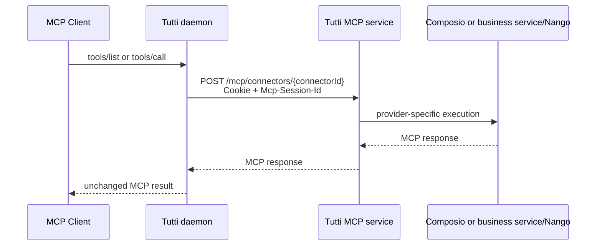

# Remote Connector MCP

Tutti treats a remote Connector as an ordinary MCP server. The Connector package owns identity and authorization metadata in `tutti.connector.json`; `implementation/mcp.json` owns only connection protocol.

The daemon loads the current Tutti account cookie for every request; it never writes a user or provider token into `mcp.json`. `Mcp-Session-Id` identifies only the MCP transport session and is separate from account authentication. Remote redirects are disabled, the endpoint hostname must exactly match `allowedHosts`, and request timeout/response size come from the profile.

Capability definitions are live. Activation performs `initialize`, `notifications/initialized`, and paginated `tools/list`; the returned Tools are registered without a checked-in snapshot. Calls are forwarded by Tool name and arguments.

## Authorization

The market host calls the account-scoped Connector authorization API and returns the third-party redirect URL to the UI. The user already has a Tutti session, so only the upstream provider consent is interactive. A background reconciler polls the durable authorization session and moves the local Connector from `pending` to `connected` or `failed`; it recovers from daemon restarts by reading the completed start operation stored locally.

Disconnect revokes the user's active Connector connections through the same control plane. Provider project secrets remain on the server.

For a Nango-backed Connector, the control plane returns Nango's short-lived Connect Link. The server tags the Connect Session with opaque Tutti authorization-session and user references, then the normal reconciler discovers and verifies the resulting Nango connection. During Tool execution, the business service calls Nango Proxy with the durable connection ID and integration ID; Nango performs credential lookup and token refresh. Neither the Nango Secret Key nor upstream credentials cross the public MCP boundary.
