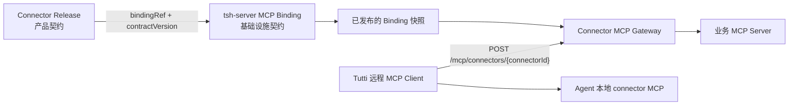
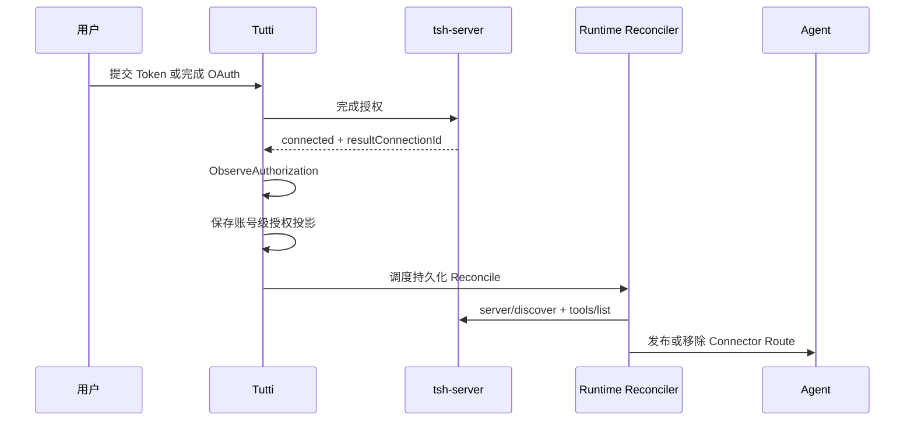

# 远程 Connector MCP 基建方案

状态：用于 Tutti 与 `tsh-server` 协同切换的确定方案。

## 当前落地范围

Tutti 侧已经采用独立的 MCP `2026-07-28` 无状态 HTTP Client，不复用旧 Stdio / Legacy
Streamable HTTP Client。Gateway Base URL 默认是 `https://api.tutti.sh`，可通过
`TUTTI_CONNECTOR_MCP_BASE_URL` 按环境覆盖；实际地址固定派生为
`POST {baseUrl}/mcp/connectors/{connectorId}`，Connector 无法覆盖该地址。

Remote Connector 在建立 Route 时仍会解析本地安装发布物，并把其中合法的 `skills/`
目录投影为 Agent Skill Root；它只是不创建本地执行快照、不启动 Connector 进程。Agent
继续只感知本地聚合 MCP Server `connector`，其 Tool 列表由已激活的本地和远程 Connector
Route 共同组成。

同步 Token 授权和异步 OAuth 授权都会读取服务端返回的 `resultConnectionId`，写入账号级
Authorization Projection，并调度 Runtime Reconcile。Remote MCP Route 只携带 Tutti Account
Session 访问 Gateway，不请求、缓存或转发 Provider Credential Grant。登录后的 Bootstrap、
安装、授权和断开操作使用同一个 Account Scope。

Tutti 通过本地 MCP Client 将每个已安装的远程 Connector 暴露给 Agent。远程执行统一经过已认证的 `tsh-server` Connector MCP Gateway；Connector 发布物不得包含业务 MCP endpoint 或 Provider 凭据注入策略。

本方案面向 MCP `2026-07-28`，不保留早期远程 MCP 使用的 `initialize`、`Mcp-Session-Id` 或 HTTP `DELETE` 生命周期。本地托管的 stdio MCP Server 继续使用现有 Legacy Client 和生命周期。

## 职责边界



Connector Release 与服务端 Binding 必须相互独立：

| 关注点                                   | 归属方                      |
| ---------------------------------------- | --------------------------- |
| Connector 标识、版本和产品元数据         | Connector Release           |
| 远程 Runtime 类型和公开协议版本          | Connector Release           |
| 稳定的 Binding 引用和所需能力            | Connector Release           |
| 向用户展示的授权 Profile                 | Connector Release           |
| 不同环境的 Gateway Base URL              | Tutti 账号/控制面配置       |
| 业务 MCP endpoint 和上游协议模式         | `tsh-server` Binding 控制面 |
| Host 白名单和凭据注入方式                | `tsh-server` Binding 控制面 |
| 路由、限制、健康、容灾和灰度策略         | `tsh-server` Binding 控制面 |
| 用户 Connection 和加密后的 Provider 凭据 | `tsh-server` 授权控制面     |

Connector 作者不能决定服务端的出网地址，也不能决定用户 Provider 凭据的发送目标。

## Connector Release 契约

远程 Connector 只声明客户端和产品语义。具体 Schema 可以位于 `tutti.connector.json`，也可以投影到安装后的 Runtime Descriptor，但逻辑结构如下：

```yaml
connectorId: tencent-docs
version: 1.0.0

runtime:
  kind: remote_mcp
  protocolVersion: 2026-07-28
  bindingRef: tencent-docs.primary
  contractVersion: 1
  bindingContractHash: sha256:...

authorizationProfile: tencent-docs.personal-token

requiredCapabilities:
  - tools

minimumHostVersion: 0.0.0
```

Connector Release 不得包含：

- 业务 MCP endpoint；
- 上游 Host 白名单；
- Provider Token 的 Header 或 Query 注入配置；
- 上游 MCP 版本或兼容模式；
- 超时、重试、限流、熔断、区域路由、健康或容灾配置。

Connector 发布方必须在激活 Release 前，根据其引用的已发布 Binding 完成校验。出现以下任一情况时，发布失败：Binding 不存在、授权契约不一致、所需能力未满足、Connector 版本不在 Binding 约束范围内，或契约版本/Hash 不兼容。

## 公开 Gateway Endpoint

Tutti 根据当前环境和 Connector 标识生成 endpoint：

```text
POST {tshServerBaseUrl}/mcp/connectors/{connectorId}
```

每个请求还必须通过 `Tutti-Connector-Version` 固定当前已安装的 Connector Release。客户端不会接收或发送 Binding Revision、业务 endpoint、Connection ID 或 Provider 凭据。

第一阶段只支持：

- `server/discover`；
- `tools/list`；
- `tools/call`。

第一阶段不支持 subscriptions、长期 SSE、MRTR、Tasks、prompts、resources、sampling、elicitation、roots 或 server-to-client requests。客户端发送空的 `clientCapabilities`，Gateway 只声明 `tools` 能力。

### MCP 请求元数据

每次调用都是独立的 HTTP `POST`，并携带：

```http
Content-Type: application/json
Accept: application/json, text/event-stream
MCP-Protocol-Version: 2026-07-28
Mcp-Method: tools/call
Mcp-Name: document.search
Tutti-Connector-Version: 1.0.0
Cookie: <Tutti account session>
```

每个请求的 `params` 都包含：

```json
{
  "_meta": {
    "io.modelcontextprotocol/protocolVersion": "2026-07-28",
    "io.modelcontextprotocol/clientInfo": {
      "name": "tutti-connector-host",
      "version": "<host version>"
    },
    "io.modelcontextprotocol/clientCapabilities": {},
    "sh.tutti/connectorVersion": "1.0.0"
  }
}
```

`MCP-Protocol-Version`、`Mcp-Method`、`Mcp-Name` 和 Connector Version 必须与 Body 中对应字段一致。当 `Mcp-Name` 或 `Mcp-Param-*` 不是安全的纯 ASCII Header 值时，必须使用 MCP Base64 Sentinel 编码。HTTP Client 从 `tools/list` 校验 `x-mcp-header` 声明，排除不合法的 Tool，并在 `tools/call` 时将合法的基本类型参数映射到 `Mcp-Param-*` Header。

## 客户端架构

远程 HTTP MCP 和本地托管 MCP 使用两个独立的协议 Client：

```text
ModernStreamableHTTPClient
  MCP 2026-07-28
  只用于 Tutti Gateway
  每个请求均无状态

LegacyMCPClient
  保留现有 initialize/session 生命周期
  只用于 managed stdio 和明确标记为 legacy 的本地 Runtime
```

`ModernStreamableHTTPClient` 必须：

- 每个 JSON-RPC Request 都发送一个新的 HTTP `POST`；
- 发送标准请求元数据 Header 和 `_meta`；
- 同时支持 JSON 和 Request-scoped SSE Response；
- 增量解析 SSE，在收到匹配的最终响应后返回，并在取消时关闭 Response；
- 在非 2xx 响应中保留 JSON-RPC Error Body；
- 忽略服务端返回的 `Mcp-Session-Id`，且不发送 `DELETE`；
- 将 Cursor 视为不透明的可空值，区分字段不存在和空字符串；
- 遵循 `ttlMs` 和 `cacheScope`，不得延长服务端返回的有效期；
- 保留生成 `Mcp-Param-*` Header 所需的 Tool Schema。

远程 Route Builder 调用 `server/discover` 和 `tools/list`，然后通过现有本地 Connector MCP Surface 发布带 Connector Namespace 的 Tool。调用 Gateway 时不得发送 `initialize` 或 `notifications/initialized`。

## 授权与 Runtime Reconcile

授权状态和 Agent Route 状态属于同一个持久化工作流：



同步 Secret 提交和异步 OAuth 完成必须汇聚到同一个 `ObserveAuthorization` 流程。授权结果携带 `resultConnectionId`；Tutti 必须先保存账号级 Projection，再调度 Runtime Reconcile。

以下变更都必须触发 Runtime Reconcile：

- 授权成功；
- Token 或授权 Scope 发生变化；
- 授权过期或进入 `reauth_required`；
- Connection 被撤销；
- Active Default Connection 发生变化；
- 已安装的 Connector Release 发生变化。

生产环境 Composition Root 必须提供 `AuthorizationProjections` 和 `AccountRuntimeBindingResolver`。没有 Active Authorized Account Binding 的远程 Connector 必须处于 Disabled 状态，不得向 Agent 发布 Route。

## Tool 生命周期

1. 安装阶段保存 Connector Release 及其 Binding 契约引用。
2. 授权阶段在 `tsh-server` 建立或更新账号级 Connection。
3. Runtime Reconcile 判断远程 Route 是否启用。
4. `server/discover` 在不访问上游 MCP 的情况下确认 Gateway 协议和公开能力。
5. `tools/list` 返回当前 Connection 可用的 Tool；Tutti 使用 Connector Namespace 注册这些 Tool。
6. `tools/call` 携带已安装的 Connector Version 和当前 Tutti Session 转发给 Gateway。
7. 授权失效时，通过同一个 Reconcile 流程移除或禁用 Route。

第一阶段不打开 `subscriptions/listen`。Tool 刷新发生在 Runtime 激活、授权或 Release Reconcile，以及 Private Cache TTL 到期后的下一次使用时。

## 错误处理

传输、身份认证和协议错误继续使用 HTTP Error；协议要求时同时返回 MCP JSON-RPC Error Body。Gateway 和协议前置条件均成功后，Tool 或上游业务错误通常返回成功的 JSON-RPC Response，并将 `result.isError` 设置为 `true`。

客户端识别标准 MCP 错误，包括：

- `-32601`：不支持的方法；
- `-32020`：缺少 Header 或 Header 与 Body 不一致；
- `-32022`：不支持的协议版本。

Tutti Gateway 的前置条件错误使用 MCP 保留区间 `-32000..-32099` 以外的错误码：

| 错误码   | 含义                      | 客户端行为                            |
| -------- | ------------------------- | ------------------------------------- |
| `-33001` | `authorization_required`  | 启动或恢复授权；不发布 Route          |
| `-33002` | `reauth_required`         | 将授权投影标记为过期并调度 Reconcile  |
| `-33003` | `connector_unavailable`   | 保留安装状态；展示临时不可用          |
| `-33004` | `upstream_timeout`        | 展示失败；只允许用户或 Agent 显式重试 |
| `-33005` | `upstream_rate_limited`   | 存在 Retry 元数据时遵循该元数据       |
| `-33006` | `upstream_protocol_error` | 展示集成故障；不得解释为授权故障      |

## 协同切换

本方案不要求兼容旧版远程协议，但仍需控制发布顺序，避免旧 Host 激活不兼容的 Connector：

1. 发布 `tsh-server` Binding 控制面和无状态数据面。
2. 发布包含 `ModernStreamableHTTPClient` 和完整授权/Reconcile 链路的 Tutti。
3. 将 Connector 的 `minimumHostVersion` 设置为对应 Tutti 版本。
4. 发布包含稳定 Binding 契约引用的 Connector Release。
5. 切换完成后，删除旧版远程 Transport Session 和 HTTP `DELETE` 实现。

保留本地 Legacy stdio 支持不是远程 Gateway 的兼容方案，而是独立的 Runtime 能力。

## 验收标准

- Connector Package 不包含业务 endpoint 或凭据注入策略。
- 授权前不存在远程 Route，授权成功后无需重启即可出现。
- 撤销授权或切换 Default Connection 后，无需重启即可更新 Agent Route。
- 客户端发送 MCP `2026-07-28` 元数据，且不创建 Transport Session。
- `server/discover`、分页 `tools/list` 和 `tools/call` 可通过 Gateway 工作。
- JSON 和 Request-scoped SSE Response 都能正确处理，且不会无限缓冲 Stream。
- 非 2xx JSON-RPC Error Body 能到达授权/Reconcile 逻辑。
- Managed stdio Connector 继续使用 Legacy MCP Client。

服务端 Binding、安全、缓存和上游 Adapter 契约定义在 `tsh-server/docs/connector-mcp.md`。
