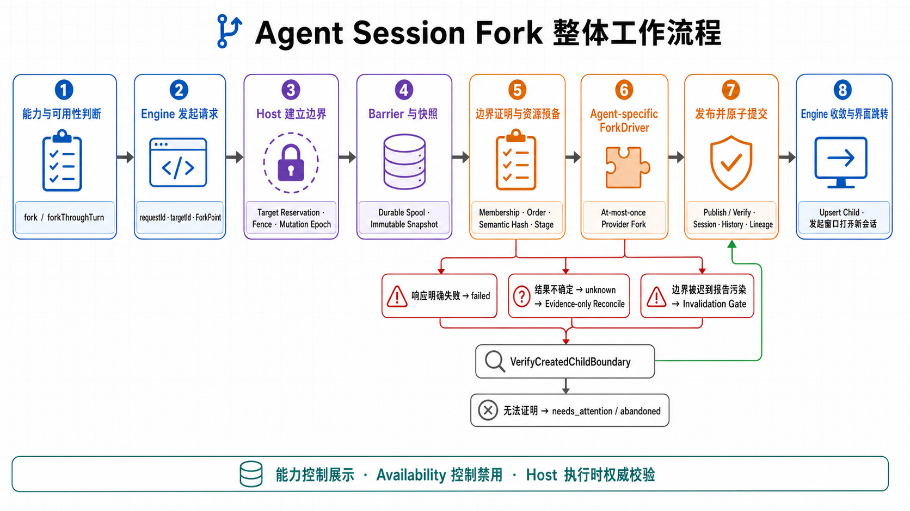
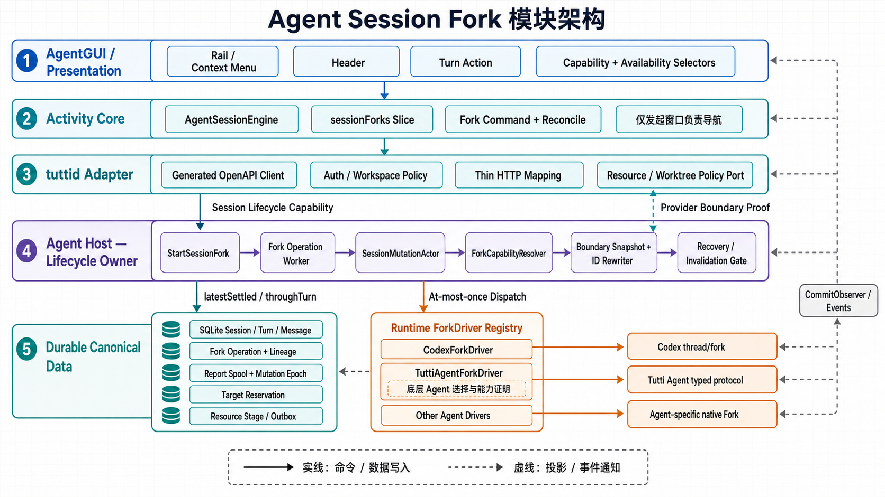

# Agent Session Fork Design

Status: superseded by the 2026-07-29 optimistic through-turn Fork contract

This document is retained as historical design context and is no longer the
implementation contract. The current contract lives in
`docs/architecture/agent-gui-node.md` and `packages/agent/host/README.md`: only
the selected canonical Turn's provider binding is verified; historical prefix
state is trusted; the source remains writable; provider Fork precedes local
materialization; unknown delivery is never redispatched; and no legacy
compatibility path is exposed.

Date: 2026-07-27

Supersedes:

- [2026-07-01 Agent Session Fork Design](./2026-07-01-agent-session-fork-design.md)
- [2026-07-01 Agent Session Fork Implementation Plan](./2026-07-01-agent-session-fork-plan.md)

## 1. 结论

AgentGUI Fork 是 Agent Host 拥有的一等 Session 生命周期能力，不是 GUI 复制消息，也不是
tuttid service 拼装 create + replay。

当前版本完整实现 `throughTurn`：

- 用户选择一个已 settled 的 canonical Turn；
- 新会话包含该 Turn 及其之前的已稳定历史；
- provider 使用原生 Fork 建立独立推理上下文；
- Store 从 prepare 时冻结的 snapshot 原子创建独立 canonical root Session；
- provider 不支持时，确切 Session 的 Turn 级 Fork 能力为 false，GUI 不展示按钮。

统一基建已经保留两个结构能力：

```text
fork             // 完整会话 Fork
forkThroughTurn  // 包含指定 Turn 的 Fork
```

本期只有 `forkThroughTurn` 具备端到端实现。`fork` 字段和统一 `ForkPoint` 已进入各层契约，
但完整会话入口、Host 分支和 provider 接入留到后续，不能仅把 capability 改为 true。

### 1.1 整体工作流程



### 1.2 模块架构



## 2. 架构所有权

```text
AgentGUI Turn action
  -> AgentSessionEngine mutation
  -> AgentActivityAdapter
  -> generated tuttid client
  -> tuttid API/service adapter
  -> Agent Host durable Fork saga
  -> store-sqlite snapshot/operation/commit
  -> provider-neutral runtime Fork
       - Codex app-server thread/fork(lastTurnId)
       - Tutti Agent app-server thread/fork(lastTurnId)
       - Claude Agent SDK forkSession(upToMessageId, title)
```

各层职责：

| 层                 | 职责                                                                 |
| ------------------ | -------------------------------------------------------------------- |
| AgentGUI           | 展示能力、提交 canonical boundary、展示 pending/lineage、成功后导航  |
| AgentSessionEngine | 唯一前端 mutation 状态源，生成并复用 request/target identity         |
| Activity adapter   | 映射 typed operation，并通过 GET 调和 accepted operation             |
| tuttid API/service | 鉴权、HTTP 状态、DTO 映射；不拥有 Fork saga                          |
| Agent Host         | 校验、序列化、runtime preparation、dispatch、恢复和提交              |
| store-sqlite       | source fence、snapshot、operation、ID remap、canonical atomic commit |
| daemon runtime     | 按确切 provider runtime 解析能力并调用 provider Driver               |
| Codex Driver       | `thread/fork`、版本门槛、完整 provider Turn prefix 验证              |
| Tutti Agent Driver | 复用 app-server Fork 协议，使用独立版本门槛和 `TUTTI_AGENT_HOME`     |
| Claude SDK Driver  | stateless inspect/fork、消息 checkpoint、child UUID 映射与复验       |

这符合 AgentGUI 的既有约束：canonical lifecycle 和 mutation 状态属于 Activity Engine；
React 不保存第二份 Fork request、pending 或结果状态。

## 3. 统一领域模型

### 3.1 Fork Point

Host 使用显式 Point，而不是为每种 Fork 建独立命令：

```go
type SessionForkPoint struct {
    Kind   SessionForkPointKind
    TurnID string
}

const SessionForkPointThroughTurn = "through_turn"
```

Store operation 持久化 `point_kind` 和 `source_turn_id`。v1 operation 的迁移语义明确为
`through_turn`，不会在恢复时根据空字段猜模式。

HTTP 使用同形 discriminated union：

```json
{
  "point": {
    "type": "throughTurn",
    "turnId": "canonical-turn-id"
  }
}
```

### 3.2 两类能力

Session lifecycle capability：

```ts
interface AgentActivitySessionLifecycleCapabilities {
  fork: boolean;
  forkThroughTurn: boolean;
}
```

能力由确切 runtime Session + Driver attestation 得出，不按 provider 名称硬编码。Host
执行时再次解析 capability，因此 GUI 中缓存的 true 不能绕过服务端校验。

当前规则：

- Codex app-server 版本满足门槛且协议支持 `lastTurnId`：
  `forkThroughTurn=true`；
- Tutti Agent app-server 版本不低于 `0.0.10` 且协议支持 `lastTurnId`：
  `forkThroughTurn=true`；
- Claude Agent SDK 能读取 exact transcript、且 canonical provider Turn UUID
  与其 root user-message prefix 匹配：
  `forkThroughTurn=true`；
- 其他 Agent、不满足门槛的 Codex/Tutti Agent runtime、以及没有真实 SDK UUID 的旧 Claude
  Turn：`forkThroughTurn=false`；
- 当前所有接入：`fork=false`，完整会话按钮不展示。

provider Turn 绑定不能仅凭 ID 非空成立。Turn 只保存通用
`RootProviderTurnID` 和 opaque `provider_turn_binding_json`；JSON 的 schema、写入和
forkability 判断均由具体 Agent 的 `ProviderTurnBindingAdapter` 维护。服务端展示按钮和
实际 Fork 都调用同一个 `CanForkProviderTurn` hook，Host/Store 不解析 Claude checkpoint
或其他 Agent 私有字段。迁移只把确有旧 checkpoint 证据的行转换为 Agent JSON；仅有
synthetic/provider-looking ID 的历史行仍为 `{}`，投影为 `recovery_required`，GUI
不展示 Fork。转换完成后旧 Claude 专属列会被删除。

结构 capability 与瞬时 availability 分开：

- capability=false：隐藏入口；
- capability=true 但 Session 忙、存在 pending Interaction 或 boundary 不可证明：
  capability 仍为 true，但按钮禁用或 Host fail closed；
- Host 永远做最终校验。

## 4. throughTurn 语义

`throughTurn(turnId)` 是包含边界：

```text
Turn 1 -> Turn 2 -> Turn 3
                    ^
                    throughTurn

child = Turn 1 + Turn 2 + Turn 3
```

它不同于 `beforeTurn`：后者排除所指 Turn。当前产品和协议只使用 throughTurn，不使用
实验性/deprecated rollback 来模拟。

source 必须满足：

- 是 canonical `kind=root` Session；
- provider Session identity 非空；
- 没有 active Turn；
- 没有 pending Interaction；
- 没有未结束 Goal control、runtime operation、submit claim 或另一个 Fork；
- 选中 Turn 属于 source、phase=settled；
- Turn sequence provenance 可验证；
- boundary 中不存在 provider-native descendant lane；
- boundary 中不存在尚未定义 immutable manifest 的 session-local attachment reference。

最后两项当前 fail closed，避免 provider history 与 canonical history 不一致。

## 5. Child Session

Fork 结果是独立 root Session：

- 新 `agentSessionId`；
- provider 返回的新 `providerSessionId`；
- `kind=root`；
- `rootAgentSessionId`、`parentAgentSessionId`、`parentTurnId`、
  `parentToolCallId` 均为空；
- `forkedFrom` 保存直接 source lineage；
- 可以继续对 child 执行下一次 Fork。

child 继承 prepare 时冻结的：

- agent target、provider、model、settings；
- cwd 和 runtime context；
- rail placement、visibility；
- 从 source title 派生并冻结的 child title，格式为
  `<source title> (<同一 source 的有效 Fork 序号>)`，首个 child 例如 `123 (2)`；
- boundary 内的 Turns、Messages、Interactions；非 terminal boundary 在 child
  中规范化为 `settled/interrupted`，pending Interaction 规范化为 `superseded`；
- provider 可恢复上下文。

历史 Session 先经过一次 `RuntimePreparation`，同一份 prepared runtime identity 同时用于
driver attestation、provider dispatch 和 canonical child 的 cwd/settings/runtime context。
runtime context 中引用 provider Session identity 的恢复游标不能越过 Fork 边界直接复用。
Claude adapter 只接受 `resumeCursor.resume == canonical providerSessionId` 的游标；child
继承到 source 游标时丢弃该游标，并以 `forkSession` 返回的 child identity 恢复，防止首次
续聊重新进入 source namespace。
env 与 provider target reference 只用于本次 provider dispatch，不作为凭据或临时运行事实写入
canonical snapshot；后续恢复 child 时仍通过正常 `RuntimePreparation` 从 agent target 和已冻结的
canonical settings/context 重新解析。由于进程重启会把未 dispatch 的 `prepared` operation 标记为
failed，所以 Host 不会用缺失的临时 runtime 事实跨进程重发 provider RPC。

child 不继承：

- active Turn、pending Interaction；
- Goal state/control；
- runtime operation、submit claim；
- Tutti mode activation；
- prompt queue、unread、pin；
- usage observation；
- provider-native child Sessions。

历史克隆不是原 ID 的浅复制。Store 根据 operation/workspace/source/target/entity/source ID
确定性生成新的 canonical Turn、Message 和 Interaction ID，并统一替换：

- Turn/Message/Interaction owner Session；
- Message/Interaction 的 Turn reference；
- `FinalAssistantMessageID`；
- closed allowlist 中的 typed payload references。

普通文本、Markdown、tool output 和 provider/source lineage 不做全局字符串替换。未知
typed reference、重复 key 或非单射 mapping fail closed。同 operation replay 得到相同 ID。

## 6. Durable operation

### 6.1 内部状态

Store 当前状态机：

```text
prepared
  -> dispatching
  -> provider_accepted
  -> committed

prepared|dispatching -> failed
dispatching          -> unknown
```

关键约束：

- `(workspace_id, request_id)` 幂等；
- target Session ID 在 prepare 时独立 reservation；
- 相同 request hash replay 返回原 operation；
- 相同 request ID、不同 hash 返回 conflict；
- provider 已可能接受时绝不自动再次 dispatch；
- provider child 状态必须通过 `host_copy` 或 `provider_owned` 的 typed binding
  evidence 证明独立可恢复，随后才能写入
  `provider_accepted` 并提交 canonical child；
- `provider_accepted` 之后只重试本地 canonical commit。
- source + point 的 durable boundary barrier 覆盖 active、unknown 和
  `committed + client-unobserved`；新 identity 命中 barrier 时返回原 operation；
- `committed` 只有经过显式 client-observed ACK 才释放 barrier；ACK 后同一 Turn
  仍可创建新的显式分支；
- `unknown` 不接受 ACK，也不释放 barrier。

operation 持久化：

- operation/request/hash；
- source/target canonical identity；
- source/target provider identity；
- ordered target provider Turn IDs、binding mode 和 verification receipt；
- `point_kind`、source canonical/provider Turn；
- commit 后的 target canonical boundary Turn；
- Driver kind/version；
- immutable snapshot/hash；
- status/error 和 dispatch/accept/complete 时间。

lineage 独立存储：

```text
source_agent_session_id
source_turn_id
target_agent_session_id
target_turn_id
operation_id
forked_at_unix_ms
```

Fork clone 会重映射 canonical Turn ID，因此 `source_turn_id` 不能用于 child 时间线定位。
commit 从已验证的 identity map 取得 `target_turn_id`，在同一事务写入 operation 和
lineage。operation 是 hard purge 后 immutable replay 的 authority，lineage 是存活 child
的快速 Session projection。V4 migration 用固定的 canonical-ID v1 规则精确回填历史
committed operation 和 lineage。删除 source 不会把 child 解释成 provider-native child。

### 6.2 Source fence

prepare transaction 在验证 snapshot 的同时建立 active Fork operation。所有会改变
source Fork 语义的 Store 写路径都检查该 operation：

- Turn/Message/Interaction mutation；
- Session settings；
- Goal control；
- runtime operation；
- submit claim；
- delete/clear；
- 另一个 Fork。

source title 和 pin 不影响已经冻结的 Fork snapshot，允许继续更新。operation 进入 failed、
unknown 或 committed 后 source fence 释放。

Host 的 session mutation actor 提供进程内串行化；Store fence 才是 crash-safe
正确性边界。

### 6.3 Runtime preparation

live Session 可以复用已附着 runtime。historical/non-live Session 必须走与 resume 相同的
`RuntimePreparation`：

- cwd；
- env；
- provider target ref；
- runtime context；
- settings。

这些事实只解析一次并冻结；第一次 capability resolve、dispatch 前 re-attestation 和
实际 Fork 使用同一个 prepared identity，避免三次解析得到不同 runtime。

historical Codex capability cache 只能复用 exact launch fingerprint：prepared command、
cwd、env 以及已解析 executable 的 size/mtime/verified identity 都必须一致。无法证明
executable identity 的 shell/package-manager wrapper 不缓存。CLI 升降级或不同 Session
runtime identity 会重新 initialize probe，避免跨 Session 误展示按钮。

## 7. Provider Driver、Codex、Tutti Agent 与 Claude SDK 接入

provider-neutral输入：

```text
source provider Session id
source canonical Turn id
ordered source provider Turn ID prefix
frozen target title
driver kind/version
frozen runtime preparation
```

Codex Driver：

1. 只在 app-server 版本达到已验证门槛时声明支持；
2. 调用 typed `thread/fork`；
3. 将 boundary 对应的 provider Turn ID 传为 `lastTurnId`；
4. 校验响应 thread ID 非空且不同于 source；
5. 校验 `forkedFromId` 与 source 匹配；
6. 校验返回的全部 provider Turn IDs 与 Store 冻结的 prefix 长度、顺序和值完全一致；
7. 任一缺失、重复、截断或额外 Turn 都视为未验证，不提交 canonical child。
8. Host 在 accepted checkpoint 前调用 provider-state binder；Codex binder 从 source
   `CODEX_HOME` 精确查找 child rollout，完整校验每条 JSONL、`session_meta.id`、文件
   size/SHA-256，只将该 rollout crash-durable 地原子复制到 target `CODEX_HOME`，不复制
   整个 provider home，也不建立依赖 source 生命周期的软链接。

Tutti Agent Driver 复用同一 app-server typed `thread/read` / `thread/fork(lastTurnId)`
协议和 Turn binding JSON，但不冒充 Codex 版本：能力由 `tutti_agent/<version>` 独立证明，
当前门槛为 `0.0.10`。provider-state binder 从 source `TUTTI_AGENT_HOME` 精确复制已验证的
child rollout 到 target `TUTTI_AGENT_HOME`，不会写入 `CODEX_HOME`。

provider-state binding 也是 provider 接入能力的一部分。每个 Agent 必须显式选择
`host_copy` 或 `provider_owned` 并提交相应 evidence；`host_copy` binder 缺失或不支持当前
provider 时必须在 provider dispatch 前 fail closed，provider 调用后的 binder 失败进入
`unknown`；缺少 mapping 或 receipt 时不能进入 `provider_accepted`。

这比只验证最后一个 Turn 更严格：最后一个 ID 相同不能证明中间历史没有丢失或重排。
provider-state binding 幂等，但不能只凭同 ID rollout 信任 target：source/target fingerprint
完全相等时直接成功；完整验证后的 target 若以 source 全部字节为精确前缀，则视为 Fork 后
合法追加并保留；target 若仅为 source 的精确前缀，则视为截断并从 source 修复；其他合法但
非前缀的分叉 fail closed。source rollout 已被清理时，只接受完整验证通过的 target。若
provider child 已经创建但 binding 失败，operation 进入 `unknown`，不提交 canonical child，
也绝不重发 provider Fork。

Claude SDK Driver 使用固定版本的官方公开 API：

1. Go adapter 在提交前生成的 UUID 仅用于出站 prompt 关联，不作为 provider 身份；
   Claude Code 可能在持久化 transcript 时改写 caller UUID，因此 sidecar 必须等待 root
   user-message 回显，读取 Claude 实际 UUID 后发出 `provider_turn_started`，canonical
   `RootProviderTurnID` 只接受该已观察身份；
2. sidecar 为主链 user/assistant/system 消息发出
   `provider_turn_checkpoint`；Claude adapter 的写入 hook 将最新外层 UUID 写进自己的
   binding JSON（当前为 `checkpointMessageId`），Store 只做 opaque JSON 持久化；Turn
   settlement 不冻结 JSON，因为尾随 system message 可能稍后到达；
3. capability 只声明固定 SDK/sidecar 的结构能力，不读取 transcript。Prepare 将所选
   Turn 的 `RootProviderTurnID` 与 `provider_turn_binding_json` 一起冻结到 operation；
   新 Turn 在 dispatch 时 O(1) 由 Claude adapter 解出 checkpoint。迁移前的旧 Turn JSON
   为空时，才读取一次
   source transcript，查找所选 origin root user UUID，并取下一个 origin root user
   之前的最后消息 UUID；task notification 与内部 synthetic user 不作为新 Turn 边界；
4. 调用 `forkSession(source, {upToMessageId, title: frozenTargetTitle})`；
5. Fork 后只读取 child 的 `getSessionInfo` / `getSessionMessages`，确认 child 身份独立可读；
   不复读 source，也不比较 Tutti 与 provider 的历史 prefix；
6. child UUID 会被 SDK 重映射。sidecar 只在 child 尾部定位最后一个真实 origin root user
   作为所选 Turn 的新 provider 身份，并从该 Turn 起取最后一个可见消息 UUID 作为 child
   checkpoint；它不验证更早历史消息的 UUID 完整性，最终返回只绑定 source/child
   session、所选 source/child Turn 与两端 checkpoint 的 `provider_owned` receipt；
7. Store 在 `provider_accepted` checkpoint 原子保存 mapping/receipt，并在 canonical clone
   时重写所选 child Turn 的 `RootProviderTurnID` 与 Claude adapter 返回的 binding JSON，
   使 fork child 可以继续 Fork；
8. child 恢复时拒绝 source 的 stale `resumeCursor`，只从 canonical child
   `providerSessionId` 启动；该约束覆盖进程重启后的首次续聊。

`forkSession` 调用前失败是 `not_started`；一旦调用开始，transport、SDK 或 post-verify
失败都是 `unknown`。Claude provider child UUID 由 SDK 生成，driver 不声明 deterministic
target identity；Host 仍预留 deterministic canonical target Session ID，但绝不重放
`unknown` provider mutation。这样不会因响应丢失或复验失败而创建第二个 provider child。

损坏 target 的修复规则更严格：只有首条 `session_meta` 已精确验证 child identity，且包括
partial tail 在内的全部原始字节都是 source rollout 的严格前缀时，才允许从 source 原位
重建。其他损坏状态一律 fail closed 且不覆盖 target；特别是
`source baseline + 完整 post-Fork history + partial tail` 不得回滚为 source baseline。

### 7.1 Delivery disposition

runtime 到 Host 使用显式 delivery disposition：

| disposition   | 含义                                        | Host 结果         |
| ------------- | ------------------------------------------- | ----------------- |
| `not_started` | RPC 前失败，确定未发送                      | failed            |
| `rejected`    | 收到明确 JSON-RPC error response            | failed            |
| `unknown`     | timeout/disconnect/响应不可验证             | unknown           |
| `accepted`    | provider child 已创建且所选 Turn 已重新绑定 | provider_accepted |

明确 provider rejection 不归类为 unknown；反之，RPC 已发送后的 timeout 也不能归类为
普通失败并生成第二个 provider child。`accepted` 是进入 `provider_accepted` 的硬门槛；
即使 adapter 返回了非空 child ID，`not_started/rejected/unknown/空值` 也不能提交
canonical child。

## 8. Public API

### 8.1 创建/重放

```http
POST /v1/workspaces/{workspaceID}/agent-sessions/{agentSessionID}/fork
```

请求：

```json
{
  "requestId": "caller-stable-id",
  "targetAgentSessionId": "caller-stable-target-id",
  "point": {
    "type": "throughTurn",
    "turnId": "canonical-turn-id"
  }
}
```

一旦 operation 已创建，provider/local 结果通过 typed operation 返回，不再丢成普通 HTTP
错误：

- `accepted`：HTTP 202；
- `committed`、`failed`、`unknown`：HTTP 200；
- operation 创建前的 invalid argument、not found、conflict 等仍为 4xx。

### 8.2 查询

```http
GET /v1/workspaces/{workspaceID}/agent-session-fork-operations/{operationID}
```

公开 operation：

```ts
interface WorkspaceAgentSessionForkOperation {
  operationId: string;
  requestId: string;
  sourceAgentSessionId: string;
  targetAgentSessionId: string;
  point: { type: "throughTurn"; turnId: string };
  status: "accepted" | "committed" | "failed" | "unknown";
  session: WorkspaceAgentSession | null;
  lineage: WorkspaceAgentSessionForkLineage | null;
  error: string | null;
}
```

`committed` 必须携带完整 Session 和 lineage。该结果从 operation 的 immutable snapshot
重建，不依赖 child 当前仍存在，因此 commit 后删除 child 也不会让 operation GET 退化为
502。Activity desktop adapter 对 accepted operation 使用 GET 调和，直到得到 terminal
operation；若调和 transport 失败，则以 delivery-unknown 交回 Engine。

GET 是纯查询，绝不隐式确认 operation。

### 8.3 Client-observed ACK

```http
POST /v1/workspaces/{workspaceID}/agent-session-fork-operations/{operationID}/acknowledge
```

ACK 仅接受 `committed` operation，并且幂等返回同一 immutable operation。Engine
只有在校验 committed result、把 authoritative child Session 纳入 canonical state
以后才发送 ACK。ACK 失败只保留 `ackPending` 并重试 ACK，不能回滚 child、改写成功状态
或再次调用 provider。服务端在 ACK 事务中更新 `client_observed_at` 并释放 source + point
barrier；ACK 与新 Fork 并发时由 Store 事务决定顺序。

ACK effect 使用 10 秒 deadline；失败或超时后 Engine 通过自身 expiry clock 按
`1s / 2s / 5s / 10s / 30s` capped backoff 自动重发相同 operation ID 的幂等 ACK，
不依赖新的 Session event 或用户点击。成功和 Engine dispose 会停止或取消后续 retry；
child/source 的后续删除不会撤销已经成立的 observation，未完成的 ACK 仍继续幂等重试。
unresolved ACK record 不参与普通 mutation 裁剪，也会阻止同 boundary 生成新的 provider
Fork intent，但不会阻止 pin/delete 等无关 Session mutation。

因此，服务端已经 commit 但 POST 响应丢失时，即使 App 重启并生成了新 request/target，
新请求也只会拿回原 committed operation 和原 target。收到并纳入该 child 后 ACK；用户
下一次显式点击才会创建第二个分支。

### 8.4 Session lineage

所有 Session projection 都有 required + nullable：

```ts
interface WorkspaceAgentSessionForkLineage {
  sourceAgentSessionId: string;
  sourceTurnId: string;
  targetTurnId: string;
  operationId: string;
  forkedAtUnixMs: number;
}
```

普通 root 和 provider-native child 为 null；Fork root 非 null。该字段贯通 list/detail、
service/API mapper、generated client、Activity normalization 和 GUI。

## 9. AgentSessionEngine 与 GUI

Engine 的 mutation record 是唯一前端状态源，保存：

- request ID；
- target Session ID；
- operation ID；
- ACK pending/observed 状态；
- source Session/Turn；
- `inFlight | succeeded | failed | unknown`。

行为：

- 新 boundary 首次提交时 Engine 生成 request/target identity；
- inFlight 重复点击不发第二条命令；
- confirmed failed 后的显式新尝试分配新 request/target identity；
- unknown 的重试必须复用原 request/target identity；
- unresolved unknown 不参与普通 128 条 settled mutation 裁剪；若 Engine 重启已丢失前端
  identity，Host 会按 source+point 找回 durable unknown operation 并禁止第二次 provider
  dispatch；
- committed 但未 ACK 的 operation 同样由 source+point barrier 找回；recovered result
  必须采用 durable operation 原 request/target/session identity，不能伪装成新 target；
- accepted operation 保持 inFlight，直到 GET 返回 terminal 或 canonical target Session
  upsert；
- committed operation 原子 upsert authoritative Session，然后 mutation succeeded 并发出
  client-observed ACK；ACK 失败只进入 ackPending；
- React 只传 workspace/source/turn，不保存 request ref 或私有 pending map。

GUI：

- 只有 `forkThroughTurn=true` 的 exact Session 显示 Turn Fork 按钮；
- 只在 canonical settled root Turn 上提供动作；
- pending Turn 从 Engine selector 派生；
- 成功后打开 authoritative target Session；
- Fork child 不在顶部展示 source Session；时间线在 `targetTurnId` 对应 Turn 完整内容后
  展示“接续自任务”分隔线；
- 分隔线复用 Turn attachment 的虚拟化定位；边界 Turn 的分页尚未加载时保持隐藏，不能
  降级到时间线末尾。

## 10. Recovery

Host 启动恢复按稳定分页扫描：

- `prepared`：没有 dispatch marker，进程重启时标记为 `failed` 并释放 fence/reservation；调用方需要显式发起一次新尝试；
- `dispatching`：不盲目重发 provider RPC；按 delivery evidence 进入 unknown；
- `provider_accepted`：provider-state binding 已完成，只执行幂等 canonical commit；
- terminal operation 不进入恢复队列。

`committed + client-unobserved` 虽然不需要 provider/canonical 恢复，仍保留 boundary
barrier，直到 Engine 显式 ACK。`failed` 立即释放；`unknown` 永久保留，等待未来独立的
人工风险处置协议。

Host 在 provider dispatch 和关键 Store checkpoint 使用独立短 checkpoint context，避免
HTTP caller cancellation 让已创建 operation 丢失状态。POST 超过同步 checkpoint 可以返回
accepted/202；operation GET 在 source actor 内幂等推进 `provider_accepted -> committed`，
启动恢复负责进程重启后的同一转换，客户端也可通过 canonical Session event 收敛。GET 遇到
遗留 `prepared` operation 会将其标为 failed；遇到已经写入 dispatch marker、但没有 durable
provider result 的 `dispatching` operation 会将其标为 unknown。两种情况都不会重新解析 runtime
或触发 provider RPC。

对早期已提交但尚未完成 namespace binding 的 Codex Fork，resume preparation 会根据
canonical lineage 与 committed operation 重新验证 source/target identity，并执行同一个
幂等单-rollout binding；因此升级后的首次继续对话可以自修复，且不会重新调用
`thread/fork`。后续每次 resume 重复执行 binder 时，target 对 source 的合法追加会被保留，
target 仅为 source 的完整记录前缀时会从 source 修复，其他非前缀分叉 fail closed，避免把
子会话已经追加的新历史覆盖回 Fork 初始状态。若 target 尾部已损坏，则仅在 target 的全部
原始字节仍是 source 的严格前缀时重建；包含完整 post-Fork 历史的损坏 target 保持原样并
fail closed。

## 11. 当前限制与后续

当前明确不支持：

- 完整会话 Fork 产品入口；
- 除 Codex、Tutti Agent 与 Claude Code 外的其他 Agent Driver；
- 没有原生历史边界能力时的消息 replay 模拟；
- 从 Message 中间位置 Fork；
- 包含 session-local attachment 的 boundary；
- 包含 provider-native descendant lane 的 boundary；
- Git branch/worktree/filesystem snapshot；
- 跨 provider Fork；
- Fork tree/ordinal UI；
- provider accepted 后的人工 repair/abandon 工作流。

下一步接入完整会话 Fork 时：

1. 在 Host 为 `Point=latestSettled` 增加明确分支和 Store snapshot 规则；
2. Driver 单独声明 `FullSession=true`；
3. API 扩展 Point union；
4. Engine 复用现有 operation/mutation，不新建 saga；
5. GUI 只在 `fork=true` 时展示 Session 级入口。

不同 Agent 独立接入：

- 各 Driver 报告真实 `FullSession/ThroughTurn`；
- 能证明 provider/canonical history 一致才置 true；
- 不支持的 Agent 保持 false，GUI 不展示；
- 禁止用品牌名推断或用历史消息 replay 伪造原生支持。

## 12. 验证要求

发布前至少覆盖：

- Store snapshot、source fence、deterministic ID remap、replay、二次 Fork和 race test；
- Host live/historical RuntimePreparation、re-attestation、recovery 和 disposition；
- Codex exact ordered provider prefix、版本门槛、RPC rejection/timeout；
- Tutti Agent 独立版本门槛、binding hook、`TUTTI_AGENT_HOME` state binding；
- Service/API 200/202/4xx 和 POST/GET typed operation；
- generated API 幂等检查；
- Activity Engine accepted/failed/unknown/committed 和 identity reuse；
- GUI capability visibility、pending、lineage navigation；
- desktop adapter accepted polling；
- Agent Host、provider、renderer 和 AgentGUI 架构边界检查。
