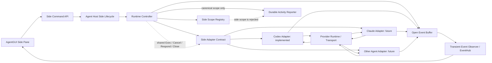

# Agent Side Conversation Technical Design

Status: implemented.

## 1. Objective

AgentGUI Side opens a short-lived conversation from the provider's current
context without stopping or mutating the parent conversation. The source may
have an active Turn. Side output is visible only through the live runtime
channel and never becomes a canonical Session, Turn, Message, lineage row, or
recovery operation.

This is intentionally separate from durable Session Fork:

| Dimension         | Durable Session Fork                   | Live Side                        |
| ----------------- | -------------------------------------- | -------------------------------- |
| Source boundary   | full session or settled Turn           | provider's current live snapshot |
| Child identity    | canonical Session                      | runtime-only side id             |
| Provider state    | durable/resumable                      | ephemeral/non-resumable          |
| Local persistence | history, lineage, operation saga       | none                             |
| Restart behavior  | recover and resume                     | expire                           |
| Event delivery    | optimistic plus post-commit projection | transient only                   |

## 2. Architecture



Responsibilities:

| Layer              | Responsibility                                                                                               |
| ------------------ | ------------------------------------------------------------------------------------------------------------ |
| AgentGUI           | create side id/request id, render a separate pane, subscribe to transient events, close on pane disposal     |
| Service API        | authorize workspace/source access and translate commands to Agent Host                                       |
| Agent Host         | product lifecycle, open idempotency, active-source policy, send/cancel/respond/close entry points            |
| Runtime Controller | scope registry, open transaction, event buffering, durable isolation, no-resume rule, shared lifecycle reuse |
| Provider Adapter   | attest exact runtime capability and create the native ephemeral branch                                       |
| Provider runtime   | snapshot/fork current model context and execute side Turns                                                   |

## 3. Provider Integration Contract

Every provider continues to implement the ordinary `Adapter` contract:

```go
type Adapter interface {
    Start(...)
    Resume(...)
    Exec(...)
    Cancel(...)
    Close(...)
}
```

A Side-capable provider additionally implements:

```go
type SideConversationAdapter interface {
    SideCapabilities(context.Context, Session) (SideConversationCapabilities, error)
    OpenSide(context.Context, SideConversationAdapterOpenInput) (SideConversationOpenResult, error)
}
```

`SideCapabilities` is resolved by the exact selected adapter, not inferred
from the provider name. The adapter may use persisted runtime metadata when
the provider supports loading a historical source identity. `OpenSide` is the
provider-specific creation operation; interactive Side flows require the
existing `InteractiveAdapter`. Standard event, command, and config sinks
remain part of the provider integration. After open, the Controller reuses
ordinary Exec, Cancel, interactive response, state, and Close behavior against
the side-scoped Session.

`OpenSide` owns failure cleanup: before returning an error it must quiesce its
callbacks and release any provider child it created. A successful return
transfers ownership to `Close`.

Required capability facts:

- `Supported`: the exact runtime supports native Side.
- `ActiveSourceTurn`: opening while the source Turn is running is safe.
- `Ephemeral`: the provider child is not durable.
- `HideInheritedTurns`: inherited turns may be model-visible but are not
  rendered as Side-local history.
- `ModelBoundaryInjected`: the provider has an explicit model-visible boundary
  between inherited context and Side-local input.

Providers that cannot prove these facts fail closed.

## 4. Runtime Session Scope

`RuntimeSessionScope` has two values:

- `canonical` (including the legacy empty value);
- `side`.

A Side Session carries:

- `AgentSessionID`: host-generated side identity;
- `SourceAgentSessionID`: canonical parent identity;
- `SideRequestID`: caller-stable open idempotency key;
- `ProviderSessionID`: native ephemeral child identity;
- `Resumable=false`;
- `Visible=false`.

Side sessions are addressable by direct runtime identity, but are excluded from
canonical session listings.

## 5. Open Transaction

Opening Side is a two-level transaction.

### 5.1 Agent Host

1. Validate workspace, source id, side id, and request id.
2. Reject a side id already present in the canonical store.
3. Serialize source and side mutations through their session actors.
4. Reserve `(workspaceId, sideId)` as `creating`.
5. Resolve the live source runtime and exact adapter capabilities.
6. Permit an active parent only when `ActiveSourceTurn=true`.
7. Dispatch `OpenSideConversation`.
8. Validate returned workspace, side identity, scope, parent identity, and all
   required capability facts.
9. Commit the registration as `ready`, or remove the reservation on failure.

An identical `(sourceId, sideId, requestId)` retry returns the committed
registration. A conflicting reuse of `sideId` fails.

### 5.2 Runtime Controller

1. Acquire the side identity lifecycle lock.
2. Register a provisional side-scoped Session before provider dispatch.
3. Buffer provider events, command snapshots, and config updates emitted while
   `OpenSide` is in flight.
4. Invoke the provider Adapter.
5. Validate the returned provider child.
6. Commit the final Session while retaining the provisional gate.
7. Publish `session.started`, repeatedly drain buffered transient events, and
   only then atomically switch the gate to live.
8. On failure, discard the Session and every buffered side channel.

This ordering prevents fork notifications from being routed to the parent,
dropped, or exposed for a Side that ultimately failed to open.

## 6. Execution and Event Routing

Side reuses the Controller's existing execution machinery:

- prompt validation and normalization;
- Turn admission and local active-Turn tracking;
- Adapter Exec/ExecAsync;
- exact cancellation;
- interactive response;
- command/config snapshots;
- provider Close.

`InteractiveAdapter` implementations share one error taxonomy:
`ErrInteractiveResponseInvalid` for malformed or unavailable options,
`ErrInteractiveRequestNotLive` for stale requests, and
`ErrInteractiveAlreadyAnswered` after terminal resolution. This keeps Side API
classification provider-neutral when additional adapters opt in.

The scope changes the sinks:

```text
canonical -> RuntimeStreamObserver + EventHub + DurableActivityReporter
side      -> SideStreamObserver    + EventHub
```

Every durable-report entry point checks the Session scope. Side submit,
streaming, terminal, snapshot, goal reconcile, and goal provenance paths are
rejected or become no-ops before the durable reporter. Goal control and
reconcile APIs are unsupported for Side until a provider-neutral transient
goal contract exists. Side events remain available synchronously through the
dedicated observer and per-session EventHub.

Durable Session Fork may recover a missing selected-Turn provider binding from
authoritative provider history before dispatch. Side must never call that
recovery path: it forks the exact live connection without `lastTurnId`.
Likewise, a Side `clientSubmitId` is transient correlation and carries no
canonical submit occurrence.

The public business-event bridge forwards a discriminated Side event union for
message deltas, message updates, state patches, command/config snapshots, and
session audits. Every variant is validated by the generated event protocol
before it is exposed over the public WebSocket.

## 7. Expiration and Cleanup

Side is never resumed:

1. If the Adapter still owns the live child, operations proceed normally.
2. If the child connection is absent, `ensureLiveAdapterSession` returns
   `ErrSideConversationExpired`.
3. It must not call Adapter Resume.
4. Explicit Close interrupts any active side Turn, releases the provider child
   without closing a shared parent connection, removes runtime state, and
   clears the Host registration.
5. Close is idempotent at the Host boundary.

Daemon restart implicitly expires every Side because neither Host nor runtime
registrations are durable.

## 8. Codex Reference Implementation

Codex forks on the source-owned app-server connection while it is live. This is
required for a source Turn whose newest state exists only in that process's
memory. For an idle or historical source, Codex starts a Side-owned app-server
connection and loads the persisted source by `threadId` without resuming the
canonical source session. Host supplies the persisted runtime snapshot through
the host-adapter boundary, including the isolated `CODEX_HOME` needed to locate
the source rollout. The historical capability probe fails closed if this
location metadata is absent. Process launch and provider preparation use the
Side identity; only the `thread/fork` request carries the canonical source
thread id.

```mermaid
sequenceDiagram
  participant H as Host/Controller
  participant C as Live-source or Side-owned app-server client
  participant P as Codex app-server

  C->>P: thread/fork(threadId=parent, ephemeral=true, excludeTurns=true)
  Note over C,P: lastTurnId is omitted; active parent is allowed
  P-->>C: child thread + forkedFromId
  C->>P: thread/inject_items(child, side boundary)
  P-->>C: accepted
  C-->>H: provider child identity
  H->>C: ordinary turn/start for Side prompt
```

Codex validation rules:

- exact initialized runtime version must support the required protocol;
- a live client must own the exact parent thread, or the historical snapshot
  must carry the exact provider thread and isolated Codex home;
- child id must be non-empty and different from the parent;
- `forkedFromId` must equal the parent thread id;
- boundary injection must succeed before open commits;
- a live parent and child remain on one connection and are routed by
  `threadId`; a historical child uses a dedicated connection;
- child notifications that arrive before `thread/fork` responds are buffered
  by a provisional connection route and replayed only after child identity
  validation;
- per-RPC handlers cannot override the connection-wide thread router;
- a shared client is reference-counted across its parent and Side sessions;
- closing Side unsubscribes the ephemeral child and either drops only the
  shared Side reference or closes its dedicated historical connection; the
  parent identity and active Turn are unchanged.
- a failed physical close retains a Side-owned cleanup handle for bounded
  retry instead of orphaning the dedicated process.

The injected developer instructions and user boundary tell the model that
inherited turns are read-only context and subsequent messages belong only to
the Side conversation.

## 9. Error Contract

| Error                            | Meaning                                    | Retry behavior                                 |
| -------------------------------- | ------------------------------------------ | ---------------------------------------------- |
| `ErrSideConversationUnsupported` | adapter/runtime cannot attest native Side  | do not retry until capability changes          |
| `ErrSideConversationInProgress`  | same Side identity is currently opening    | wait or retry with the same request id         |
| `ErrSideConversationConflict`    | side id was reused with different identity | allocate a new side id                         |
| `ErrSideConversationExpired`     | ephemeral child is no longer live          | open a new Side                                |
| provider error                   | native fork/boundary operation failed      | retry only with the same side/request identity |

## 10. Conformance Requirements

The provider-neutral conformance suite verifies:

- Side opens while the parent Turn is active;
- the parent remains active;
- Side is marked ephemeral and non-resumable;
- Side send produces transient events;
- no Side operation produces canonical writes;
- Close releases the Side while leaving the parent active.

Runtime tests additionally verify:

- canonical and Side observers are isolated;
- failed open discards buffered events;
- expired Side never calls Resume;
- Side is absent from canonical runtime listings;
- Codex sends the exact fork and boundary RPCs;
- Codex active-parent Side uses exactly the source process/connection;
- closing Codex Side deletes only its child and retains the shared process;
- Host Open versus Close cannot leave a ghost ready registration;
- mandatory capability facts fail closed;
- goal reconcile/provenance and submit provenance produce zero Side writes.

## 11. Delivery Phases

### Phase A — infrastructure and Codex reference adapter

Implemented:

- scope and provider contract;
- Host lifecycle;
- runtime open transaction;
- transient observer;
- durable/no-resume isolation;
- Codex ephemeral fork and boundary injection;
- conformance and focused tests.

### Phase B — service contract

Implemented:

- OpenAPI-generated resolve/open/send/cancel/respond/close endpoints;
- workspace/source identity validation delegated through the single
  application Host lifecycle;
- conflict, unsupported, expired, invalid, and downstream error mapping;
- workspace-scoped `agent.side.updated` transient events with source/Side
  identity and a monotonic Side-local sequence;
- strict separation from `agent.activity.updated`.

Implemented command surface:

| Command              | Required identity                             | Result                           |
| -------------------- | --------------------------------------------- | -------------------------------- |
| `agent.side.resolve` | workspace + source session                    | exact capability facts           |
| `agent.side.open`    | workspace + source + side + request id        | ephemeral Side descriptor        |
| `agent.side.send`    | workspace + side + turn + client submit id    | accepted Turn descriptor         |
| `agent.side.cancel`  | workspace + side + exact turn                 | cancellation result              |
| `agent.side.respond` | workspace + side + turn + interaction request | interaction result               |
| `agent.side.close`   | workspace + side                              | idempotent closed/expired result |

The public transient envelope carries `workspaceId`, `sideAgentSessionId`,
`sourceAgentSessionId`, a monotonic Side-local `sequence`, a discriminated
`eventType`, and typed variant `data`. It is never replayed from canonical
history. Disconnect or a sequence gap returns `expired` and asks the client to
open a new Side instead of synthesizing a durable replay.

### Phase C — AgentGUI

Implemented:

- capability-gated `/side`, including while the source Turn is active;
- optional provider-neutral Side runtime and desktop transport adapter;
- separate Side pane/store keyed by Side id;
- inherited-history-hidden rendering;
- sequence-gated transient event subscription;
- exact-turn cancel and interactive-response transport;
- close, source-switch cleanup, and disconnect expiry behavior.

The renderer host exposes a runtime factory. Each mounted AgentGUI surface
creates and disposes its own Side runtime so embedded and detached windows
cannot overwrite one another's transient ownership. The renderer keeps Side
in that dedicated store keyed by workspace and active `sideId`;
canonical Session/Turn/Message reducers must reject `scope=side`. Closing a
pane sends `agent.side.close` and keeps the pane in `closing` until the remote
acknowledgment; a failed close remains visible and retryable. A daemon
disconnect immediately clears every visible local Side identity and retains a
close tombstone until remote cleanup succeeds; the next open retries unresolved
cleanup first.

### Phase D — additional providers

For each provider:

1. implement `SideCapabilities`;
2. implement `OpenSide`;
3. implement exact live-session probing and failure cleanup;
4. implement the ordinary optional interfaces used by its advertised Side UX
   (for example interactive response);
5. pass the shared conformance suite;
6. add one protocol-level test proving ephemeral identity, active-source
   behavior, boundary semantics, and cleanup.

No provider-specific Side state machine should be added outside the Adapter.

Minimum provider composition:

| Capability                         | Required when                                    |
| ---------------------------------- | ------------------------------------------------ |
| `SideConversationAdapter`          | always                                           |
| ordinary `Exec`, `Cancel`, `Close` | always                                           |
| `InteractiveAdapter`               | provider can emit approvals/questions            |
| command/config/event sink adapters | provider advertises those live updates           |
| connection/thread router           | multiple Side roots share one provider transport |

## 12. Operational Observability

Before product rollout, add metrics for:

- open attempts, accepted, unsupported, failed, and expired;
- open latency split by initialize/fork/boundary injection;
- active-parent versus idle-parent opens;
- buffered event count and discarded event count;
- live Side count and close reason;
- any attempted durable report for a Side scope as a high-severity invariant
  violation.

Logs and traces must include workspace id, source session id, side id, provider,
provider child id after acceptance, request id, and phase. They must not include
prompt text, injected model context, credentials, or environment values.

## 13. Architecture Review Closure

The implementation review produced the following corrections:

| Review risk                                                       | Resolution                                                                                                      |
| ----------------------------------------------------------------- | --------------------------------------------------------------------------------------------------------------- |
| cross-process fork could miss the active source suffix            | Codex now forks on the source-owned connection                                                                  |
| one callback handler could mix parent and Side events             | connection-wide `threadId` router overrides per-RPC handlers                                                    |
| fork could emit a child notification before child identity exists | provisional connection route buffers then replays against the committed Side                                    |
| legacy approval requests use `conversationId`                     | one thread-id extractor handles modern and legacy request schemas                                               |
| closing Side could terminate the parent process                   | shared-client reference counting plus child `thread/unsubscribe`                                                |
| an unhealthy shared transport could leave sibling refs live       | transport invalidation expires every parent/Side ref and closes once                                            |
| Host Open/Close could create a ghost ready entry                  | source/side session actors serialize the transition                                                             |
| a stale Host registration could target a canonical runtime        | every Side operation revalidates scope, source, and request                                                     |
| a canonical id could be reused as a Side id                       | Host checks the canonical store before reservation                                                              |
| events or command/config snapshots could overtake open            | one provisional drain loop covers all three channels                                                            |
| partial capability claims could commit                            | preflight and open results validate every mandatory fact                                                        |
| historical Side open could mutate canonical source liveness       | the dedicated client loads by `threadId`, routes fallback events as Side, and is owned only by the Side session |
| goal/provenance paths could write Side state durably              | goal APIs are disabled and every durable sink has a Side guard                                                  |
| the canonical idle reaper could silently expire Side              | Side is excluded; explicit Side lifecycle owns expiration                                                       |
| provider failure could leave delayed callbacks/resources          | `OpenSide` keeps resource-creating response identities until response/client shutdown and cleans late children  |
| malformed fork lineage could leak an ephemeral child              | cleanup is armed as soon as a distinct child id is returned                                                     |
| invalid provider identity could close a canonical session         | unvalidated identities are never passed to ordinary `Close`                                                     |
| two AgentGUI surfaces could share transient Side ownership        | Desktop injects a factory and each mounted surface owns one runtime                                             |
| a stale connection sample could admit Side without events         | connection state methods are mandatory and sampled around subscription/open                                     |
| a parent child index could steal the exact Side thread            | exact provider-session matches run before child-thread fallback                                                 |

This document covers the provider-neutral infrastructure, Codex adapter,
public service command/event schema, and the user-visible AgentGUI `/side`
vertical slice.
