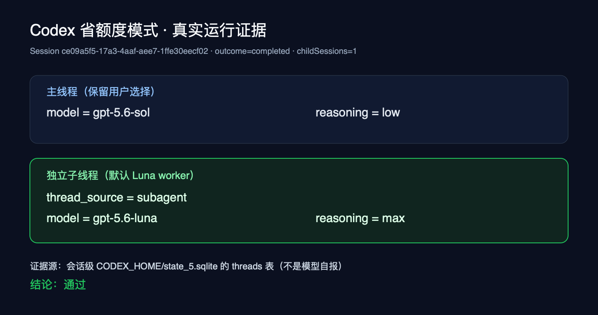
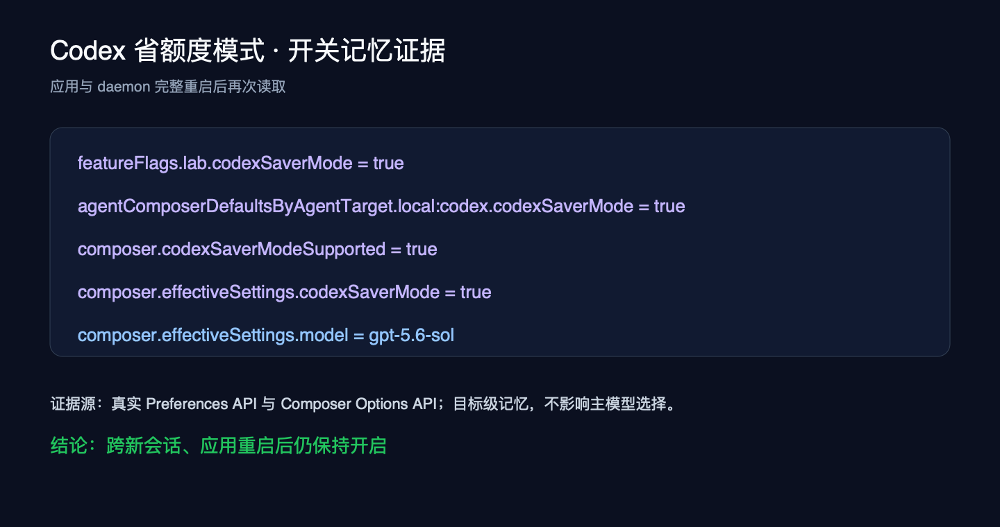
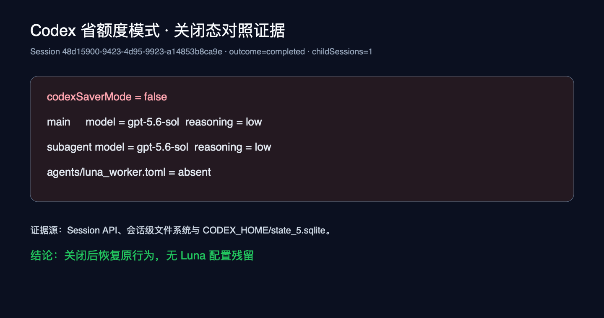

# Codex 省额度模式验收记录（2026-08-03）

> This Codex-specific Luna subagent mode remains a supported, independent
> composer option. Provider-neutral, Session-scoped RTK saver mode is an
> additional option for every Agent provider; it does not replace this mode or
> install anything globally. See `docs/architecture/agent-runtime-preparation.md`.

> 目标：用户开启输入框旁的单一开关后，主线程继续使用用户选择的 Codex 主模型，适合拆分的独立子任务默认交给 `gpt-5.6-luna`（`max` 推理），并跨新会话与应用重启记住开关状态。

## 结论

**功能链路、桌面 UI 与成本感知路由验收通过；质量等价、固定节省比例和提速不作为承诺。** 真实 Tutti Desktop、tuttid、Codex provider 和模型调用链已完成入口展示、开启态、持久化、真实子线程模型和关闭态对照验证。早期“复杂任务默认至少两个 Worker”的规则使自然任务成本增加 4.9%，已被否决。最终规则改为只在独立工作能替换主线程工作时委派，并在一个三仓只读审计中将整条工作流 API 等价成本降低 54.9%，在一个同仓双问题复杂编码任务中降低 22.7%；两组质量证据相当，但后者耗时增加 62.1%。单一强耦合任务和可由一个阻塞命令完成的机械流程不再为了使用 Luna 而派发。此前 SWE-bench 隐藏测试仍显示不同任务存在质量波动，因此当前证据不支持“效果评分一样”“每项固定节省 1/10”或默认开启。macOS 系统录屏权限不可用时，使用 Electron `webContents.capturePage()` 仅截取 Tutti 自身窗口；会话验收附件中同时保留已有会话只读态与重启后新会话可操作开启态截图。

## 执行信息

| 项目         | 内容                                                                       |
| ------------ | -------------------------------------------------------------------------- |
| 分支         | `feat/codex-saver-mode`                                                    |
| 桌面环境     | Tutti Desktop dev build，`make dev-gui`                                    |
| 本地入口     | `http://127.0.0.1:5173/`                                                   |
| Workspace    | `ac379c4a-5c34-4751-bd41-a29b1fa51446`                                     |
| Agent target | `local:codex`（可访问 model-plan）                                         |
| 主模型/推理  | 单任务 `gpt-5.6-sol / low`；多任务 `gpt-5.6-sol / medium`                  |
| Luna 子线程  | `gpt-5.6-luna` / `max`                                                     |
| 证据优先级   | Codex `state_5.sqlite` > Session/Preferences API > 会话生成文件 > 模型回复 |

## 场景清单

| ID  | 场景                   | 操作与通过标准                                                                                           | 结果                                                                                                                                                                 |
| --- | ---------------------- | -------------------------------------------------------------------------------------------------------- | -------------------------------------------------------------------------------------------------------------------------------------------------------------------- |
| S01 | 开发者入口控制         | `lab.codexSaverMode` 关闭时不展示输入框开关；开启后仅支持该能力的 Codex target 展示。                    | ✅ 自动化测试、真实 Preferences/Composer API 与桌面截图通过。                                                                                                        |
| S02 | 单一输入框开关         | 输入框旁只出现一个“Codex 省额度模式”开关，不增加模型/role/线程数选择。                                   | ✅ 真实桌面截图显示单一开关；已有会话为只读，新会话可操作。                                                                                                          |
| S03 | 目标级记忆             | 对 `local:codex` 开启后，新会话与应用/daemon 重启后仍为开启。                                            | ✅ 完整重启后 API 均为 `true`；新会话 DOM 为 `checked`、`disabled=false`，截图显示紫色开启态。                                                                       |
| S04 | 主模型不变             | 开启省额度模式后，新建会话仍使用用户选择的 `gpt-5.6-sol` / `low`。                                       | ✅ Session API 与 Codex 状态库一致。                                                                                                                                 |
| S05 | Luna 配置注入          | 开启后，会话级 `CODEX_HOME/agents/luna_worker.toml` 为 Luna/max，并向会话 `AGENTS.md` 注入轻量路由规则。 | ✅ 文件真实存在；未修改用户全局 `$CODEX_HOME`。                                                                                                                      |
| S06 | 真实子线程切模         | 给主线程一个边界明确、可独立执行的任务；主线程调用 `spawn_agent`，子线程实际为 Luna/max。                | ✅ 最终代码会话 `ce09a5f5-17a3-4aaf-aee7-1ffe30eecf02` 完成，1 个子线程；状态库为 Luna/max。前一诊断会话确认模型按版本无关提示选择当前 schema 的 `fork_turns=none`。 |
| S07 | 关闭态兼容             | 显式关闭后执行同类子线程任务，不生成 Luna role，不注入 Saver 规则，子线程继承主模型。                    | ✅ 会话 `48d15900-9423-4d95-9923-a14853b8ca9e` 完成；主/子均 Sol/low，role 文件不存在。                                                                              |
| S08 | 活跃会话保护           | 已启动会话中不允许热切换该设置，避免运行时配置与 UI 状态不一致。                                         | ✅ service 与 AgentGUI 定向测试通过。                                                                                                                                |
| S09 | 提示词成本感知且跨版本 | 只在独立单元能够替换主线程工作时委派；默认一个，多个真正独立单元才多开；不硬编码 V1/V2 参数或并发配置。  | ✅ runtimeprep 测试确认无 `fork_turns`/`fork_context`、无 `max_concurrent_threads`；真实 A/B 同时覆盖不派发、单 Worker 和多 Worker。                                 |

## 关键链路证据

### 1. 主模型保留，子线程实际使用 Luna/max



权威查询来自会话级 `CODEX_HOME/state_5.sqlite`：

```text
thread_source  model         reasoning_effort
-------------  ------------  ----------------
(main)         gpt-5.6-sol   low
subagent       gpt-5.6-luna  max
```

这里不采用模型回复中的“我正在使用 Luna”作为通过依据。

### 2. 开关跨应用重启记忆



应用和 daemon 完整重启后，真实 API 返回：

```text
preferences.featureFlags.lab.codexSaverMode = true
preferences.agentComposerDefaultsByAgentTarget.local:codex.codexSaverMode = true
composer.codexSaverModeSupported = true
composer.effectiveSettings.codexSaverMode = true
composer.effectiveSettings.model = gpt-5.6-sol
```

### 3. 关闭态恢复原行为



关闭态会话仍可正常调用子线程，但不会生成 `agents/luna_worker.toml`，主线程与子线程均保持 Sol/low。

### 4. 同任务开启/关闭 A/B（效果、耗时与成本）

2026-08-03 使用相同主模型 `gpt-5.6-sol / low`、相同提示词和相同验收答案，分别创建开启与关闭会话。任务固定只创建 1 个无历史子线程，计算并复核 `1² + 2² + … + 100² = 338350`。模型与 token 均取自会话级 Codex `state_5.sqlite` 和 rollout 原始事件，不采用模型自报。

| 指标                          | 开启省额度模式                                  | 关闭省额度模式                                 |
| ----------------------------- | ----------------------------------------------- | ---------------------------------------------- |
| 主线程                        | Sol / low                                       | Sol / low                                      |
| 子线程                        | Luna / max                                      | Sol / low                                      |
| 正确性                        | 主/子答案均正确                                 | 主/子答案均正确                                |
| 子线程 token                  | 16,424（输入 16,224，其中缓存 5,888；输出 200） | 16,157（输入 16,104，其中缓存 9,984；输出 53） |
| 主线程 + 子线程 token         | 66,252                                          | 65,833                                         |
| 子线程耗时 / TTFT             | 8.320s / 8.019s                                 | 7.124s / 6.911s                                |
| 整个主 Turn 耗时              | 20.622s                                         | 18.293s                                        |
| API 等价估算：子线程          | 约 $0.0024                                      | 约 $0.0372                                     |
| API 等价估算：主线程 + 子线程 | 约 $0.0672                                      | 约 $0.0929                                     |

本次单样本中，Luna/max 子线程 token 略多且约慢 16.8%，但按 OpenAI 2026-07-30 公布的 API 单价（[Sol](https://developers.openai.com/api/docs/models/gpt-5.6-sol)：输入/缓存/输出分别为 $5/$0.50/$30 每百万 token；[Luna](https://developers.openai.com/api/docs/models/gpt-5.6-luna)：$0.20/$0.02/$1.20）折算，子线程约便宜 93.5%，整条工作流约便宜 27.7%。这说明该模式的主要收益来自 Luna 的更低计价，而不是保证减少 token 或降低延迟。

上述美元数是 **API 等价估算，不是本次 Pro/Codex 订阅的实际扣费**。估算只计算 rollout 可区分的未缓存输入、缓存读取和输出，未计无法从该记录单独识别的 cache-write surcharge。OpenAI 明确说明 Codex 订阅价格和 quota budget 不变，Luna 会消耗更少 credits；本次运行前后 UI 只提供整数百分比额度，均显示 90% 剩余，粒度不足以测出单任务实际 credit 差值。单次简单算术任务也不能代表复杂代码任务，应通过多任务、多次重复的质量/成本评测再决定默认开启范围。

公开资料：

- [OpenAI：GPT-5.6 price-performance 更新](https://openai.com/index/advancing-the-price-performance-frontier-with-gpt-5-6/) 给出的推荐编码链路正是 Sol 处理不确定性和规划，Luna 执行定义清晰的实现、测试和评估；同时说明 Luna API 降价 80%，Codex 中会消耗更少 credits。
- [OpenAI 在 X 的价格公告](https://x.com/OpenAI/status/2082878156483219672) 说明 Luna 降价 80%，并将更低价格反映到 Codex/ChatGPT Work 的 usage 计算。
- [Viv 的 X 讨论](https://x.com/Vtrivedy10/status/2083197691429863687) 指出 Luna 并非 Codex Multi-Agent V2 原生推荐的协作子代理，建议将其作为独立 Thread 运行；其讨论中也有人报告“Luna Max 主线程 + Sol 顾问 Thread”用量更低，但属于个人单次经验。
- [Eric Provencher 的 X 提醒](https://x.com/pvncher/status/2083300990350954981) 不建议修改 model catalog 强行开放 Luna，并认为需要主动代理间通信的任务仍应使用 Sol/Terra。本实现不修改 catalog，且提示词只把边界清楚、可独立验收的任务交给 Luna。
- [社区价格/基准对比](https://x.com/_codemeow/status/2084095080705741153) 称 Luna/max 与 GPT-5.4/xhigh 在 Artificial Analysis 上同为 51 分、价格低 92%；这是社区转述，不作为本功能验收的权威质量证据。

目前未找到针对“Sol 主线程 + Luna/max 独立子线程 + 本开关实现”的公开、可复现受控评测，因此公开讨论只能作为路由策略参考，不能替代本地 A/B 和后续业务任务评测。

### 5. 真实仓库复杂任务：Django #30179 / SWE-bench Lite

为避免把简单算术误当成复杂项目能力，追加了一个真实历史仓库任务。评测方法参考 [SWE-bench 官方说明](https://www.swebench.com/SWE-bench/)：固定仓库和 base commit，仅向模型提供 issue，模型完成后再应用未向模型暴露的测试补丁，并分别统计 `FAIL_TO_PASS` 与 `PASS_TO_PASS`。真实工单为 [Django #30179](https://code.djangoproject.com/ticket/30179)，官方标记 `Easy pickings: 否`，历史上有 24 轮讨论，问题涉及多列表依赖图、稳定排序、去重、循环冲突告警和兼容输出。

| 项目               | 内容                                                                                 |
| ------------------ | ------------------------------------------------------------------------------------ |
| SWE-bench instance | `django__django-11019`                                                               |
| 仓库               | `django/django`                                                                      |
| 固定 base commit   | `93e892bb645b16ebaf287beb5fe7f3ffe8d10408`                                           |
| 隐藏验收           | 16 个 `FAIL_TO_PASS`，58 个 `PASS_TO_PASS`                                           |
| 主模型             | 两组均为 `gpt-5.6-sol / low`                                                         |
| 提示词约束         | 不允许联网查上游修复；受控 A/B 均要求只委派 1 个只读分析子任务，主线程负责实现和测试 |
| 隔离               | 开启、关闭、自然触发分别使用独立 git worktree                                        |

评测分为两层：

1. **自然触发**：只提供真实 issue，不强制委派。开启模式后主线程自行完成，未创建任何子线程；这符合“强耦合任务留在主线程”的轻量路由策略，但该次运行没有产生 Luna 节省。
2. **受控 A/B**：同一提示词要求把一个边界明确的只读分析子任务交给子代理。开启组实际为 Luna/max，关闭组实际为 Sol/low；模型身份均从会话级 `state_5.sqlite` 与 rollout 事件读取。

| 指标               | 自然触发开启 |   受控开启 |   受控关闭 |
| ------------------ | -----------: | ---------: | ---------: |
| 主线程             |    Sol / low |  Sol / low |  Sol / low |
| 子线程             |           无 | Luna / max |  Sol / low |
| 总耗时             |      99.356s |   300.900s |   172.378s |
| 子线程耗时         |            - |   184.731s |    67.845s |
| 主线程 token       |      239,731 |    735,592 |    584,356 |
| 子线程 token       |            - |    381,368 |    165,354 |
| 总 token           |      239,731 |  1,116,960 |    749,710 |
| API 等价总成本     |   约 $0.3585 | 约 $0.7592 | 约 $0.8958 |
| `FAIL_TO_PASS`     |       4 / 16 |     4 / 16 |     4 / 16 |
| `PASS_TO_PASS`     |      58 / 58 |    58 / 58 |    58 / 58 |
| SWE-bench resolved |           否 |         否 |         否 |

受控开启组的 Luna 子线程 API 等价成本约 $0.0240，关闭组 Sol 子线程约 $0.2474，子线程成本下降约 90.3%；但开启组总耗时增加约 74.6%，总 token 增加约 49.0%。由于 Luna 更低的单价抵消了额外 token，整条受控流程的 API 等价成本仍下降约 15.2%。这些美元数仍是按公开 API 单价折算，不是 Pro/Codex 订阅的实际扣费。

质量上两组没有差异：两份实现都通过了代理自己编写的测试和 640 个可见 `forms_tests`，但隐藏测试揭示它们都错误地保留了单声明 tuple/dict 表示、选择了与目标行为不同的稳定拓扑顺序，并保留了不符合目标格式的冲突告警。因此模型自测通过不能作为任务完成依据，最终以隐藏测试为准。

编排上，Luna 子线程在产出 `task_complete` 后，主线程连续执行等待且约 47 秒没有自动恢复；发送一次运行中 guidance 后主线程继续。关闭组的 Sol 子线程没有复现该问题。该现象是单样本，尚不能断言只由 Luna 导致，但在扩大灰度前必须补充多次重复测试和超时/完成态恢复保护。

本次在本机 Python 3.8 环境按 SWE-bench harness 的关键顺序等价执行：应用模型补丁、将测试文件恢复到 base commit、应用隐藏 `test_patch`、运行对应测试模块。由于当前 Docker 可用磁盘不足以满足官方建议的约 120GB，本次没有构建完整 SWE-bench Docker image；仓库提交、隐藏补丁和测试集合均来自官方数据集。这一环境差异应在 CI 或独立评测机上再复跑确认。

### 6. Sol/medium 三任务补测

为避免继续依赖单样本，固定主线程为 `gpt-5.6-sol / medium`，追加 3 个 SWE-bench Lite 真实任务。每组使用相同 issue 提示词并要求恰好 1 个只读分析子任务；模型完成后保存补丁，将测试文件恢复到固定 base commit，再应用官方隐藏 `test_patch`。Saver 开启组由当前产品 `runtimeprep` 生成会话级 `CODEX_HOME`，实际配置为主线程 Sol/medium、子线程 Luna/max；关闭组主、子线程均由 rollout 证实为 Sol/medium。

| 任务                   | 复杂点                                 | 关闭组隐藏验收 | Saver 开启隐藏验收 | 关闭成本    | 开启成本    | 关闭耗时   | 开启耗时    |
| ---------------------- | -------------------------------------- | -------------- | ------------------ | ----------- | ----------- | ---------- | ----------- |
| `django__django-11019` | 媒体依赖图、稳定排序、冲突兼容         | 4/16，未解决   | 4/16，未解决       | $1.5024     | $1.0253     | 355.6s     | 551.5s      |
| `django__django-16820` | 迁移优化器、操作归约、旧索引语义       | 7/7，已解决    | 4/7，未解决        | $1.8533     | $1.6405     | 288.6s     | 496.8s      |
| `django__django-17051` | bulk upsert、RETURNING、数据库能力兼容 | 5/5，已解决    | 5/5，已解决        | $1.0905     | $0.7190     | 165.8s     | 234.0s      |
| **合计**               |                                        | **16/28；2/3** | **13/28；1/3**     | **$4.4462** | **$3.3848** | **809.9s** | **1282.4s** |

两组 `PASS_TO_PASS` 均为 300/300，说明没有发现既有行为回归。Saver 开启组 API 等价总成本下降约 23.9%，但总 token 为 8,578,571，对照组为 3,674,332；主线程累计耗时增加约 58.3%。Luna 子线程三任务合计成本约为对应 Sol/medium 子线程的 15.0%，单任务范围约为 6.0%～26.0%，所以“约 1/10”只能作为当前定价和典型用量的简化说明，不能承诺每项任务的实际消耗固定为 1/10。

这轮还观察到 2 次小于工具下限的 timeout 参数、1 次命令进程创建重试，以及媒体任务子线程完成后的额外等待。模型均自行恢复，但说明 Luna/max 在复杂分析子任务上的 token、时延和编排稳定性仍需优化。

限制：`tutti agent start` 当前未暴露 `codexSaverMode` 参数，直接由 CLI 启动的会话明确不存在 `luna_worker.toml`，因此被保留为关闭组；开启组使用同一版本产品 `runtimeprep` 生成真实 Saver 配置后通过 Codex CLI 执行。两组提示词、base commit、主模型和隐藏测试一致，但启动外壳不完全相同；正式结论仍应在 daemon 暴露等价启动参数后复跑。三个任务并行执行，因此绝对耗时只用于同轮观察，不能与之前串行单任务直接比较。

### 7. 同一复杂任务的 3 子代理受控 A/B

在同一个 `django__django-16820` base commit 上追加一次多子代理实验。两组使用同一提示词、同一 `gpt-5.6-sol / medium` 主线程和两个隔离 worktree，并要求在主线程写代码前并发启动恰好 3 个无历史、只读子任务：实现语义分析、隐藏边界对应的测试矩阵、兼容风险复核。关闭组 3 个子线程均由 rollout 证实为 Sol/medium；Saver 组 3 个子线程均为 Luna/max。主线程汇总后独立实现，模型自写测试随后被恢复，再应用模型未见过的 SWE-bench 隐藏测试补丁判分。

| 指标                    | 3×Sol/medium 对照组 | 3×Luna/max Saver 组 |
| ----------------------- | ------------------: | ------------------: |
| 主线程                  |          Sol/medium |          Sol/medium |
| 子线程                  |      3 × Sol/medium |        3 × Luna/max |
| 隐藏 `FAIL_TO_PASS`     |               1 / 7 |               5 / 7 |
| 隐藏 `PASS_TO_PASS`     |           300 / 300 |           300 / 300 |
| 完整解决                |                  否 |                  否 |
| 输入 token              |           2,895,475 |          16,907,604 |
| 其中缓存输入            |           2,673,408 |          16,324,608 |
| 输出 token              |              28,942 |              72,073 |
| 总 token                |           2,924,417 |          16,979,677 |
| 主线程 API 等价成本     |             $1.4609 |             $1.8878 |
| 3 个子线程 API 等价成本 |             $1.8544 |             $0.4541 |
| 工作流 API 等价总成本   |             $3.3153 |             $2.3419 |
| 主 Turn 耗时            |              598.5s |              810.5s |

成本仍按 Sol 输入/缓存输入/输出 `$5/$0.50/$30`、Luna `$0.20/$0.02/$1.20` 每百万 token 计算。Saver 组虽然总 token 是对照组约 **5.81 倍**，但 3 个 Luna 子线程成本仍比 3 个 Sol 子线程低约 **75.5%**，整条工作流低约 **29.4%**。由于 Saver 主线程输入也被更长的等待和汇总放大，主线程成本反而高约 **29.2%**；Luna 的低单价并不等于多代理工作流会按固定比例省钱。

质量上，本次 Saver 组隐藏修复点明显高于对照组（5/7 对 1/7），但两组都没有完整解决任务，且单次结果与前一轮“1 个子代理”实验方向不同，不能据此宣称 Luna 质量稳定高于 Sol。耗时方面 Saver 组增加约 **35.4%**。其中一个 Luna 子线程没有产生 `task_complete` 事件，token 记录持续到主线程结束；另两个 Luna 子线程分别约运行 667s 和 315s，说明多个 Luna/max 并发时仍存在过度分析和完成态收敛风险。

实验材料保存在 `/Users/wwcome/work/evals/sol-medium-3agents/`：统一提示词、两组完整 JSONL、模型原始补丁、隔离 worktree 和应用隐藏测试后的失败现场均已保留。本次观察到 Saver 组部分隐藏修复点覆盖更高，但不能把差异归因于 Luna 或多视角；该补测支持“多 Luna 子线程仍可降低 API 等价成本”，不支持“效果评分一样”“固定 1/10 消耗”或默认无条件拆成多个子代理。

### 8. 零调度提示过度派发 A/B（历史失败，规则已否决）

为验证用户无需在任务提示中主动要求子代理，继续复用 `django__django-16820` 固定 base commit。两组使用完全相同的自然任务描述和 `gpt-5.6-sol / medium` 主线程；提示词中不含 `agent`、`subagent`、`Luna`、`spawn`、`parallel`、`子代理` 或 `并行`。关闭组没有 Saver role 或路由规则；开启组只通过产品 `runtimeprep` 注入当时版本的 Saver `AGENTS.md` 和默认 Luna role。

首版规则能够自动触发 1 个 Luna/max，但主线程重复执行了其侦察范围，工作流约 $1.5639、耗时 440.81s，相比关闭组成本和耗时都更高。随后用于验证自动多派发的规则把复杂编码任务默认拆成两个 Worker，分别负责源码/实现语义和测试/验证/兼容风险；该规则能够触发多个 Luna，但不符合省额度目标，已被最终成本感知规则替换。

| 指标                     | Saver 关闭组 | 历史自动多派发组 |
| ------------------------ | -----------: | ---------------: |
| 用户提示中的调度词       |            0 |                0 |
| 主线程                   |   Sol/medium |       Sol/medium |
| 自动创建子线程           |            0 |                2 |
| 子线程模型               |            — |     2 × Luna/max |
| 主线程输入 token         |    1,531,889 |        1,380,307 |
| 主线程缓存输入 token     |    1,458,688 |        1,296,128 |
| 主线程输出 token         |       10,876 |            9,122 |
| 两个 Luna 子线程总 token |            — |        4,066,790 |
| 主线程 API 等价成本      |      $1.4216 |          $1.3426 |
| 子线程 API 等价成本      |           $0 |          $0.1485 |
| 工作流 API 等价总成本    |      $1.4216 |          $1.4911 |
| 主 Turn 耗时             |      343.75s |          636.51s |
| 最终可见 migrations 测试 |  721，跳过 2 |      722，跳过 2 |

运行证据确认两个子线程由同一 Sol 父线程在 15.8 秒内先后创建，实际模型均为 `gpt-5.6-luna / max`；主线程随后等待结果，没有先执行相同的仓库检索或代码修改。因此“无需用户提示即可自动触发多个 Luna”验收通过。主线程成本下降约 **5.6%**，但两个 Luna 的成本抵消了这部分收益，整条流程成本仍增加约 **4.9%**，耗时增加约 **85.2%**。该样本证明自动路由生效，不证明每个复杂任务都能省钱或提速。

这轮不用于质量横评：一个子线程误读了 base commit 之后的本地 Git 历史，主线程发现后未直接接受其结论，并使用完整可见测试重新核验，但样本仍存在信息污染。同时，两个写任务通过互斥文件范围在共享 worktree 中并行，而不是各自创建隔离 worktree；本轮证明了自动派发和模型选择，没有证明并行写入隔离策略。实验提示词、三轮 JSONL、独立 Codex Session rollout、耗时和 worktree 保存在 `/Users/wwcome/work/evals/sol-medium-auto-routing/`。

### 9. 最终成本感知规则的多场景 A/B

最终规则不再把“复杂”或“实现加测试”直接等同于多 Worker，而是要求 Luna 真正替换一段主线程工作：一个完整独立单元默认一个 Worker；只有多个非重叠大单元才多开；一个阻塞或事件驱动命令能完成的机械流程留在主线程。所有提示词均不包含 `agent`、`subagent`、`Luna`、`spawn`、`parallel`、`子代理` 或 `并行`，主线程固定为 `gpt-5.6-sol / medium`。

| 场景               | 关闭组  | 最终 Saver 组      | 路由行为                                      | API 等价成本                                      | 耗时                | 质量证据                                                                                             |
| ------------------ | ------- | ------------------ | --------------------------------------------- | ------------------------------------------------- | ------------------- | ---------------------------------------------------------------------------------------------------- |
| 三仓独立只读审计   | 1 × Sol | 1 × Sol + 3 × Luna | 三个非重叠仓库各一个 Worker                   | `$0.8348 → $0.3766`，降低 **54.9%**               | `242.74s → 241.26s` | 两组均正确定位三个根因、文件和测试边界；六个 worktree 均 clean                                       |
| 同仓双问题复杂编码 | 1 × Sol | 1 × Sol + 2 × Luna | 迁移优化器与 bulk upsert 分开执行，主线程汇总 | `$1.7312 → $1.3381`，降低 **22.7%**               | `438.80s → 711.15s` | 两组均修改相同五类文件；迁移 optimizer/autodetector 与 bulk_create 测试通过，`git diff --check` 通过 |
| 单一强耦合编码     | 1 × Sol | 1 × Sol            | 不为“复杂”强行创建 Worker                     | 无可归因的 Luna 节省；没有子线程新增成本          | 单样本存在模型波动  | Media 与 bulk_create 两个独立复跑均完成可见测试                                                      |
| 三仓机械测试矩阵   | 1 × Sol | 1 × Sol            | 一个 bounded 流程留在主线程                   | 不再产生 Luna 编排成本；跨轮 Sol 成本不作归因比较 | 最终开启组 119.34s  | 精确执行三条命令；一条按原命令缺少 `PYTHONPATH` 失败，两条通过；不修环境、不重复、仓库 clean         |

成本仍按 Sol 未缓存输入/缓存输入/输出 `$5/$0.50/$30`、Luna `$0.20/$0.02/$1.20` 每百万 token 折算。双问题 Saver 组中 Sol 为 `$1.1815`，两个 Luna 合计 `$0.1566`；三仓审计 Saver 组中 Sol 为 `$0.2710`，三个 Luna 合计 `$0.1055`。两组成本拆分均与“由 Luna 替换昂贵主线程工作，而非无条件增加代理”的机制一致；单次非确定性 A/B 不用于证明因果。

机械测试矩阵的前一版规则曾额外创建 1 个 Luna，使成本从约 `$0.0831` 增至 `$0.1013`，高 21.8%；最终规则复跑确认只保留一个 Sol 会话，结构性额外成本已消除。关闭组当轮遭遇 WebSocket TLS 失败并返回空最终消息，因此不同轮次的 Sol 绝对成本不用于宣称节省。

工具调用预算目前是提示词约束，不是 provider 运行时硬限额。三仓审计的三个只读 Luna 实际工具调用数高于建议的 8 次；双问题任务中主线程在收到足够证据后主动中断了两个仍在继续验证的 Luna，避免继续扩大。该机制降低了本轮总成本，但不能保证所有模型版本严格遵守预算；后续若 Codex 暴露原生 per-agent tool/turn limit，应优先改为运行时限制。

完整材料保存在 `/Users/wwcome/work/evals/codex-saver-v4/`，包括自然提示词、完整 A/B/复跑 JSONL、会话级 rollout、计时日志和隔离 worktree。

## 数据链路验收

```text
开发者开关 lab.codexSaverMode
        │ 控制入口是否展示
        ▼
输入框 Codex 省额度模式开关
        │ target 级默认值持久化
        ▼
Preferences → Composer Options → Create Session
        │ codexSaverMode=true，主模型字段原样保留
        ▼
Host / daemon Session settings
        │ normalize、stream payload、resume 均保留设置
        ▼
runtimeprep（仅会话级 CODEX_HOME）
        ├─ agents/luna_worker.toml：默认 subagent = Luna/max
        └─ AGENTS.md：边界任务 + spawn_agent 无历史 fork + 主线程复核
        ▼
Codex 主线程（用户模型） → 独立子线程（Luna/max） → 主线程汇总
```

## 验证命令与结果

```bash
go test ./packages/agent/runtimeprep ./packages/agent/daemon/runtime ./packages/agent/daemon/hostadapter
```

结果：通过。

```bash
pnpm check:changed
```

结果：最终 34 个 lane 全部通过（失败 lane 修复后复跑：6 个实际执行、28 个复用已通过结果）。独立 reviewer 已复查 settings round-trip、Codex V1/V2 no-history 兼容、默认 role 覆盖、TOML 合并边界和提示词重量；其提出的问题均已修复并补回归，最终复审 PASS、无阻断项。

## 已发现并修复的问题

1. Session settings 在 daemon runtime normalize 与 stream payload 往返时曾丢失 `codexSaverMode`，表现为创建请求为 `true`，随后读取变成 `false`。已补齐字段透传与回归测试。
2. 直接暴露 `agent_type` 会改变 Codex 保留工具 schema，当前 Sol 接口会以 400 拒绝，故未采用。
3. Codex V1 与 V2 的无历史参数不同（V1 为 `fork_context`，V2 为 `fork_turns`），且完整继承主线程时上游不会应用不同 role/model。最终方案把 Luna 配成省额度会话的默认子代理，并用版本无关的轻量 `AGENTS.md` 指示子任务不要继承主会话历史，由模型按当前工具 schema 选择对应选项。最终真实会话选择了 `fork_turns=none`。
4. 用户原配置若已定义 `agents.default`，会与自动发现的 Luna default 冲突。已改为只在省额度会话的隔离 `config.toml` 中显式声明 `agents.default → ./agents/luna_worker.toml`，不修改用户全局配置；标准表、quoted 表、`[agents]` 内联表、root dotted keys 及多行 description 均有冲突回归测试。
5. 应用重启后，旧 runtime 观测值曾覆盖创建时的不可变 Session 快照，使数据库仍为 `true` 的会话被 API/UI 错误显示为 `false`。已改为从 runtime snapshot 恢复 `codexSaverMode`；开启、关闭和缺少该字段的旧会话均有回归测试。重启最终开发版后，截图中的会话 `b8560ee5-0c85-42fa-9acd-f9e91193e3c3` 已由 Session API 正确返回 `true`。
6. Composer Options 进入 activity engine 时，clone 曾漏掉 `codexSaverModeSupported`，导致后端返回支持但 UI 展示层收到 `undefined`，输入框入口被隐藏。已补字段克隆和 reducer 回归测试。
7. 重启后服务端 `effectiveSettings.codexSaverMode=true` 曾未回填到新会话 UI/创建请求；同时稳定化比较把“未设置”和“显式关闭”都视为 `false`，可能吞掉用户 opt-out。已改为服务端默认值仅在本地三态值缺失时回填，并补充 authority=true 下无本地值、显式 false 两组展示与 activation 回归。

## 风险与待补

- 系统级 Accessibility 与 Screen Recording 权限仍未授予，因此无法使用桌面 CUA；本次截图只使用 Electron 自身窗口捕获，不包含其他应用或系统区域的交互验证。
- “不继承主会话历史”依赖主模型遵循会话指令；若模型忽略并使用完整历史 fork，子线程会按 Codex 上游规则继承主模型。真实验收任务已正确选择当前工具的 no-history 选项并切到 Luna/max。
- 该模式只改变适合独立委派的子线程，不保证每个任务都会拆分；轻量、强耦合任务继续由主线程处理属于预期行为。
- Luna 当前不是公开讨论中 Multi-Agent V2 原生推荐的主动协作模型。应继续限制为上下文自包含、结果可由主线程复核的独立任务；复杂跨代理协作、频繁互发消息和高风险决策仍留给 Sol/Terra。
- Sol/medium 三任务中，关闭组完整解决 2/3、Saver 开启组解决 1/3；当前不应宣传“效果评分一样”，也不建议默认开启。扩大灰度前仍需更多仓库、多次重复和完成态恢复保护。
- 受控开启组观察到一次子线程已 `task_complete`、主线程仍持续等待的恢复问题；需增加超时/终态同步验证，并判断是否为上游 Codex 编排问题。
- 工具调用预算目前只是提示词约束，不是 provider 运行时硬限额；模型可能超出建议值。主线程应在中间结果已满足验收条件时主动终止子线程，后续若 Codex 提供原生 per-agent tool/turn limit，应改用运行时限制。
- 默认 Luna Worker 不允许继续嵌套派发；只有父任务显式授权并给出嵌套 Worker 与工具调用总预算时才允许，以免递归放大成本。该边界目前同样由提示词执行，尚无 provider 运行时硬限制。
- 本次隐藏测试按官方顺序在本机 Python 3.8 等价执行，尚未在官方 Docker image 中复跑；CI/独立评测机需要补一次容器化复验。
- 开启态只写会话级 Codex home；关闭或新建关闭态会话不会遗留 Luna 配置，不需要数据迁移。

## 最终人工复验步骤

1. 在开发者设置打开“Codex 省额度模式入口”。
2. 新建 Codex 会话，确认输入框旁出现且只有一个“Codex 省额度模式”开关。
3. 选择任意 Codex 主模型并开启开关，发送一个可独立拆分的中等任务。
4. 确认主会话仍显示用户选择的模型，且能看到一个子线程完成后回到主线程汇总。
5. 新建会话并重启应用，确认开关仍为开启。
6. 关闭开关再新建会话，确认行为恢复且无 Luna 配置注入。
