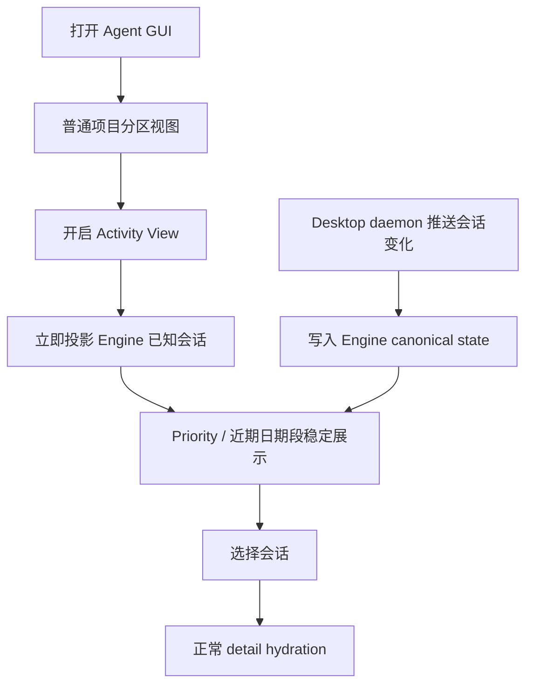

# Agent 会话 Activity View PRD

Status: implemented; pending code review

- 日期：2026-08-05
- 产品范围：Tutti Agent GUI Conversation Rail
- 交付承载：Desktop Workbench、独立 Agent 窗口与 Native Mobile
- 共享边界：`@tutti-os/agent-gui`、`@tutti-os/agent-activity-core`、Conversation Rail runtime、Desktop daemon 实时会话投影
- 参考实现：Codex.app 左侧会话列表的 Activity View
- Golden reference：Codex.app `26.730.61639`（build `6234`），验证日期 2026-08-05

## 1. 摘要

为 Agent GUI 左侧 Conversation Rail 增加“Activity View”。用户开启后，列表不再以项目分区和单纯时间倒序为主，而是把需要用户处理、未读结果和正在运行的会话集中到列表顶部，再补充最近 7 个自然日的会话。

该功能不是对当前屏幕中的 DOM 行临时排序，而是对 Agent GUI 当前内存态中的 canonical Session 摘要做稳定投影。它复刻 Codex.app 的实际展示行为：

1. 开启时同步快照当前 Engine 已在内存中的可见**根会话摘要**；
2. 立即按 `waiting → unread → active` 的客户端 presentation policy 投影 Priority；
3. 同一份摘要集合中其余最近 7 个自然日的会话直接放入 Today、Yesterday 或 weekday 日期段；
4. 开启时快照 Priority 顺序与日期段 recency；开启期间监听 canonical 状态，但保留既有成员顺序，只按 Codex 规则增量合入新候选并更新行状态；
5. 开启 Activity View 本身不发起历史查询、补页或 transcript hydration；Desktop daemon 新推送或更新的会话先进入 Engine，再按实时规则增量入队。

展示范围以当前 Engine 内存态为准，而不是以 React 此刻挂载的 DOM 行为准。未加载进内存的历史会话不因开启 Activity View 而额外加载；用户本次没有加载、daemon 也没有实时推送的会话不在本功能的关注范围内。

Desktop 首期不改变普通 Rail 的项目分区、每次显示 5 条和“显示更多”逻辑。普通视图与 Activity View 是同一 Conversation Rail 的两种 presentation mode；Mobile 会话首页直接使用 Activity View，不再提供项目分组目录视图。

Activity View 是一个专用的列表展示模式，不是通用筛选器。本功能不新增筛选入口、筛选条件、筛选状态、组合规则或可复用的 filter API，也不把 Tutti 现有的 Agent target 选择能力纳入 Codex 体验对齐范围。Activity View 直接消费当前挂载 `AgentSessionEngine` 中的内存态 canonical sessions，不定义或改变上游数据语义。

### 1.0 Mobile adoption amendment（2026-08-06）

Native Mobile 会话首页从本次实现起固定使用 Activity View。Mobile 不再展示旧的 pinned / project / conversations 项目分组目录，也不提供会话 Pin 或 Unpin 操作。Priority 与最近 7 个自然日的分组、会话行的生命周期状态和稳定排序复用本 PRD 及 `@tutti-os/agent-gui` 的共享投影规则。

搜索仍然临时接管内容区，但由共享 Conversation Rail query controller 负责服务端分页查询，从而可以查找当前 Engine 尚未载入的历史会话；清空搜索后恢复 Activity View。该 Mobile 差异只改变承载视图和历史搜索入口，不改变 canonical session、attention/read 或 pin durable owner；Desktop 的普通 Rail 和 Activity View 行为不变。

Mobile Activity 会话行不显示单独的 `...` 操作按钮。普通点击进入会话，长按会话行打开重命名和删除操作列表。存在项目归属时，项目名以文件夹图标加项目名的形式显示在标题下方；没有项目归属时显示“对话”来源标识。

### 1.1 Codex 体验同构原则

Codex.app 当前正式安装版是本功能所有**可观察产品行为**的 golden reference。入口位置与形态、按钮状态、coachmark、菜单结构与默认值、分组、排序、空状态、批量操作、选中保留、滚动、实时更新与列表稳定策略、加载反馈、键盘与无障碍行为均默认逐项复刻，不由 Tutti 另行定义“更合理”的标准。

Tutti 可以采用不同的内部数据访问和状态实现，但不得改变用户可观察结果。只有满足以下条件时才允许体验差异：

1. Codex 原行为已经验证；
2. 差异来自 Tutti canonical 数据/权限边界，或经过产品明确批准的首期范围裁剪；
3. PRD 单列差异，写清 Codex 原行为、Tutti 特有事实或范围决策、最小差异方案和验收用例；
4. 差异经过产品与架构显式批准。

未完成上述记录和批准的行为一律回到 Codex 现行设计。内部技术限制、实现成本或个人偏好不构成体验差异理由；Codex 行为尚未查清时，结论是“待验证”，不是自由设计。

4.1 中已批准的首期裁剪是唯一交互例外；除此之外，排序、状态变化、空状态、搜索接管、选中保持、滚动、实时入队与列表稳定行为全部逐项对齐 Codex。

## 2. 背景与问题

当前 Conversation Rail 主要解决“会话属于哪个项目”和“最近使用了什么”两个问题：

- 后端按 `pinned`、项目和 `conversations` 分区返回会话；
- 每个分区首屏默认 5 条；
- 用户通过“显示更多”加载分区下一页；
- 分区内按会话 sort time 倒序，置顶区按 pinned time 倒序；
- 搜索可进一步缩小当前列表；host 侧如已有 Agent target 选择，它发生在数据进入 Rail 之前，不属于本 PRD。

这套结构适合浏览，但不适合同时运行多个 Agent 时的注意力管理。典型问题包括：

- 一个等待审批的会话可能沉在某个项目分区中；
- 多个项目同时运行时，用户需要逐区检查哪些 Agent 仍在工作；
- 已完成或失败但未读的会话容易被更新更近、但不重要的会话挤下去；
- 当前 DOM 通常只有每区 5 条，直接操作 DOM 会漏掉已经在 Engine 中但未挂载的会话，以及 daemon 刚推送的新会话；
- Message Center 已经具备关注项聚合，但它不是 Conversation Rail 的快速导航替代品。

Activity View 的核心价值是把 Conversation Rail 从“目录”临时切换为“工作队列”，帮助用户回答：

> 现在最需要我打开的是哪个 Agent 会话？

## 3. 产品目标

### 3.1 目标

1. 用户能在一次操作内看到当前列表上下文中需要处理、未读和运行中的会话。
2. 视图基于 Engine 当前全部内存态会话，而不是只读取当前 DOM 行。
3. 打开视图后立即完成本地投影，不为该视图额外等待网络查询。
4. 视图复用现有 canonical lifecycle 和 attention/read facts，不创建第二套会话状态。
5. 实时状态变化无需刷新即可更新行状态；成员与顺序按 Codex activation snapshot/incremental-merge 规则保持稳定。
6. Desktop 普通 Rail 的项目组织、搜索、置顶、会话操作和选择行为保持兼容；Mobile 会话首页固定使用 Activity View，不提供项目分组和置顶入口。
7. Desktop host 通过【实验室】中的 Activity View 开关选择性启用该能力，默认关闭；共享 `agent-gui` 的外部 host 仍可通过 runtime capability 关闭且不受行为影响。

### 3.2 非目标

- 不替代 Message Center 的摘要、批量处理和交互卡片能力；
- 不定义新的 Session、Turn、Interaction 或 Goal 生命周期；
- 不根据标题、消息文本或 provider 名称推测优先级；
- 不在开启视图时加载所有历史会话或所有 transcript；
- 不因开启视图发起任何 Session 列表补页、全历史查询或 secondary-content hydration；
- 不改变 Session pin、read/unread 的 durable owner；
- 不新增 Session archive 生命周期或 Activity View 批量删除入口；
- 不改变现有单条删除及其他页面已有的删除能力；
- 不在首期提供用户自定义权重、拖拽调整优先级或 AI 自动评分；
- 不新增或改造 Agent target、workspace、provider 等通用筛选器能力；
- 不把 Mobile 的旧项目分组目录继续作为会话首页；Mobile 采用本节已批准的 Activity View 承载差异；
- 不要求外部 AgentGUI host 实现、展示或对齐 Activity View；
- 不把普通项目分区永久替换成优先级分组。

## 4. 关键产品决策

| 编号 | 决策                                                                | 理由                                                              |
| ---- | ------------------------------------------------------------------- | ----------------------------------------------------------------- |
| D1   | 功能名称为 Activity View；Priority 是视图顶部的固定标题区段         | 不再把整个能力称为 Priority View                                  |
| D2   | Desktop 默认关闭，由用户显式开启；Mobile 会话首页固定开启           | Desktop 保留既有项目目录心智；Mobile 直接采用已批准的新首页承载   |
| D3   | 最近范围固定为最近 7 个自然日                                       | 覆盖一周工作上下文，避免无边界加载历史                            |
| D4   | Priority 顺序复刻 Codex：`waiting`、`unread`、`active`              | 不按失败/成功再创造一套 Tutti 排序标准                            |
| D5   | `waiting` 由根会话 canonical `needsUserAction` 映射                 | 与普通 Rail 一致，包含后代 pending Interaction，但保留精确子身份  |
| D6   | 子 Session 不作为左栏独立行，其 lifecycle 不改变根行 lifecycle 状态 | 子 Agent 运行状态留在详情中；待处理提醒仍汇总到根会话             |
| D7   | Priority 与近期日期段之间去重                                       | 一个 Session 只在最靠前的可见位置出现一次                         |
| D8   | 搜索临时接管内容区，清空搜索后恢复 Activity View                    | 搜索是明确查找意图，避免搜索结果与工作队列结构混杂                |
| D9   | Activity View 不新增或改造通用筛选器                                | 当前 Engine 是完整输入边界，不增加 host context 契约              |
| D10  | Activity View 开启本身仅投影当前 Engine 内存态，不因开启视图补页    | Desktop Activity View 聚焦当前工作；Mobile 的显式搜索另走分页查询 |
| D11  | Activity View 不提供批量归档或批量删除入口                          | Archive chats 映射为 Tutti 删除，但首期不纳入标题菜单             |

### 4.1 已识别的体验差异与数据映射

| Codex 行为/概念                   | Tutti 特有事实                                     | 处理方式                                                       | 是否改变体验                 |
| --------------------------------- | -------------------------------------------------- | -------------------------------------------------------------- | ---------------------------- |
| 本地 task attention `waiting`     | Tutti 用 pending Interaction / `needsUserAction`   | adapter 映射为 waiting                                         | 否                           |
| 子 Agent 仍在工作或等待           | 子 Session 有独立 lifecycle 和 pending Interaction | lifecycle 留在详情；pending Interaction 汇总为根会话 attention | 是；状态与提醒分别投影       |
| `threadId` / `parentThreadId`     | Tutti 用 `agentSessionId` / `parentAgentSessionId` | identity adapter，保留根行/子行关系                            | 否                           |
| ChatGPT 模式可筛 Work / Chat      | Tutti Agent GUI 只有 Agent Session                 | 不显示无意义的 Work/Chat 选项                                  | 是；最小差异，数据类型不存在 |
| Scheduled 选项                    | Tutti 没有 canonical scheduled Session 类型        | 不显示 Scheduled 选项                                          | 是；数据类型不存在           |
| Activity View options             | 首期明确不纳入范围                                 | 不显示标题菜单；不实现 Pinned、Mark all as read 等操作         | 是；已批准的首期范围裁剪     |
| 首次使用 coachmark                | 首期明确不纳入范围                                 | 不展示引导，也不保存“已看过引导” preference                    | 是；已批准的首期范围裁剪     |
| 前 9 个 Priority 快捷导航         | Tutti 没有 Rail 级会话快捷导航基础设施             | 首期不实现，也不新增全局快捷键                                 | 是；已批准的首期范围裁剪     |
| Codex `Archive chats`             | Tutti 对应现有 delete 会话语义                     | 复用现有单条删除；首期 Activity View 不新增批量入口            | 是；首期裁剪批量操作         |
| Codex 本地 catalog 已提供全局摘要 | Tutti 只保证 Engine 当前内存态                     | 不补历史；对内存态会话投影并接收 daemon 实时增量               | 是；覆盖范围较窄             |

除本表外当前没有批准的体验差异。新增差异必须更新本表、验收标准和 parity 测试后才能实现。

## 5. 用户与使用场景

### 5.1 核心用户故事

- 作为同时运行多个 Agent 的用户，我希望先看到等待我批准或回答的会话，以便解除阻塞。
- 作为保持 Agent GUI 运行一段时间后返回的用户，我希望看到内存态中尚未阅读的完成和失败结果。
- 作为管理多个项目的用户，我希望跨项目看到仍在工作的会话，而不必逐个展开项目。
- 作为查找历史会话的用户，我希望搜索行为不因 Activity View 而改变。
- 作为键盘用户，我希望能快速切换视图并完整操作列表。

### 5.2 典型旅程



## 6. 术语与 canonical facts

### 6.1 术语

- **普通视图（Directory mode）**：现有 pinned、项目和 conversations 分区视图。
- **Activity View（Activity mode）**：本 PRD 新增的跨项目工作队列视图；顶部显示 Priority，其余近期会话直接按日期标题排列。
- **Priority**：Activity View 顶部的固定标题区段，只承载 waiting、unread 和 active 根 Session；不是整个视图的名称。开启后已经进入 Priority 的成员即使变为已读或 idle，也保留到下一次 toggle；这属于 activation snapshot retention，不是新的 idle admission 类型。
- **近期日期段**：由 Today、Yesterday 或 weekday 标题及其会话组成；产品模型和界面均不存在名为 Recent 的固定分组。
- **Desktop daemon**：host 向 Agent Engine 推送 canonical Session 变化的后台通道；Tutti 对应 `tuttid`，其他 Desktop host 可对应 `desktopd`。两者都必须先写入 Engine，再由 Activity View 投影消费。
- **Engine identity**：现有 `AgentSessionEngine.identity`，由 `(workspaceId, runtime origin)` 定位 Engine；Activity View 不新增或复制该 identity。
- **activation instance**：每次开启 Activity View 创建的 surface-local 快照实例；关闭时丢弃，重新开启时重建。
- **轻量会话数据**：Session、latest Turn、pending Interactions、attention/read marker、项目归属和标题等列表投影，不含完整消息历史。
- **根 Session**：`kind = root` 的顶层会话，是 Conversation Rail 的展示单位。
- **子 Session**：由另一个 Session 派生、`kind = child` 且带 `parentAgentSessionId` 的协作/子 Agent 会话；可独立读取，但不在 Rail 中单列，当前通过父会话中的活动卡片展开查看。

### 6.2 事实来源

| 产品事实      | canonical owner                                           | 禁止的替代判断                          |
| ------------- | --------------------------------------------------------- | --------------------------------------- |
| 需要用户处理  | pending `Interaction` / existing needs-attention selector | 从 transcript 文案或 `waiting` 字样猜测 |
| 正在运行      | active Turn phase 与现有 display status projection        | 从 spinner、DOM 或更新时间猜测          |
| 未读完成/失败 | Engine attention/read state，按 completion key 记录       | 仅根据 latest outcome 推测              |
| 会话时间      | 现有 conversation sort time projection                    | 直接混用任意 updated timestamp          |
| 项目归属      | canonical `railSectionKey` 和项目目录                     | 从 `cwd` 反推                           |
| 可见性        | plural consumer selector 与后端 visible projection        | resumable 或收到事件就强制显示          |

## 7. 信息架构与交互

### 7.1 入口

在 Conversation Rail 顶部操作区放置与 Codex `View activity` 同构的 icon toggle：

- 默认状态：关闭；
- 关闭时语义与 Codex `View activity` 一致；有待关注项时 accessible label 带 needs-attention 语义；
- 开启时语义与 Codex `Turn off activity view` 一致；
- 使用 `aria-pressed`，关闭态为 ghost，开启态为 accent-subtle；
- 首期不展示 coachmark 或其他首次使用引导，也不创建对应的已读 preference；
- 只有 host runtime capability 显式启用且 Engine 提供 canonical Session 与 attention selectors 时才展示入口；
- capability 关闭或缺失时不展示入口，不提供只排序当前 DOM 行的降级版本；
- 首期不把前 9 个 Priority 会话接入快捷导航，不新增 Rail 级全局快捷键或 command-palette 入口。

外部 host 的能力开关采用 fail-closed 语义：

```ts
interface AgentGUIRuntime {
  conversationActivityViewEnabled?: boolean;
}
```

- Desktop Workbench 与独立 Agent 窗口使用的 Desktop runtime 仍显式声明 `conversationActivityViewEnabled: true`，但最终入口还受【实验室】`lab.conversationActivityView` 开关控制，默认关闭；
- 外部 host 传入 `false` 或不提供 `conversationActivityViewEnabled` 时视为禁用；
- 有效启用条件为 runtime capability 严格等于 `true`；
- 禁用时不注册入口，不创建 activation；
- 若 capability 在视图已开启时变为 `false`，立即清理本次 activation 并恢复普通 Rail；普通 Rail 的既有请求和 Session durable state 均不受影响。

### 7.2 首期无标题菜单

首期不在 Priority 标题右侧提供 `Activity view options` 或其他标题操作入口，因此不实现 Pinned、Mark all as read、Restore defaults 和 Archive chats。Desktop 现有 pin/unpin、单条标记已读和单条删除能力仍在原有位置按原行为工作；Mobile Activity View 不提供 pin/unpin，仅保留单条会话操作和删除能力。Activity View 不新增批量操作。近期日期段始终显示，不提供“显示最近会话”开关。

Activity View 开启状态属于当前 surface 的临时状态。首期没有 Activity View 专属可持久化选项。滚动不创建 Activity View 专用位置，复用该 Rail mode 的现有 scroll state。

### 7.3 列表排列

最终展示顺序：

1. **Priority / 优先处理**
2. 其余最近 7 天会话直接按 **Today / Yesterday / weekday** 日期标题排列；不增加额外总标题

Priority 内部不再增加多层可折叠标题，避免窄 Rail 产生过多 chrome。会话行通过状态 icon、unread dot 和 accessible label 表达具体原因。

### 7.4 优先级排序规则

每个根 Session 先映射为 Codex 同构的 attention state，再计算纯 presentation rank：

| rank | Codex 同构状态 | Tutti canonical 映射                                        | 行内原因                         |
| ---- | -------------- | ----------------------------------------------------------- | -------------------------------- |
| 0    | `waiting`      | 根会话 `needsUserAction=true`，包含后代 pending Interaction | 需要处理                         |
| 1    | `unread`       | 现有 attention/read state 表示存在未读结果                  | 未读；不再细分失败或成功的优先级 |
| 2    | `active`       | 根 Session 自身仍有 active lifecycle projection             | 进行中                           |

普通 idle 不进入 Priority，由近期日期范围决定是否出现在某个日期段。Activity View 运行期间晚到的 canonical idle summary 也不会被视为 activity，不会改变 Priority；它只可在下一次 toggle 的初始快照中按近期日期进入日期段。仅因用户选择历史会话而临时注入的 idle summary 同样不属于 Activity candidate。已经进入当前 Priority snapshot 的会话即使随后标记已读或变为 idle，也保留原成员和相对顺序，直到下一次 toggle；删除 tombstone 是唯一的即时移除例外。

同 rank 内按现有 canonical recency 倒序。相同 recency 保留输入顺序；去重 identity 使用 exact `agentSessionId`。这与 Codex 的稳定排序策略一致，不额外用 Session ID 改变用户可见顺序。

当一个 Session 同时满足多个条件时只使用最小 rank。例如：

- 一个置顶会话正在等待审批：只进入 Priority；
- 一个未读会话同时位于最近 7 天：只进入 Priority；
- 一个普通置顶会话如果不满足 Priority 条件：仅在属于最近 7 天时进入对应日期段；置顶状态不会创建 Activity View 专属区段；
- 一个已读完成会话且在最近 7 天：进入对应日期段。

### 7.5 近期会话与日期段范围

- cutoff 为当前本地时区“今天 00:00”向前 6 天，即包含今天在内的最近 7 个自然日；
- 使用现有 canonical conversation sort time；
- 已在 Priority 展示的 Session 不再进入日期段；
- read failure、completed、canceled、ready/idle 和 imported Session 均可进入对应日期段；
- imported Session 不因历史导入自动生成 unread，但可以按真实 sort time 进入对应日期段。

### 7.6 子 Session / 子 Agent 行为

Codex.app 同时采用了“实体独立、导航聚合”的设计，Tutti 首期照此实现：

- 子 Session 有自己的 `agentSessionId`、`parentAgentSessionId`、状态和 transcript；当前可在父会话的子 Agent 活动卡片中展开查看；
- 普通 Rail 和 Activity View 都过滤 `kind = child` 的条目，不把子 Session 当成与根 Session 并列的会话行；
- 子 Session 的 working/waiting lifecycle 不覆盖根 Session 的 lifecycle 状态，根行仅在根 Session 自身运行时表现为 active；
- 子 Session 的 pending Interaction 通过 canonical root-attention selector 让根行表现为“需要处理”，但提交仍使用精确子 Session/Turn/Interaction 身份；
- 根行的标题和未读不通过拼接子 Session 文案推测，继续读取各自 canonical selector；
- 父会话协作详情沿用现有子 Session 加载机制；该机制不属于本 PRD，也不得把加载到的子 Session 自动插入普通 Rail 或 Activity View。

### 7.7 项目上下文

Activity View 跨项目扁平化。列表的展示单位始终是根 Session，不是项目卡片；不显示项目标题、不形成项目分组，也不提供项目折叠。

单条会话行严格复刻 Codex 的两层布局：

1. **第一行：会话标题 + 尾部状态栏**
   - 会话标题是主信息；过长时按 Codex 当前行布局截断；
   - 右侧尾部状态栏展示现有运行状态、未读提示和单条 hover actions，并在两行布局下与标题行对齐；
   - Activity View 会话行不显示时间戳，也不在尾部重复显示 remote host environment icon。
2. **第二行：项目/source context**
   - 不展示会话 prompt、Agent 回复或其他 transcript 内容，避免把会话正文混入工作队列；
   - 有精确项目归属时，显示项目 icon + user project label；
   - 没有精确项目上下文时，显示 source label fallback；
   - Activity View 不为补齐第二行额外读取 Turn 或 transcript。

项目归属只能读取 canonical `railSectionKey` 和项目目录，不从 `cwd` 计算。点击会话行仍选择原 Session，不切换或重写其项目归属。

### 7.8 与现有搜索和导航的组合

| 现有能力                  | 组合行为                                                                           |
| ------------------------- | ---------------------------------------------------------------------------------- |
| 搜索                      | 沿用 Codex 当前搜索接管与恢复行为；不为 Tutti 另设搜索期间的 Priority 规则         |
| 项目折叠                  | 仅属于普通视图；Activity View 不读取或修改项目折叠状态                             |
| 分区显示条数              | 仅属于普通视图；Activity View 一次渲染已投影的全部区段成员，不出现“显示更多”       |
| pin/unpin                 | 沿用现有 durable 行为；不创建 Activity View 专属 Pinned 区段，也不改变当前成员位置 |
| 标记未读                  | 操作成功后 Session 进入 Priority 的 unread rank                                    |
| rename/delete/open window | 沿用现有 Session action 与 interaction lock                                        |

## 8. 状态与界面反馈

### 8.1 首次开启

开启视图后应在同一渲染帧内显示当前 Engine 已知结果，不清空列表、不切换为全屏 skeleton，也不显示 coverage 进度。开启动作不触发网络 loading。

### 8.2 Priority 空状态

Priority 区段始终存在。其成员为空时，在该区段内显示与 Codex `Nothing needs attention` 同构的单行弱化空状态；下方日期段仍正常展示。不替换整张 Rail，不增加说明卡片或额外 CTA。

### 8.3 数据错误

- Engine 当前没有会话：按正常空状态展示，不为 Activity View 创造第二套错误状态；
- Desktop daemon 推送失败或断连：沿用现有全局连接状态和恢复机制，不弹出 Activity View 专用错误；恢复后到达的 canonical updates 正常参与增量入队；
- 普通视图和 Activity View 共享 canonical entities，但各自 presentation state 不互相重置。

### 8.4 实时变化

- 开启时按当时 `waiting → unread → active` 生成 Priority 初始顺序；
- 开启期间，既有 Priority 成员即使 attention state 改变也不做全量移组或重排；行上的 spinner、unread、状态与可执行操作读取 live canonical facts；普通 Rail refresh 暂时不返回某个已入队 ID 时，也不得把它当成删除，继续使用该行最近一次已知 summary，直到下一次 toggle 重建 activation；
- Desktop daemon 新推送或更新的根 Session 先写入 Engine；满足 waiting/unread/active 的新候选再按当前 selector 顺序增量入队并按 exact ID 去重；
- activation 打开后由 daemon 新发现的普通 idle 根 Session 不进入 Priority，也不因为 canonical snapshot 到达而改变现有队列；打开时已存在的普通 idle Session 按时间进入日期段；
- 用户选择一个尚未出现在 canonical snapshot 中的历史 Session 时，详情层可以临时注入该 Session 的 summary；若它当前 idle，则按普通近期会话处理，不因选择动作进入 Priority，只有真实 waiting/unread/active facts 才可进入 Priority；
- 会话第一次进入本次 activation 的日期段时记录 recency，之后在本次视图中保持原日期段和相对顺序；已经进入 Priority 的会话不因已读或 idle 状态变化移入日期段；
- Session 被现有删除能力删除后，Activity View 按 canonical tombstone 立即移除对应行；pin/unpin 不触发 Activity View 专属区段变化；
- Activity View 本身不提供批量删除或归档入口；现有单行删除行为不在本 PRD 中修改；
- 关闭再开启、切换 sidebar context 或 activation 重建时，才基于最新 canonical facts 重新生成完整成员与顺序；
- 任何成员变化都不得改变当前选中的 Session，也不得强制 detail 重新 hydration。

### 8.5 当前选中会话

Codex 使用两层机制避免当前会话突然消失：

1. 已经位于本次 Priority snapshot 的条目在标记已读后仍保留原成员位置；不会在当前 activation 中立即移入日期段；
2. 新增的普通 idle canonical Session 不因晚到 snapshot 而进入 Priority；它只在下一次 toggle 的初始快照中按日期规则处理；
3. 关闭再开启时只按当时最新 facts 重建，不继承上一次 activation 的 Priority 成员；
4. 无论左栏是否仍显示，detail 保持当前 Session，不自动选择另一行；
5. hover 和 keyboard focus 不产生另一套冻结规则；稳定性来自 activation snapshot 与 controller-owned row cache。

该规则同时适用于所有 provider：Activity View 不创建 retained-idle admission 类型，也不把详情选择或已读后的 recency 变化解释为新的 activity。

## 9. 内存投影与实时入队

### 9.1 数据边界

Codex 的本地 Activity View 是当前 store 上的客户端 presentation policy，不是一个带 priority sort 参数的新服务端列表。Tutti 采用同样的简单边界：

- 输入是 Engine 当前内存态中可枚举的 canonical 根 Session，不是 React 当前挂载的 DOM 行；
- 开启视图不调用 `listSessionsPage`、不展开项目分区、不扫描 SQLite、不读取 transcript；
- 当前未进入 Engine 的历史会话不会因为开启视图而出现；
- 普通 Rail 原有加载和分页继续独立工作，但 Activity View 自身没有“加载更多”；
- 开启前已经在进行中的普通 Rail 请求不被取消；其结果按原流程进入 Engine 后，可作为新的内存态成员增量入队；
- Desktop daemon 推送的新建或更新会话写入 Engine 后，可实时进入 Priority 或对应日期段。

这个覆盖范围是已批准的产品取舍：Activity View 用于关注当前进行中和当前已知的会话，不承担历史发现职责。

### 9.2 Activation state

```ts
interface ActivityViewActivation {
  cutoffDayStartUnixMs: number;
  referenceDayStartUnixMs: number;
  priority: readonly ActivityMember[];
  recent: readonly ActivityMember[];
}
```

- activation object identity 区分每次开启；关闭后到达的旧渲染结果不能恢复已清理的 snapshot；
- activation 绑定创建它的 Engine 实例；Engine 被替换、surface 卸载或视图关闭时立即取消订阅并清理；
- sidebar 的 workspace、用户、Rail filter 或 AgentGUI context 变化时重建 activation；当前选中会话的 provider/target 变化不重建 activation，因为 Activity 队列跨 provider 展示；这是组件内部的 stale-state fence，不是新增筛选器或 host API；
- Activity View state 只保存 activation、成员引用、Priority 顺序和日期段 recency snapshot，不把 Session 副本放进 activation 或分页 cursor；controller 可以在当前 activation 内短暂缓存已入队行的最近一次 summary，用于抵抗普通 Rail refresh 的临时缺席；该缓存随 toggle、context/Engine 重建或 canonical tombstone 清理；
- cutoff 固定取本次 activation 的本地日期；持续打开跨午夜不自行刷新日期标题，关闭再开启时才使用新的 cutoff。

### 9.3 投影与事件算法

```text
activate(activityView, engine)
  1. snapshot in-memory canonical root sessions from Engine
  2. derive Priority and in-memory date buckets
  3. subscribe to Engine canonical session/attention/delete changes

onEngineSessionUpsert(session)
  1. receive the canonical Engine update after daemon reconciliation
  2. ignore child rows at the Rail projection boundary
  3. update live facts for existing members
  4. incrementally enqueue newly eligible root sessions by exact ID

deactivate(activityView)
  1. clear activation snapshot and retained row cache
  2. keep canonical Engine sessions unchanged
```

Desktop daemon push 可能重复、乱序或在 surface 切换后迟到，因此：

- Engine 继续负责 canonical upsert/reconciliation；Activity View projection 不直接消费 transport payload；
- 按 exact `agentSessionId` 去重；
- 只消费当前 activation 所绑定 Engine 的 subscription；旧 Engine 或旧 activation 的回调被丢弃；
- 删除 tombstone 立即移除对应成员；
- 既有成员只更新 live facts，不因推送全量重排；新候选按 Codex incremental-merge 规则入队。

## 10. 投影模型

建议在 `@tutti-os/agent-gui` 内定义纯投影，而不是在 JSX 中拼装：

```ts
type AgentConversationPriorityReason = "waiting" | "unread" | "active";

interface AgentConversationActivityViewModel {
  sections: Array<{
    id: "priority" | `date:${string}`;
    items: AgentConversationRailSummary[];
  }>;
}
```

投影要求：

- 输入只接受 canonical summaries、attention facts 和 ordered membership；
- 输出引用稳定：一个 Session 更新不得重建所有无关行；
- 去重使用 exact `agentSessionId`；
- 未知 enum 或缺失 identity 必须 fail closed；
- rank 是 presentation policy，不写回 Session；
- 子 Session 在 projection 入口被过滤；其 lifecycle 不进入根行状态，只有 pending Interaction 通过 canonical root-attention selector 进入 waiting 排序；
- projection 仅服务本 PRD 的 Desktop Rail；不在此处承诺其他终端复用。

## 11. 组件和架构落点

| 层                                 | 建议职责                                                                  | 明确不负责                      |
| ---------------------------------- | ------------------------------------------------------------------------- | ------------------------------- |
| Desktop daemon / runtime adapter   | 将新建、更新、删除 Session 事件规范化并写入 Engine                        | priority rank、Rail 区段        |
| `agent-activity-core`              | canonical Session、unread/attention selectors、实时 upsert/reconciliation | Rail DOM、菜单、滚动位置        |
| Conversation Rail Query Controller | 保持普通 Rail 既有加载、分页和搜索；暴露当前 Engine 内存态                | 为 Activity View 额外查询历史   |
| `agent-gui` projection             | activation snapshot、rank、去重、日期区段、结构共享                       | 网络请求、消息历史加载          |
| Rail view                          | 切换入口、空状态、行与区段渲染、可访问交互                                | 解析 completion key、重建状态机 |
| Desktop host adapter               | 显式启用 capability，并接入既有 daemon → Engine 事件通道                  | 复制 controller 或业务排序      |
| 外部 host adapter                  | 传入可选 capability；关闭或缺失时保持普通 Rail                            | 被要求实现 Activity View 能力   |

本功能不新增 OpenAPI endpoint、SQLite 查询或独立的 Activity View query controller。Activity activation state 挂在既有 Conversation Rail query controller 的生命周期上；普通 Rail 已经加载进 Engine 的会话与 Desktop daemon 后续实时推送，是 Activity View 投影的全部数据来源。

## 12. 功能需求清单

| ID    | 需求                                                                                 | 优先级 |
| ----- | ------------------------------------------------------------------------------------ | ------ |
| FR-01 | Rail 提供可发现、可访问的 Activity View 切换入口                                     | P0     |
| FR-02 | 首帧基于 Engine 已知会话立即投影                                                     | P0     |
| FR-03 | 只展示根 Session；子 lifecycle 留在详情，子 pending Interaction 投影为根行 attention | P0     |
| FR-04 | waiting/unread/active 事实可投影                                                     | P0     |
| FR-05 | 近期日期段只使用当前 Engine 内存态，不触发补页                                       | P0     |
| FR-06 | Priority 按 waiting/unread/active 和 recency 排序                                    | P0     |
| FR-07 | Priority 与近期日期段全局去重                                                        | P0     |
| FR-08 | 不新增筛选入口、筛选条件、组合状态或通用 filter API                                  | P0     |
| FR-09 | 搜索接管与恢复行为逐项沿用 Codex                                                     | P0     |
| FR-10 | daemon 推送先写入 Engine，再按 snapshot 规则增量入队/移除                            | P0     |
| FR-11 | 开启 Activity View 不触发 Session 查询、补页或 transcript hydration                  | P0     |
| FR-12 | 普通视图状态、scroll 和分页不受破坏                                                  | P0     |
| FR-13 | 复用现有 Rail scroll；不设独立 visible limit                                         | P0     |
| FR-14 | 不提供 Activity view options 标题菜单                                                | P0     |
| FR-15 | 不提供批量已读、批量归档或批量删除                                                   | P0     |
| FR-16 | 现有 pin/unpin、单条标记已读和单条删除能力保持原样                                   | P0     |
| FR-17 | 首期不展示 coachmark，也不保存引导 preference                                        | P0     |
| FR-18 | 首期不提供前 9 个 Priority 会话快捷导航                                              | P0     |
| FR-19 | 会话行按 Codex 两层布局展示标题、项目上下文、状态及 secondary content                | P0     |
| FR-20 | 外部 host 可通过默认关闭的 runtime capability 禁用全部能力                           | P0     |

## 13. 非功能需求

### 13.1 性能

- 开启按钮到已知内容首帧目标：本地 P95 小于 100 ms；
- 不因一个 Session 的 token streaming 重建整个 Activity View list；
- 不在每个 token 或每个 message delta 上重新执行全 workspace 排序；只在影响 Session rank/sort identity 的 canonical projection 变化时更新；
- 开启视图不得增加 Session 列表、SQLite 或 transcript 请求；
- daemon 高频推送先由 Engine 合并，再触发受影响 Session 的投影更新。
- host 未显式启用 capability 时，Activity 专用 selector 返回共享空投影，不扫描 Engine 根 Session；Activity 行隐藏时间戳时不订阅分钟时钟。

### 13.2 一致性

- activation 所属 workspace/filter scope 与 runtime Engine identity 均需保持一致；
- Desktop daemon 事件必须先经过 Engine canonical reconciliation，Activity View 不直接保存 transport payload；
- 已选 Session 即使从 Priority 或日期段消失，也不能被自动 unactivate；
- Priority snapshot 的成员变化不得反向 prune Engine entities。

### 13.3 可访问性与本地化

- 切换按钮、状态原因、加载和错误均通过 i18n；
- 中文 UI 文案不以中文句号结尾；
- 所有状态不能只靠颜色区分；
- Priority 和日期区段使用语义 heading，行重排不得抢焦点；
- keyboard navigation、focus visible 和 screen reader 语义必须覆盖；
- `prefers-reduced-motion` 下不使用位移动画表达重排。

### 13.4 隐私与诊断

- telemetry 不记录标题、prompt、cwd、项目路径或 Session ID；
- 错误 UI 不暴露 provider stderr、账号信息或 transport details；
- diagnostics 可记录 Engine origin kind、daemon 增量入队结果和匿名数量。

## 14. 测量边界

首期不新增 Activity View 产品埋点，避免为单一展示模式扩展数据采集范围。正确性和性能通过匿名本地性能测量、请求计数断言、Engine 投影测试及 parity checklist 验证；不得记录标题、prompt、cwd、项目路径或 Session ID。后续如需评估使用效果，另行评审事件、字段、隐私边界和数据保留策略，不在本 PRD 中预埋未批准事件。

## 15. 验收标准

### 15.1 核心功能

1. 开启 Activity View 只投影 Engine 当前内存态；不调用 Session list/page、SQLite 或 transcript 接口。
2. Engine 已知、距离现在超过 7 天但为 waiting 的根 Session 仍出现在 Priority。
3. Engine 已知、距离现在超过 7 天但为 unread 的根 Session 仍出现在 Priority。
4. 根会话 canonical `needsUserAction=true` 映射为 waiting，包含后代 pending Interaction；根 Session 自身运行映射为 active；子 Session 的 lifecycle working/waiting 不改变根行 lifecycle 状态。
5. waiting 排在 unread 前，unread 排在 active 前；unread 不按结果成功/失败二次排序。
6. 同 rank 两条会话按 recency 倒序；时间相同保留输入顺序。
7. 同时满足 Priority 与近期日期范围的 Session 只出现在 Priority。
8. 近期会话直接按 Today、Yesterday 或 weekday 日期标题排列；不存在额外总标题或“显示最近会话”开关。
9. Priority 标题右侧不存在 Activity view options 或其他标题菜单。
10. 不显示 Pinned、Work/Chat source 和 Scheduled 选项，也不显示独立 Pinned 区段。
11. Activity View 不提供 Mark all as read、Archive chats、Delete conversations 或其他批量操作。
12. 现有 pin/unpin、单条标记已读和单条删除能力保持原样；pin/unpin 不改变成员位置，标记未读按 unread 规则进入 Priority。
13. 现有单条删除及其他页面已有的删除入口、确认和权限行为不因本功能改变；删除结果通过 canonical tombstone 从 Activity View 移除。
14. Activity View 不显示“加载更多”，所有当前内存态成员直接渲染。
15. activation 内既有 Priority 顺序不因状态变化全量重排；新候选增量合入，关闭再开启后按最新事实重建。
16. 日期段使用会话首次进入本次 activation 时的 recency，持续打开跨午夜不自动换组。
17. Activity View 不注册前 9 个 Priority 会话快捷导航，也不新增 Rail 级全局快捷键。
18. Activity View 的展示单位是根 Session；项目只作为行内上下文，不出现项目卡片、项目标题、项目分组或折叠控件。
19. 会话行第一行只显示主标题，右侧状态栏与标题行对齐；该行不显示时间戳，也不重复显示 remote host environment icon。
20. 会话行第二行只显示项目/source context；不得为补齐该内容新增 Turn 或 transcript 请求。
21. 第二行不展示会话 prompt 或 Agent 回复；有精确项目归属时显示项目 icon 和 user project label，没有精确项目归属时显示 source fallback。
22. 标题溢出、secondary content 截断、状态图标、未读提示及 hover actions 的可观察布局与目标 Codex build 一致。

### 15.2 Engine 隔离、搜索与导航

1. Engine 实例替换或 surface 卸载时清理旧 activation；旧 Engine 的后续更新不能污染新列表。
2. Activity View 不要求 host 提供额外 context/scope identity API；内部仅复用页面已有 workspace、用户和 Agent context 作为 activation stale-state fence。页面不存在本功能新增的 target/workspace/provider 筛选入口或组合状态。
3. 搜索开始、结果展示和清空恢复均与 Codex 当前行为一致，不增加独立 Priority 搜索状态。
4. 打开 Priority 中的 Session 沿用现有 selection/detail hydration；选择一个历史 Session 只允许产生详情层 transient summary，不得因此改变 Activity View 的 Priority 顺序；其他行不因 Activity View 触发后台 hydration。
5. 当前 Agent Session 被标记已读后在本次 snapshot 中保留原位置；退出并重新开启时才按最新 facts 重建，detail 始终保持打开且不自动选中其他会话。
6. 项目折叠和显示条数不被修改；滚动复用现有 Rail mode 状态，不创建 Activity View 专用 scroll key。

### 15.3 实时与异常

1. 根或子 Session 的新 pending Interaction 到达时，根会话以 waiting 进入 Priority 且不需要手动刷新；子 Session 的 lifecycle 状态仍不覆盖根行状态。
2. Interaction 处理完后行状态立即更新，但本次 snapshot 中的既有成员与顺序保持；重新开启后按剩余 facts 重建。
3. Turn 完成或失败生成新 unread completion 时，新候选增量进入 Priority；既有成员不因该事件全量重排。
4. Desktop daemon 推送的新建/更新根 Session 先进入 Engine；符合规则时无需刷新即可增量入队，重复事件不产生重复行。
5. 标记已读、标记未读和 delete 按 snapshot/watcher 规则更新；pin/unpin 不改变 Activity View 成员或顺序；任何操作均不触发未经定义的全量重排。
6. daemon 断连沿用现有全局反馈，Activity View 不增加 partial badge 或阻断式错误页。
7. surface detach、关闭 Activity View、Engine 替换或 activation generation 变化后，旧订阅不得恢复已清理 snapshot。
8. host capability 为 `false` 或缺失时，入口不注册，不创建 activation，也不触发 Activity View 查询副作用。
9. capability 在视图开启期间变为 `false` 时恢复普通 Rail；Session、pin 和 read/unread durable state 不变。

### 15.4 性能与结构稳定性

1. 一个无关 Session 的消息流更新不改变其他 priority row 的对象引用。
2. 一次 Activity View activation 不产生任何新增网络或 SQLite 查询。
3. 未选中的 Session 只读取 Engine snapshot 中已有的消息缓存，不发起消息历史或 transcript 请求。
4. daemon 批量或重复推送不会形成重复行或无界全列表重排。
5. `pnpm check:agent-gui-degradation` 预算不增加。

## 16. 测试策略

### 16.1 单元测试

- rank 判定矩阵；
- 根会话 canonical `needsUserAction` 到 waiting、根 Session 普通运行到 active 的映射；
- waiting/unread/active 的排序，以及已读后既有 Priority 成员的 snapshot retention；
- child Session 过滤、child lifecycle 不改变 root Rail status，以及 child pending Interaction 保留 root attention；
- Priority 与日期段去重；
- 7 日 cutoff 和本地午夜边界；
- imported、hidden、deleted、unknown enum；
- projection structural sharing；
- completion key 到 exact Session target 的 activity-core helper；
- host runtime capability 的启用矩阵，缺失 capability 按 `false` 处理。

### 16.2 Controller 测试

- activation 只读取 Engine 当前内存态，不调用 Session list/page runtime；
- Desktop daemon 新建、更新、删除事件先经 Engine 后增量更新成员；
- 重复和乱序事件按 exact Session ID 与 canonical revision 收敛；
- detach、Engine replacement、search activation 和 stale generation；
- capability 关闭或缺失时不创建 Activity View activation。

### 16.3 Engine 与 adapter 测试

- Desktop daemon DTO mapper 不丢 latest Turn、pending Interaction、parent/root 或 rail identity；
- daemon 推送的 child Session 不形成独立 Rail 行；child lifecycle 不覆盖根 status，pending Interaction 只更新根 attention；
- 删除 tombstone 从 Engine 和 Priority 投影移除 exact Session；
- 不新增 OpenAPI、SQLite query 或 generated client 变更。

### 16.4 UI 与端到端

- 与目标 Codex build 并排核对入口位置、icon、ghost/accent-subtle 状态、tooltip、`aria-pressed` 和 accessible label；
- 核对首期不展示 coachmark，也不创建对应 preference；
- 核对 Activity View 不注册 Rail 级会话快捷键，现有会话内部快捷键不受影响；
- 核对 Priority 标题右侧不存在 options 菜单或其他标题操作；
- 核对单条会话行第一行只显示主标题、标题行对齐的尾部状态栏，以及隐藏时间戳和重复 remote host environment icon；
- 核对第二行不显示会话 prompt 或 Agent 回复，并显示项目/source context；
- 核对标题溢出与 secondary content 的布局，不因补齐 secondary content 产生 Turn/transcript 请求；
- Codex 同构的 Priority empty；开启动作没有额外 loading；
- 搜索临时接管和恢复；
- 普通视图与 Activity View 复用同一 Rail mode scroll state；
- 实时 pending → answered → completed → read 全链路；
- Desktop daemon 推送当前未在 Engine 中的新会话后，符合条件的根 Session 实时入队；
- 已读或变为 idle 的既有 Priority Session 在当前 snapshot 保持原位置；重建时不继承旧 Priority，普通 idle 按最新日期规则处理；
- Priority 空但日期段非空时只在 Priority 区段显示 `Nothing needs attention` 同构空状态；
- Workbench AgentGUI 与独立 Agent window；
- 外部 host 在 capability 为 `false` 和缺失两种情况下均保持原普通 Rail，且没有 Activity View 查询副作用；
- 使用真实 Desktop daemon 事件验证跨项目会话增量入队，并断言开启动作没有新增 list/page/transcript 请求。

### 16.5 Codex parity gate

每次实现或调整本功能时记录目标 Codex.app 版本，并维护一份逐项 parity checklist。以下任一可观察行为不同，且未列入 4.1 差异表并获批，均视为验收失败：

- 控件位置、层级、文案语义、默认值或持久化时机；
- 区段成员、排序、日期标题、空状态或 secondary content；
- 现有单条标记已读、单条删除、置顶、搜索和切换模式后的结果；
- 当前选择、焦点、滚动、activation 内稳定顺序、增量成员变化或加载反馈；
- keyboard、screen reader 与 reduced-motion 行为。

若 Codex 版本升级改变该功能，先更新参考事实和 parity fixtures，再决定 Tutti 是否同步；不得在实现代码中静默漂移。

## 17. 发布策略

### Phase 0：契约和测量

- 固化 optional boolean runtime capability，缺失时默认关闭；
- 建立投影性能与“activation 新增请求数为 0”的基线；
- 固化 optional boolean runtime capability 契约；该契约不要求新增 OpenAPI endpoint。

### Phase 1：Desktop 内测

- shared projection 与 Desktop host adapter 落地；
- Desktop Workbench 和独立 Agent window 显式启用 runtime capability；
- Workbench 和独立 Agent window 同时开放；
- 记录内存态漏项、daemon 增量入队和性能指标；
- 外部 host capability 关闭或缺失时 fail closed，并回归普通 Rail。

### Phase 2：默认开放

- 性能和漏项验收通过后默认启用入口，但视图仍默认关闭；
- 外部 host 继续通过 runtime capability 独立控制是否启用；
- 更新 `docs/architecture/agent-gui-node.md` 为当前事实。

## 18. 风险与缓解

| 风险                         | 后果                          | 缓解                                                                               |
| ---------------------------- | ----------------------------- | ---------------------------------------------------------------------------------- |
| 只读取当前 DOM 行            | 漏掉已在 Engine、但未挂载的行 | projection 输入取 Engine 内存态，不读取 DOM                                        |
| 用户误以为覆盖全部历史       | 未加载旧会话不会出现          | 产品定位为当前工作队列；不开启历史查询，不展示 coverage 承诺                       |
| daemon 推送重复或乱序        | 重复行或状态回退              | Engine canonical reconciliation、exact ID 去重、activation fence                   |
| 子 Session 与根 Session 并列 | 左栏重复、状态难理解          | Rail 过滤 child；根 status 只读根 lifecycle，根 attention 汇总 pending Interaction |
| 实时更新造成列表移动         | 用户需重新定位                | 复刻 Codex activation snapshot；既有成员不全量重排                                 |
| 批量执行 Tutti 删除          | 产生不可恢复的高风险批量操作  | Archive chats 虽映射为删除，首期仍不提供 archive/delete 批量入口                   |
| 多 surface 状态互相影响      | 一个窗口切换另一个窗口        | activation 保持 surface-local                                                      |
| 共享包升级影响外部 host      | 意外出现入口或触发查询        | optional capability 默认关闭；disabled-path consumer tests                         |

## 19. 已确认的范围边界

1. Activity View 的单项是根 Session，不是项目卡片；第一行只显示主标题，第二行只显示项目/source context，不展示会话 prompt 或 Agent 回复，且不额外读取 Turn。
2. Tutti 没有 canonical scheduled Session，首期不显示 Scheduled。
3. Activity View 只投影 Engine 当前内存态，不补近期日期段分页或历史 attention 会话。
4. 首期不提供 Activity view options 标题菜单，因此不实现 Pinned、Mark all as read、Restore defaults 和 Archive chats。
5. 首期不展示 coachmark，也不保存“已看过引导”状态。
6. 首期不提供前 9 个 Priority 会话快捷导航，也不新增 Rail 级全局快捷键。
7. Activity View 不提供任何批量操作；现有 pin/unpin、单条标记已读和单条删除能力保持原样。
8. Mobile 不在范围；外部 host 通过默认关闭的 capability 禁用本功能。

## 20. 参考与现状依据

### 20.1 Codex.app 参考结论

对当前安装版 Codex.app 的验证显示：

- Activity View 首先同步使用当前前端 catalog/store；
- Codex 本地任务模式不会因为开启 Activity View 再调用 `thread/list` 补 Priority；Tutti 只参考该本地模式，不实现 ChatGPT 近期会话补页分支；
- 普通侧边栏的无限滚动是独立逻辑，约每批 10 条；
- Activity View 本身不提供“加载更多”；开启时快照 Priority 顺序与日期段 recency，期间保留既有顺序并增量合入新候选；
- Codex 某些本地任务分支会保存 exact recency，并允许 idle 行留在 Priority；Tutti 本实现不采用这个独立 admission marker，只保留当前 activation 中已入队成员直到下一次 toggle；
- 已进入当前 Priority snapshot 的会话在标记已读后仍保持原位置；下一次重建时普通 idle 按最新事实进入对应日期段或被 cutoff 排除；
- 子线程通过 `parentThreadId`/sub-agent source 建模；左栏过滤子线程，父线程承担导航表示；
- Priority 区段不会加载完整 transcript；Tutti 进一步约束为不因该视图执行任何 Turn hydration；
- Activity View 本地任务行使用两层布局：第一行只显示标题和标题行对齐的尾部状态栏，不显示时间戳；第二行只显示项目/source 信息，不展示会话 prompt 或 Agent 回复；
- 公开的 `thread/list` 是 cursor 分页接口，优先级本身是客户端 presentation policy，而非公开的服务端排序参数。

公开接口参考：[Codex App Server](https://learn.chatgpt.com/docs/app-server)

### 20.2 Tutti 当前能力

- Conversation Rail 已有普通列表加载和分页；本功能不调用或修改这些接口；
- 当前 section page size 与 visible increment 为 5，但 Engine 内存态可能包含更多已加载或实时推送的 Session；
- Session summary 已包含 status、`needsUserAction`、sort time、unread completion 和 exact rail section identity；
- Desktop daemon 的 Session push 已进入 Engine canonical reconciliation；本功能在该层之后订阅变化；
- Message Center 已存在 priority/status/agent/time 分组，可复用其产品语义，但不能成为 Rail 的第二数据源；
- attention/read state 已在 Engine 中按用户与 workspace 分区，并由 Desktop local storage 持久化 completion keys。

这些基础能力使首期重点集中在“内存态 Codex 同构 Activity View presentation + daemon 实时入队 + 根 lifecycle/会话树 attention 分离投影”，无需新增 Activity View API、数据库查询或 Session lifecycle。
