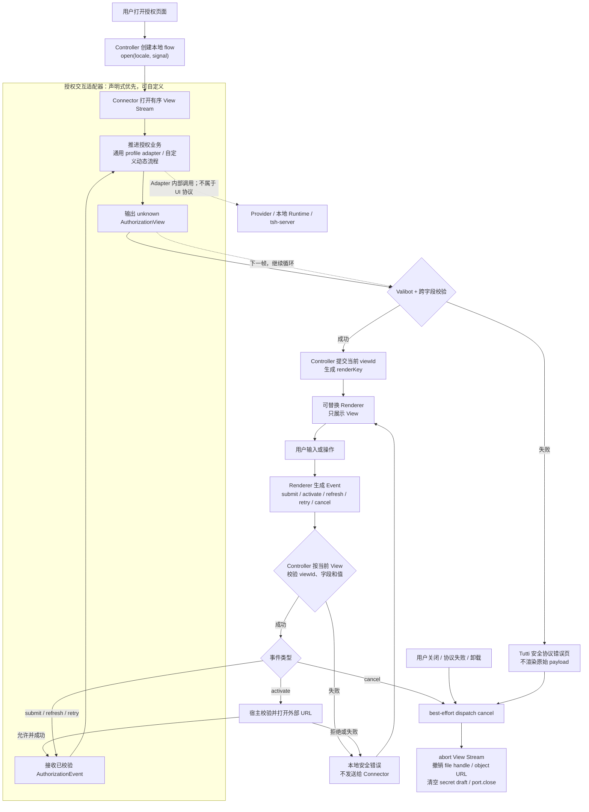

# Connector 授权 UI 协议与可替换渲染方案

Status: Draft RFC

Owner: Connector Platform

Protocol:

- `tutti.connector.authorization.view.v1`
- `tutti.connector.authorization.event.v1`

## 0. 决策摘要

Connector 授权采用一套 Tutti 所有、版本化、与 React 无关的声明式 UI 协议。授权交互适配器
只描述当前要展示的授权界面，Renderer 只展示界面并返回用户事件。常规单凭证、OAuth 等场景
优先由平台的声明式适配器根据 Connector 配置完成，不要求每个 Connector 发布 JS 处理器；
只有二维码、设备码、轮询或其他动态多步流程才实现自定义交互适配器。

协议只存在于 Connector 和 Renderer 的边界，不是 tsh-server API、Connector Market API、
持久化模型或通用低代码页面协议。tsh-server 不解析、不校验、也不生成该协议。

协议实现放在独立 workspace 包：

```text
packages/connector/authorization-protocol
```

包名：

```text
@tutti-os/connector-authorization-protocol
```

该包使用 Valibot 定义 V1 Schema，并从 Schema 推导 TypeScript 类型。首期不引入 JSON
Schema、AJV、JSON Forms、RJSF 或表单状态库。默认 Renderer 继续放在
`@tutti-os/connector-market`，使用 `@tutti-os/ui-system`；宿主可以替换整个 Renderer，
也可以替换某种 view 或 field 的 Renderer。

UI 协议与声明式授权配置是两个边界：前者是 Adapter/Renderer 之间的 View/Event；后者是
Connector package 提供给平台通用 Adapter 的可信配置。credential 最终注入哪个 header、
endpoint 或进程环境仍由现有受信 binding 决定，不进入 UI 协议。

## 1. 背景和第一处错误边界

当前授权 Dialog 根据 `authorizationKind === "api_key"` 决定是否展示 secret 输入框，
并直接理解 `secret`、`authorizationUrl` 等授权实现细节：

```text
authorizationKind
  -> ConnectorAuthorizationDialog 分支
  -> secret 或 authorizationUrl
  -> beginAuthorization
```

`authorizationKind` 描述凭证类型，不等于当前应该渲染的用户交互。一个 API key Connector
可能需要多个字段，一个 OAuth Connector 可能需要链接、device code 或二维码；Renderer
不应该根据凭证类型猜测界面。

目标数据流是：

```text
Connector
  -> AuthorizationViewEnvelopeV1 (unknown JSON)
  -> Valibot parse + 跨字段校验
  -> Authorization UI Controller
  -> injected AuthorizationRenderer
  -> AuthorizationEventEnvelopeV1
  -> Controller 校验事件与当前 view 是否匹配
  -> Connector
  -> 下一份 AuthorizationViewEnvelopeV1
```

第一个需要修正的状态是 Connector 没有显式输出 UI view，而不是 Dialog 缺少更多
`authorizationKind` 分支。

### 1.1 工作流程图



图中的实线 `View` 和 `Event` 是本方案定义的授权适配器/Renderer UI 协议；适配器到
Provider、本地 Runtime 或 tsh-server 的调用不共享这套 UI Schema。Renderer 永远不直接
访问这些 backend。

### 1.2 腾讯文档现状核对

腾讯文档 `0.2.0` 没有 Connector 专属授权脚本，业务链路确实是配置驱动的：

- `tutti.connector.json` 声明 `authorization.kind: "api_key"`、
  `backend: "native_secret"`；
- `implementation/mcp.json` 通过 `bindingRef: "tencent-docs.primary"` 关联服务端 binding；
- `server/tsh-binding.json` 声明远端 MCP endpoint、`Authorization` header 注入、allowlist 和
  `initialize` / `tools/list` 验证；
- tsh-server 负责校验、加密保存和运行时 header 注入，Connector 不处理 token。

但当前 UI 仍不是“显式表单配置”：桌面端根据 `authorizationKind === "api_key"` 硬编码生成
单个 `secret` 输入框。也就是说，腾讯文档的授权业务和 binding 已配置化，表单展示仍靠 UI
猜测。本方案要补齐的是最后这一段：由通用声明式适配器把显式 presentation 配置转换为
View/Event，Renderer 不再根据 authorization kind 猜字段，同时不破坏腾讯文档现有的
`native_secret` 和 tsh binding 链路。

## 2. 范围

### 2.1 目标

- 用有限、版本化的 union 描述当前授权页面；
- 覆盖邮箱加授权码、PAT、数值配置、OAuth 文件、外部链接、device code、二维码、等待和
  结果页；
- 所有 Connector 输出在进入 Renderer 前经过运行时校验；
- Renderer 不理解具体 Connector、provider 或凭证类型；
- Connector 不提供 React、HTML、CSS、组件路径或脚本；
- 支持替换整体 Renderer、单个 view Renderer 和单个 field Renderer；
- 对未知版本、未知 view、未知 field 和额外属性 fail closed；
- secret、二维码内容和本地文件句柄不进入日志、持久化或 analytics；
- 保持协议轻量，首期只增加 Valibot。

### 2.2 非目标

- 不定义 tsh-server、HTTP、gRPC、protobuf 或 Connector Market backend 接口；
- 不定义 Connector 内部如何完成 OAuth、轮询或凭证交换；
- 不提供任意页面布局、嵌套对象、数组表单、条件表达式或远程组件；
- 不允许 Connector 下发 Markdown、HTML、CSS、className、图标 URL 或任意 handler；
- 不允许 Connector 选择 Renderer；
- 不让 Renderer 直接访问 Connector transport、Market backend 或 credential store；
- 不为非 TypeScript 语言生成 JSON Schema；
- 不在 V1 提供自定义 field/view type 扩展槽。

## 3. 所有权与依赖方向

### 3.1 包职责

```text
packages/connector/authorization-protocol/
  package.json
  src/
    index.ts
    limits.ts
    parseAuthorizationEvent.ts
    parseAuthorizationView.ts
    validateEventForView.ts
    v1/
      eventSchemas.ts
      types.ts
      viewSchemas.ts
    __fixtures__/
      valid/
      invalid/
```

协议包只拥有：

- Valibot Schema；
- 从 Schema 推导的 V1 DTO 类型；
- 统一 parser 和稳定的 parse error；
- 事件与当前 view 的语义校验；
- 安全上限常量；
- package-private contract fixtures。

协议包禁止依赖：

- React 和 DOM；
- `@tutti-os/ui-system`；
- `@tutti-os/connector-market`；
- desktop bridge；
- tsh-server client；
- Connector runtime transport；
- Valtio 或其他业务状态库。

依赖方向：

```text
Authorization adapter ────┐
                          ├──> connector-authorization-protocol
Authorization controller ┤
Default Renderer ─────────┘

connector-authorization-protocol -X-> connector-market
connector-authorization-protocol -X-> tsh-server
```

这满足 `packages/AGENTS.md` 的共享边界要求：协议包由授权 Adapter 输出侧、Controller 和
Renderer 多方消费，职责可以精确命名，不是为了“看起来可复用”而抽取。

### 3.2 默认 Renderer 位置

首期默认实现放在：

```text
packages/connector/market/src/ui/authorization/
  DefaultAuthorizationRenderer.tsx
  AuthorizationRenderer.types.ts
  viewRenderers/
    AuthorizationFormView.tsx
    AuthorizationExternalLinkView.tsx
    AuthorizationQrCodeView.tsx
    AuthorizationDeviceCodeView.tsx
    AuthorizationProgressView.tsx
    AuthorizationResultView.tsx
  fieldRenderers/
    AuthorizationTextField.tsx
    AuthorizationSecretField.tsx
    AuthorizationNumberField.tsx
    AuthorizationSelectField.tsx
    AuthorizationBooleanField.tsx
    AuthorizationLocalFileField.tsx
```

只有出现第二个真实 UI 消费方后，才将默认实现拆为
`packages/connector/authorization-ui`。协议包从一开始独立，避免 Connector 依赖 Market
或 React。

### 3.3 发布形态

本方案不发布需要单独执行或通过 CDN 加载的 JS 脚本。发布物是普通 ESM npm library：

```text
@tutti-os/connector-authorization-protocol
  dist/index.js
  dist/index.d.ts
  dist/v1/index.js
  dist/v1/index.d.ts
  README.md
  package.json
```

推荐 exports：

```json
{
  "exports": {
    ".": {
      "types": "./dist/index.d.ts",
      "import": "./dist/index.js"
    },
    "./v1": {
      "types": "./dist/v1/index.d.ts",
      "import": "./dist/v1/index.js"
    }
  }
}
```

- 声明式 Connector 直接在 manifest 中携带 JSON 配置，不需要 import 或执行 JS；
- 自定义 JS/TS Adapter 可以从 `/v1` import typed builder；
- Tutti Controller 和默认 Renderer 依赖同一 package；
- `valibot` 是该 package 的普通 runtime dependency，不要求调用方配置 peer version；
- package 输出编译后的 ESM JS 和 `.d.ts`，不公开 `src/*`；
- npm package version 与 UI protocol version 独立：package 可以修 bug，Connector 通过
  `/v1` subpath 明确选择协议版本；
- Python 或其他语言 Connector 不需要执行这份 JS，仍可按协议生成 JSON，由 Tutti 的
  Valibot parser 做最终边界校验；
- 首期不发布 JSON Schema、CDN bundle、全局变量脚本、CLI executable 或远程可执行代码。

本次实现将协议作为 public workspace package，并已加入
`docs/conventions/npm-package-release.md` 的固定发布组。Connector manifest 只携带 JSON，
不要求加载该 package 或执行远程 JS；仓库外 TypeScript Adapter 后续可从 `/v1` import 类型和
builder。

## 4. 协议设计原则

1. **一帧一个 view**：Connector 每次只描述当前界面，不下发完整流程图。
2. **Adapter 拥有状态转换**：Renderer 不推断下一步、不轮询、不交换凭证。Adapter 可以是
   Tutti 提供的通用声明式实现，也可以是 Connector 的自定义动态实现。
3. **纯数据**：协议是可结构化克隆的 JSON 数据，不包含函数或框架对象。
4. **显式 union**：view 和 field 均使用封闭的 discriminated union。
5. **严格 V1**：V1 Schema 使用 `strictObject`，未知字段拒绝；发布后冻结。
6. **安全能力由宿主决定**：打开 URL、读取文件和复制内容必须经过可信宿主能力。
7. **文案与视觉分离**：Connector 可以提供业务标题和说明；通用按钮、状态和错误文案由
   Tutti i18n 提供。
8. **协议与 Renderer API 分离**：协议包只定义数据；React component props 留在 UI 包。

Adapter 输出的业务文案必须已经按 `open` 收到的 locale 解析；协议不承载 i18n message
key。声明式配置由通用 Adapter 选择 locale，自定义 Adapter 自行选择；缺少目标语言时使用
Connector 的默认语言，Tutti-owned 文案仍由宿主 i18n 生成。

## 5. Authorization View V1

### 5.1 Envelope

```ts
interface AuthorizationViewEnvelopeV1 {
  protocol: "tutti.connector.authorization.view.v1";
  viewId: string;
  view: AuthorizationViewV1;
}
```

`viewId` 是 Connector 为当前 UI 帧生成的不透明标识：

- 在同一次授权流程内必须唯一；
- view 的交互语义发生变化时必须生成新值；
- Renderer 返回事件时原样回传；
- Controller 只接受与当前 `viewId` 相同的事件；
- 它不是服务端 session ID、Market revision 或幂等键；
- 不得包含账号、token、路径或其他敏感信息。

授权流程实例 ID 由 Controller 内部管理，不属于 Connector/Renderer 协议。

### 5.2 View union

```ts
type AuthorizationViewV1 =
  | AuthorizationFormViewV1
  | AuthorizationExternalLinkViewV1
  | AuthorizationDeviceCodeViewV1
  | AuthorizationQrCodeViewV1
  | AuthorizationProgressViewV1
  | AuthorizationResultViewV1;

interface AuthorizationViewBaseV1 {
  type: string;
  title?: string;
  description?: string;
}
```

所有文字按纯文本渲染。`description` 不支持 Markdown、HTML 或内嵌链接；链接必须使用
结构化 `helpLinks`。

### 5.3 Form view

```ts
interface AuthorizationFormViewV1 extends AuthorizationViewBaseV1 {
  type: "form";
  helpLinks?: AuthorizationHelpLinkV1[];
  fields: AuthorizationFieldV1[];
  fieldErrors?: Record<string, string>;
  submitLabel?: string;
}

interface AuthorizationHelpLinkV1 {
  label: string;
  url: string;
}
```

`submitLabel` 只允许覆盖业务动作，例如“保存并连接”。取消、返回、重试等通用文案由
Renderer 的本地 i18n 提供。`fieldErrors` 只能引用当前 form 已声明的字段，内容按纯文本
展示；它用于 Connector 完成业务校验后返回错误，不替代 Renderer 的本地基础校验。

### 5.4 External link view

```ts
interface AuthorizationExternalLinkViewV1 extends AuthorizationViewBaseV1 {
  type: "external_link";
  url: string;
  actionLabel?: string;
  expiresAt?: string;
}
```

Renderer 不直接使用 `window.open`。用户触发后发出 `activate` 事件，由可信宿主通过统一
external navigation policy 校验并打开 URL。协议不支持 `autoOpen`；是否在特定受信场景
自动打开由宿主策略决定，Connector 无权指定。

### 5.5 Device code view

```ts
interface AuthorizationDeviceCodeViewV1 extends AuthorizationViewBaseV1 {
  type: "device_code";
  verificationUrl: string;
  userCode: string;
  actionLabel?: string;
  expiresAt?: string;
}
```

Renderer 展示和复制 `userCode`，并通过 `activate` 请求宿主打开 `verificationUrl`。复制是
Renderer 本地操作，不向 Connector 发事件。

### 5.6 QR code view

```ts
interface AuthorizationQrCodeViewV1 extends AuthorizationViewBaseV1 {
  type: "qr_code";
  source:
    | {
        type: "payload";
        value: string;
      }
    | {
        type: "png_base64";
        value: string;
      };
  fallbackText?: string;
  expiresAt?: string;
  refreshable?: boolean;
}
```

优先使用 `payload`，默认 Renderer 在本地编码二维码。只有 Connector 无法获得原始 payload
时才允许 `png_base64`。V1 不允许远程图片 URL、data URL、SVG 或 HTML：

- payload 最大 4,096 UTF-8 bytes；
- PNG 解码后最大 512 KiB；
- 协议 parser 检查 base64、decoded length、PNG signature 和 IHDR 尺寸；
- 默认 Renderer 在展示前还必须使用受限 decoder 完成实际解码，解码失败安全终止；
- 二维码尺寸、纠错等级、颜色、留白和 Logo 由 Renderer 决定；
- `fallbackText` 可以复制，但不得记录；
- `expiresAt` 仅用于显示倒计时和禁用过期操作，不让 Renderer 自动调用 Connector；
- `refreshable: true` 时显示本地“刷新”按钮并发出 `refresh` 事件。

Connector 负责扫码结果观察。扫码成功后 Connector 主动输出新的 result view，Renderer
不轮询二维码状态。

### 5.7 Progress view

```ts
interface AuthorizationProgressViewV1 extends AuthorizationViewBaseV1 {
  type: "progress";
  message?: string;
}
```

`progress` 只描述展示状态。Connector 在后台工作完成后主动输出下一帧；Renderer 不依据
该 view 启动 timer、poll 或网络请求。Dialog 是否允许关闭由宿主策略控制。

### 5.8 Result view

```ts
interface AuthorizationResultViewV1 extends AuthorizationViewBaseV1 {
  type: "result";
  outcome: "success" | "failure";
  message?: string;
  retryable?: boolean;
}
```

`retryable` 只对 failure 有效。为 true 时 Renderer 显示本地化重试按钮并发出 `retry`
事件。Result 是 Connector 的业务结果，不用于表示协议解析失败或 Renderer 异常；后两者由
Tutti 自己的错误 UI 处理。

## 6. Form field V1

### 6.1 Field union

```ts
type AuthorizationFieldV1 =
  | TextAuthorizationFieldV1
  | SecretAuthorizationFieldV1
  | NumberAuthorizationFieldV1
  | SelectAuthorizationFieldV1
  | BooleanAuthorizationFieldV1
  | LocalFileAuthorizationFieldV1;

interface AuthorizationFieldBaseV1 {
  name: string;
  label: string;
  description?: string;
  helpLinks?: AuthorizationHelpLinkV1[];
  required?: boolean;
}
```

字段名必须匹配 `^[a-z][a-z0-9_]{0,63}$`，同一 form 内不能重复。Renderer 使用 `name`
关联值和错误，不将它直接用作 DOM id。

### 6.2 Text 和 secret

```ts
interface TextAuthorizationFieldV1 extends AuthorizationFieldBaseV1 {
  type: "text";
  format?: "plain" | "email";
  placeholder?: string;
  defaultValue?: string;
  minLength?: number;
  maxLength?: number;
}

interface SecretAuthorizationFieldV1 extends AuthorizationFieldBaseV1 {
  type: "secret";
  placeholder?: string;
  minLength?: number;
  maxLength?: number;
}
```

V1 不允许 secret `defaultValue`。text 默认去除首尾空白；secret 永不自动 trim，避免改变
真实凭证。`format: "email"` 提供基础格式反馈，但 Connector 仍负责业务校验。

### 6.3 Number

```ts
interface NumberAuthorizationFieldV1 extends AuthorizationFieldBaseV1 {
  type: "number";
  placeholder?: string;
  defaultValue?: number;
  minimum?: number;
  maximum?: number;
  step?: number;
  unit?: string;
}
```

数值必须是有限安全数值，拒绝 `NaN`、`Infinity` 和超出 JavaScript safe integer 范围的
整数。`step` 必须大于 0；step 校验以 `minimum ?? 0` 为基准，并允许有限浮点误差。

### 6.4 Select 和 boolean

```ts
interface SelectAuthorizationFieldV1 extends AuthorizationFieldBaseV1 {
  type: "select";
  defaultValue?: string;
  options: Array<{
    value: string;
    label: string;
    description?: string;
  }>;
}

interface BooleanAuthorizationFieldV1 extends AuthorizationFieldBaseV1 {
  type: "boolean";
  defaultValue?: boolean;
}
```

Select option value 在字段内必须唯一；提交值必须来自 options。未勾选 boolean 的规范值是
`false`，除非 required 语义明确要求用户确认 true。

### 6.5 Local file

```ts
interface LocalFileAuthorizationFieldV1 extends AuthorizationFieldBaseV1 {
  type: "local_file";
  extensions?: string[];
}

interface AuthorizationLocalFileValueV1 {
  type: "local_file";
  handleId: string;
}
```

V1 的 `local_file` 返回宿主创建的短期 opaque handle，不把原始路径或文件内容放进协议。
Renderer 可以显示经过脱敏的文件名或路径，但事件只携带 `handleId`。Connector 通过宿主
提供的受限文件能力读取 handle；该能力不属于本协议。

约束：

- handle 绑定当前授权流程，关闭 Dialog 或 view 切换时撤销；
- Connector 只能读取用户明确选择的文件；
- 不允许 Connector 自行解析任意宿主路径；
- 不支持 `defaultValue`，避免静默读取历史路径；
- extensions 最多 20 个，使用规范化的 `.json` 形式；
- 宿主读取时重新检查 handle、文件类型、大小和权限，不能只信任选择时检查；
- 实现应避免符号链接切换和选择后替换造成的 TOCTOU；优先使用已打开的只读句柄或安全
  快照。

如果某个受信本地 Connector 确实需要路径而不是文件内容，应通过宿主的 Connector
capability 显式解决，不把 `path` 加回通用 UI 协议。

### 6.6 字段与 Connector 参数绑定

`field.name` 是授权交互内部的提交键，Renderer 不维护 credential 映射表。绑定分两层：

```text
声明式授权配置输出 field.name
  -> Renderer 以 name 收集 draft
  -> submit.values[name]
  -> Controller 做结构和类型校验
  -> 通用授权 Adapter 按 trusted submission 配置取值
  -> 现有 authorization backend / credential binding
```

声明式配置不属于 Renderer 协议，也不会原样发送给 Renderer。建议在 Connector 的
authorization method 中增加 `interaction`，由平台通用 Adapter 消费：

```ts
interface DeclarativeAuthorizationInteractionV1 {
  protocol: "tutti.connector.authorization.declarative.v1";
  initialView: {
    defaultLocale: string;
    locales: Record<string, AuthorizationViewV1>;
  };
  submission: {
    kind: "native_secret";
    secretField: string;
  };
}
```

`initialView.defaultLocale` 必须引用 `initialView.locales` 中存在的语言项。locale 精确命中时选择
对应 View，未命中时选择 `defaultLocale`；所有语言项必须保持相同字段 contract。
`secretField` 只能引用每个语言 View 中类型为 `secret` 的字段。通用 Adapter 收到 submit 后，
从 values 中取出该字段，并调用现有 `native_secret` complete 流程；它无权指定 header、host、
endpoint 或文件路径。这些安全敏感的运行时映射继续由 tsh binding 或其他受信 runtime
binding 管理。

以 Figma PAT 为例，Connector package 只需声明配置，不需要 `handleFigmaEvent`：

```json
{
  "protocol": "tutti.connector.authorization.declarative.v1",
  "initialView": {
    "defaultLocale": "en-US",
    "locales": {
      "en-US": {
        "type": "form",
        "title": "Configure Figma",
        "submitLabel": "Save and enable",
        "fields": [
          {
            "type": "secret",
            "name": "personal_access_token",
            "label": "Personal access token",
            "required": true
          }
        ]
      },
      "zh-CN": {
        "type": "form",
        "title": "配置 Figma",
        "submitLabel": "保存并启用",
        "fields": [
          {
            "type": "secret",
            "name": "personal_access_token",
            "label": "个人访问令牌",
            "required": true
          }
        ]
      }
    }
  },
  "submission": {
    "kind": "native_secret",
    "secretField": "personal_access_token"
  }
}
```

运行时通用 Adapter 执行：

```text
personal_access_token
  -> submit.values.personal_access_token
  -> submission.secretField
  -> CompleteAuthorization({ secret })
  -> encrypted native_secret
  -> trusted runtime binding（例如 X-Figma-Token）
```

腾讯文档可以沿用同一路径：

```json
{
  "protocol": "tutti.connector.authorization.declarative.v1",
  "initialView": {
    "defaultLocale": "en-US",
    "locales": {
      "en-US": {
        "type": "form",
        "title": "Connect Tencent Docs",
        "fields": [
          {
            "type": "secret",
            "name": "personal_token",
            "label": "Personal Token",
            "required": true
          }
        ]
      },
      "zh-CN": {
        "type": "form",
        "title": "连接腾讯文档",
        "fields": [
          {
            "type": "secret",
            "name": "personal_token",
            "label": "Personal Token",
            "required": true
          }
        ]
      }
    }
  },
  "submission": {
    "kind": "native_secret",
    "secretField": "personal_token"
  }
}
```

随后仍调用现有 `native_secret` backend；`Authorization` header 名称、空 prefix、
`docs.qq.com` allowlist 和 MCP 验证全部保持在 `tsh-binding.json`，不重复写入 UI 配置。

为了兼容现有 Tencent Docs manifest，迁移期通用 Adapter 可以把
`kind: "api_key" + backend: "native_secret" + secret: {}` 转换为一个默认单 secret 表单。
这是集中在 Adapter 内的 legacy 兼容，不允许 Renderer 继续包含
`authorizationKind === "api_key"` 分支。Connector 想自定义标题、字段名和帮助链接时，应显式
提供 `interaction`。

V1 的声明式 submission 先只支持 `native_secret` 单敏感字段。邮箱账号加授权码、多 credential
slot、非敏感 runtime settings 等场景，只有在对应 backend 已定义明确的存储与消费 contract
后才增加新的封闭 union 分支；不能通过通用表达式或任意 `binding` 对象绕过安全边界。动态
二维码、device code、轮询等流程使用自定义 InteractionPort，但仍输出相同 View/Event 协议。

Connector manifest tooling 可以提供轻量 builder 校验 presentation 和 submission 引用一致；
它不是 Renderer protocol package 的职责：

```ts
const figmaAuthorization = defineDeclarativeAuthorization({
  protocol: "tutti.connector.authorization.declarative.v1",
  initialView: {
    defaultLocale: "en-US",
    locales: {
      "en-US": {
        type: "form",
        title: "Configure Figma",
        fields: [
          {
            type: "secret",
            name: "personal_access_token",
            label: "Personal access token",
            required: true
          }
        ]
      }
    }
  },
  submission: {
    kind: "native_secret",
    secretField: "personal_access_token"
  }
} as const);
```

这段 TypeScript 只是可选的构建期辅助；发布物可以直接携带等价 JSON。不存在需要宿主下载并
执行的 Connector JS 脚本。Renderer protocol package 仍只导出 View/Event Schema。

Renderer 实际收到的 submit event 仍然只有 UI 数据：

```json
{
  "protocol": "tutti.connector.authorization.event.v1",
  "viewId": "figma-token-1",
  "event": {
    "type": "submit",
    "values": {
      "personal_access_token": "figd_..."
    }
  }
}
```

V1 不增加 `envName`、`configPath`、`headerName` 或通用 `binding` 属性，原因是：

- Renderer 不应该知道 credential 最终落在哪里；
- 远端 Connector、本地 CLI 和 managed broker 的落地方式不同；
- 允许 Connector 通过 UI Schema 指定环境变量、文件路径或 header 会扩大安全权限；
- credential binding 可以独立演进，不迫使 UI 协议升级。

`field.name` 不是用户可见文案，也不是最终运行时参数名。它只是一次授权交互内的稳定提交
key。声明式配置的 contract test 必须证明 `submission` 引用的每个 key 都由 form 声明且类型
匹配；自定义 Adapter 必须证明消费字段与 form 声明一致。未知 key 必须拒绝，不能静默丢弃。

## 7. Authorization Event V1

### 7.1 Envelope 和 event union

```ts
interface AuthorizationEventEnvelopeV1 {
  protocol: "tutti.connector.authorization.event.v1";
  viewId: string;
  event: AuthorizationEventV1;
}

type AuthorizationEventV1 =
  | {
      type: "submit";
      values: Record<string, AuthorizationValueV1>;
    }
  | { type: "activate" }
  | { type: "refresh" }
  | { type: "retry" }
  | { type: "cancel" };

type AuthorizationValueV1 =
  | string
  | number
  | boolean
  | AuthorizationLocalFileValueV1;
```

### 7.2 Event 与 view 的合法组合

| 当前 view        | 允许事件                                |
| ---------------- | --------------------------------------- |
| `form`           | `submit`, `cancel`                      |
| `external_link`  | `activate`, `cancel`                    |
| `device_code`    | `activate`, `cancel`                    |
| `qr_code`        | `refresh`（仅 `refreshable`）, `cancel` |
| `progress`       | `cancel`                                |
| `result/success` | `cancel`                                |
| `result/failure` | `retry`（仅 `retryable`）, `cancel`     |

`validateEventForView(currentView, event)` 必须执行以下语义校验：

- `viewId` 必须等于 Controller 当前 view；
- submit 只能用于 form；
- values 不能包含未知字段；
- required 字段必须存在；
- optional 空值按第 7.3 节规范化；
- value 类型必须与 field type 匹配；
- select value 必须存在于 options；
- 字符串、数值和本地文件必须满足字段限制；
- refresh/retry 只有对应 flag 为 true 才能发送。

### 7.3 Form 值规范化

- optional text 为空时从 values 中省略；
- required text trim 后为空时报字段错误；
- secret 不 trim，空字符串只在 required 时拒绝；
- optional number 输入为空时省略，不能转换成 0；
- boolean 始终提交明确的 true/false；
- local_file 只提交当前 flow 创建且仍有效的 handle；
- defaultValue 只负责初始化 Renderer draft，用户提交前仍按同一规则校验；
- Renderer 本地字段错误使用稳定内部 code，不使用 Connector 提供的 HTML 或富文本错误。

## 8. Valibot 组织

### 8.1 唯一协议实现

Valibot Schema 是 V1 TypeScript 协议定义和运行时校验的单一来源：

完整、可类型检查的参考 Schema 位于
[`packages/connector/authorization-protocol/src/v1/schema.ts`](../../packages/connector/authorization-protocol/src/v1/schema.ts)。
它包括全部 View、Field、Event、限制、跨字段检查、推导类型、typed form builder，以及依赖
当前 View 的 `validateAuthorizationEventForViewV1`。以下代码只展示两个顶层 envelope：

```ts
import * as v from "valibot";

export const authorizationViewEnvelopeV1Schema = v.strictObject({
  protocol: v.literal("tutti.connector.authorization.view.v1"),
  viewId: viewIdSchema,
  view: authorizationViewV1Schema
});

export const authorizationEventEnvelopeV1Schema = v.strictObject({
  protocol: v.literal("tutti.connector.authorization.event.v1"),
  viewId: viewIdSchema,
  event: authorizationEventV1Schema
});

export type AuthorizationViewEnvelopeV1 = v.InferOutput<
  typeof authorizationViewEnvelopeV1Schema
>;
```

禁止另外手写一份结构相同的 TypeScript interface 作为协议源。本文代码块用于表达规范，
实现时以 Schema 和推导类型为准。

首期不生成 JSON Schema，原因是该协议没有 tsh-server 或其他语言运行时消费者。未来只有
出现明确的跨语言 Connector SDK 消费者时，才评估从同一来源生成发布 artifact；不能手写
第二份 Schema。

### 8.2 Parser

```ts
type AuthorizationProtocolParseResult<T> =
  | { ok: true; value: T }
  | { ok: false; error: AuthorizationProtocolError };

function parseAuthorizationView(
  input: unknown
): AuthorizationProtocolParseResult<AuthorizationViewEnvelopeV1>;

function parseAuthorizationEvent(
  input: unknown
): AuthorizationProtocolParseResult<AuthorizationEventEnvelopeV1>;
```

Parser 负责：

- 按完整 protocol literal 路由版本；
- 执行 strict structural validation；
- 执行数组长度、字符串长度、URL、时间、base64、PNG header 和尺寸上限；
- 执行字段名、select option 和跨字段约束；
- 将 Valibot issue 转为稳定错误 code；
- diagnostics 只保留字段路径、code 和协议版本，不保留原始值。

建议上限：

| 项目                    | V1 限制                                                    |
| ----------------------- | ---------------------------------------------------------- |
| 单个 form 字段          | 16                                                         |
| select options          | 每字段 100                                                 |
| title/label/actionLabel | 128 Unicode 字符                                           |
| description/message     | 1,024 Unicode 字符                                         |
| placeholder/unit        | 128 Unicode 字符                                           |
| 用户文本输入            | 每字段最大 8,192 字符                                      |
| helpLinks               | view 最多 8 个、field 最多 4 个                            |
| URL                     | 最大 2,048 字符，`https:`；开发策略可允许 loopback `http:` |
| QR payload              | 4,096 UTF-8 bytes                                          |
| QR PNG                  | 解码后 512 KiB，最大 2,048 × 2,048                         |
| local_file extensions   | 20                                                         |

## 9. Connector 集成与 Headless Controller

协议不规定 Adapter 使用 stdio、进程 RPC、worker 还是内存调用。Market feature 定义一个
transport-neutral port。这个 port 通常由 Tutti 的声明式 profile adapter 实现；只有动态流程
才由 Connector 自定义实现。为避免 request/response 返回值和异步订阅产生新旧 view 竞态，
输出统一为单一、有序的 AsyncIterable：

```ts
interface ConnectorAuthorizationInteractionPort {
  open(options: {
    connectorKey: string;
    locale: string;
    signal: AbortSignal;
  }): AsyncIterable<unknown>;

  dispatch(
    event: AuthorizationEventEnvelopeV1,
    options: { signal: AbortSignal }
  ): Promise<void>;

  close?(): Promise<void>;
}
```

- `open` 返回当前授权 flow 唯一的 view stream，第一项必须是首帧；
- stream 内所有 view 按 Adapter 状态提交顺序输出，不能在较新 view 后输出旧 view；
- `dispatch` 只确认事件已被 Adapter 接收，不返回 view；
- 简单声明式 adapter 也必须把响应放入同一 stream；
- OAuth、扫码和等待等异步结果同样进入该 stream；
- 返回值保持 unknown，必须经过 parser 后才能进入状态；
- transport 的认证、超时和进程生命周期不属于 UI 协议。

Controller 状态仅描述本地请求生命周期：

```ts
interface AuthorizationControllerState {
  view: AuthorizationViewEnvelopeV1 | null;
  status: "idle" | "starting" | "ready" | "dispatching" | "failed";
  error?: AuthorizationUiError;
}
```

`progress` 和 `result` 是 Connector 输出的业务 view，不重复编码成 controller status。

Controller 独占：

- parse Connector 输出；
- 保存当前 viewId；
- 串行 dispatch，拒绝重复点击和旧 view 事件；
- 单线程消费 Connector view stream，保证 UI 不发生响应/订阅竞态；
- 对 form event 做 view-aware validation；
- 管理 Renderer draft 的 reset key；
- 管理 AbortController 和 Connector view stream；
- 通过宿主能力打开 URL、创建/撤销 local file handle；
- close、view 变化、失败和卸载时清理 secret、object URL 和 file handle；
- 将 transport/protocol 错误映射为 Tutti-owned 安全错误。

`activate` 的处理顺序是：Controller 校验当前 view 和 URL，通过宿主 external navigation
policy 打开成功后，再向 Connector dispatch `activate`；用户拒绝或宿主拦截时不通知
Connector 已激活。`cancel` 在 Dialog 关闭时 best-effort dispatch，随后总是 abort stream、
撤销本地资源并调用 port `close`，不能因为 Connector 无响应阻止窗口关闭。

Authorization Adapter 独占：

- 授权状态机；
- 网络请求和凭证交换；
- OAuth/device code/扫码结果观察；
- 业务字段校验；
- 决定下一份 view；
- 生成用户安全、可展示的业务失败信息。

默认采用平台通用声明式 Adapter：它读取 Connector 的 `interaction` 和既有 authorization
profile，生成首帧、验证提交字段，并调用现有 backend。自定义 Adapter 只用于声明式能力无法
表达的动态流程；两者对 Controller 暴露同一个 port，因此 Renderer 无感知。

Renderer 独占：

- 布局和视觉；
- 临时表单 draft；
- 本地基础校验和字段错误关联；
- 倒计时、复制、密码显示/隐藏等展示行为；
- 发出结构化 UI event。

## 10. 可替换 Renderer

React 接口属于 `connector-market/ui`，不导出自协议包：

```ts
interface AuthorizationRendererProps {
  connector: Pick<Connector, "key" | "release">;
  view: AuthorizationViewEnvelopeV1;
  renderKey: string;
  busy: boolean;
  error?: AuthorizationUiError;
  capabilities: AuthorizationRendererCapabilities;
  onEvent(event: AuthorizationEventEnvelopeV1): void;
}

type AuthorizationRenderer = React.ComponentType<AuthorizationRendererProps>;

interface AuthorizationRendererCapabilities {
  selectLocalFile(options: { extensions?: string[] }): Promise<{
    handleId: string;
    displayName: string;
  } | null>;
}
```

`renderKey` 是 Controller 创建的 `flowInstanceId + viewId` 不透明组合，只用于强制清理
Renderer subtree，不进入协议。`selectLocalFile` 是唯一需要暴露给 Renderer 的宿主能力：
宿主负责弹出系统选择器、创建 flow-scoped handle，并只返回用于展示的脱敏文件名。
Renderer 不能自行构造 handle。打开外部 URL 仍由 Controller 处理，不作为 Renderer
capability 暴露。

整体替换只能在可信宿主组合根注入：

```tsx
<ConnectorMarketDialogHost
  authorizationRenderer={CustomAuthorizationRenderer}
/>
```

Connector manifest 和 view 均不能指定 Renderer。

默认 Renderer 内提供两级 registry：

```ts
interface AuthorizationViewRendererMap {
  form: AuthorizationViewRenderer<AuthorizationFormViewV1>;
  external_link: AuthorizationViewRenderer<AuthorizationExternalLinkViewV1>;
  device_code: AuthorizationViewRenderer<AuthorizationDeviceCodeViewV1>;
  qr_code: AuthorizationViewRenderer<AuthorizationQrCodeViewV1>;
  progress: AuthorizationViewRenderer<AuthorizationProgressViewV1>;
  result: AuthorizationViewRenderer<AuthorizationResultViewV1>;
}

interface AuthorizationFieldRendererMap {
  text: AuthorizationFieldRenderer<TextAuthorizationFieldV1>;
  secret: AuthorizationFieldRenderer<SecretAuthorizationFieldV1>;
  number: AuthorizationFieldRenderer<NumberAuthorizationFieldV1>;
  select: AuthorizationFieldRenderer<SelectAuthorizationFieldV1>;
  boolean: AuthorizationFieldRenderer<BooleanAuthorizationFieldV1>;
  local_file: AuthorizationFieldRenderer<LocalFileAuthorizationFieldV1>;
}
```

宿主可以传入 `Partial<AuthorizationViewRendererMap>` 或
`Partial<AuthorizationFieldRendererMap>` 覆盖局部实现。未知类型在 parser 阶段已经拒绝，
不能静默跳过 required 字段。

默认实现使用 `@tutti-os/ui-system` 的公开组件、图标和 token。字段 Renderer 只接收字段
定义、当前值、字段错误和 `onChange`；不接收 Controller、Connector port 或 backend。

Dialog 必须以 `renderKey` 作为 Renderer 的 React key。view 改变时强制销毁旧 subtree，
确保 secret draft、倒计时、临时 object URL 和 field-local state 被清理。

## 11. 典型场景

### 11.1 邮箱和 IMAP/SMTP 授权码

```json
{
  "protocol": "tutti.connector.authorization.view.v1",
  "viewId": "mail-credentials-1",
  "view": {
    "type": "form",
    "title": "邮箱授权",
    "description": "输入邮箱地址和 IMAP/SMTP 授权码（非登录密码）",
    "helpLinks": [
      {
        "label": "如何开启 IMAP/SMTP 并获取授权码",
        "url": "https://example.com/mail-help"
      }
    ],
    "submitLabel": "保存并连接",
    "fields": [
      {
        "type": "text",
        "format": "email",
        "name": "email",
        "label": "邮箱地址",
        "required": true
      },
      {
        "type": "secret",
        "name": "authorization_code",
        "label": "IMAP/SMTP 授权码",
        "required": true
      }
    ]
  }
}
```

### 11.2 Figma PAT 完整流程

Figma PAT 与腾讯文档 Personal Token 同属单 secret 场景，应完全走声明式配置，不发布
Connector 专属授权 JS。Connector manifest 的 authorization method 在现有 profile 上增加
presentation 和 submission 配置：

```json
{
  "kind": "api_key",
  "methods": [
    {
      "profileId": "figma-personal-token",
      "profileVersion": "1",
      "method": "api_key",
      "displayName": "Connect Figma",
      "backend": "native_secret",
      "secret": {},
      "interaction": {
        "protocol": "tutti.connector.authorization.declarative.v1",
        "initialView": {
          "defaultLocale": "en-US",
          "locales": {
            "en-US": {
              "type": "form",
              "title": "Configure Figma",
              "description": "Enter a Figma Personal Access Token",
              "submitLabel": "Save and enable",
              "fields": [
                {
                  "type": "secret",
                  "name": "personal_access_token",
                  "label": "Personal access token",
                  "required": true
                }
              ]
            },
            "zh-CN": {
              "type": "form",
              "title": "配置 Figma",
              "description": "输入 Figma Personal Access Token",
              "submitLabel": "保存并启用",
              "fields": [
                {
                  "type": "secret",
                  "name": "personal_access_token",
                  "label": "个人访问令牌",
                  "required": true
                }
              ]
            }
          }
        },
        "submission": {
          "kind": "native_secret",
          "secretField": "personal_access_token"
        }
      }
    }
  ]
}
```

配置加载后，通用声明式 Adapter 为本次 flow 生成 `viewId`，输出 Renderer 协议帧：

```json
{
  "protocol": "tutti.connector.authorization.view.v1",
  "viewId": "figma-token-1",
  "view": {
    "type": "form",
    "title": "配置 Figma",
    "description": "输入 Figma Personal Access Token",
    "submitLabel": "保存并启用",
    "fields": [
      {
        "type": "secret",
        "name": "personal_access_token",
        "label": "个人访问令牌",
        "required": true
      }
    ]
  }
}
```

Renderer 不理解 Figma，只按 `field.name` 生成 submit event：

```json
{
  "protocol": "tutti.connector.authorization.event.v1",
  "viewId": "figma-token-1",
  "event": {
    "type": "submit",
    "values": {
      "personal_access_token": "figd_..."
    }
  }
}
```

通用 Adapter 校验事件后读取 `submission.secretField`，调用现有 `native_secret` 授权完成接口。
验证、加密保存与运行时注入继续沿用已有 backend/binding：

```text
personal_access_token
  -> submit.values.personal_access_token
  -> declarative submission.native_secret
  -> existing CompleteAuthorization secret proof
  -> encrypted credential storage
  -> trusted Figma binding
  -> provider request header
```

这里不存在 Renderer 到具体 header 的直接映射，也没有 Figma 专属
`handleFigmaAuthorization`。通用 Adapter 只把指定 secret 交给 backend，受信 binding 决定
最终注入位置。验证失败时 Adapter 根据 backend 的结构化错误生成新的 form view 和
`fieldErrors`；PAT 不能回传为 `defaultValue`。

`timeout_seconds` 是 Connector 运行配置，不是授权凭证。首期不把它混入 `native_secret`
submission；应由独立 settings 配置处理。如果未来要求在同一个 Dialog 提交，必须先定义
一个明确的 `credential_and_settings` backend contract，再给声明式 submission union 增加对应
分支，不能让 Renderer 直接写 runtime config。

“让 Agent 帮我配置”是 Tutti 宿主能力，不由 Connector 协议下发按钮。宿主需要时在整体
Renderer 外围根据可信 feature flag 添加。

### 11.3 OAuth JSON 文件

```json
{
  "protocol": "tutti.connector.authorization.view.v1",
  "viewId": "google-oauth-file-1",
  "view": {
    "type": "form",
    "title": "配置 Google 日历",
    "fields": [
      {
        "type": "local_file",
        "name": "oauth_credentials",
        "label": "OAuth 凭据文件",
        "required": true,
        "extensions": [".json"]
      }
    ]
  }
}
```

Renderer 展示文件选择器，提交 opaque handle；协议不传 `~/...` 原始路径。

### 11.4 二维码

```json
{
  "protocol": "tutti.connector.authorization.view.v1",
  "viewId": "scan-login-1",
  "view": {
    "type": "qr_code",
    "title": "扫码授权",
    "description": "请使用目标应用扫描二维码",
    "source": {
      "type": "payload",
      "value": "https://example.com/device/authorize?challenge=opaque"
    },
    "fallbackText": "https://example.com/device/authorize?challenge=opaque",
    "expiresAt": "2026-08-12T12:00:00Z",
    "refreshable": true
  }
}
```

默认 Renderer 使用 Tutti 已有的 `qrcode-generator` 依赖本地编码。共享编码 helper 应放在
适当的 UI 基础层或授权 UI 内部，不能让 Connector Market 反向依赖 Desktop feature。

## 12. 错误模型

协议边界错误由 Tutti 定义，不允许 Connector 模拟。`stale_view` 和
`invalid_event_for_view` 由 Controller 的 view-aware validation 产生，其余错误来自 parser：

```ts
interface AuthorizationProtocolError {
  code:
    | "unsupported_protocol"
    | "invalid_envelope"
    | "invalid_view"
    | "invalid_event"
    | "invalid_event_for_view"
    | "limit_exceeded"
    | "stale_view";
  path?: string;
}
```

业务字段错误由 Connector 在收到 submit 后通过 form view 的 `fieldErrors` 返回。
`fieldErrors` 只能引用当前 form 已声明字段，值是安全纯文本。返回错误时 Connector 必须生成
新的 viewId，Controller 销毁旧 draft；如需保留非敏感输入，应由 Connector 在新 view 的
对应字段 `defaultValue` 中显式返回。Connector 禁止回传 secret defaultValue，因此 secret
失败后必须重新输入。

Transport 错误、Connector 崩溃和 Renderer error boundary 使用 Tutti-owned
`AuthorizationUiError`，不属于协议。

## 13. 安全和隐私

- Connector 字符串全部按纯文本展示；
- URL 仅允许 HTTPS，开发策略可以显式允许 loopback HTTP；
- 打开 URL 必须经过宿主 external navigation policy；
- Renderer 不加载 Connector 提供的远程图片、SVG、HTML 或 data URL；
- QR payload、fallbackText、PNG、secret、field values、file handle 和显示路径均不写入
  日志、analytics、Valtio snapshot 或持久化；
- secret 只存在于当前 Renderer subtree 的临时 draft；
- view 切换、提交完成、失败、关闭和卸载都清空 secret；
- protocol parse error 不记录原始 payload；
- local file handle 绑定 flow、短期有效、只读、可撤销；
- 自定义 Renderer 只能由可信宿主注入，Connector 无权选择；
- Renderer event 在发送给 Connector 前必须再次进行 view-aware validation；
- Connector 必须把 Renderer 输入视为不可信，并执行最终业务校验；
- `viewId` 只防止本地旧 UI 事件错投，不替代 transport 层认证或 Connector 自身幂等性。

## 14. 版本策略

- V1 使用 `strictObject`，发布后属性集合和语义冻结；
- 修正文档、收紧实现 bug 或增加 fixture 不改变版本；
- 新增可见属性、view type、field type、value type 或事件语义必须发布 V2；
- parser 通过完整 protocol literal 路由，未知版本 fail closed；
- 同一个 UI Controller 可以注册多版本 parser，并归一化到内部 Renderer model；
- V2 只有在需要兼容已发布 V1 Connector 时才引入 normalizer，不提前维护重复 domain type；
- 首期不提供开放 `metadata` 或 `extensions` bag，避免形成无法校验的隐式协议；
- Connector 和 Tutti 的版本协商属于 transport adapter，不属于 UI message 本身。

## 15. 兼容迁移

### 阶段 A：协议包

- 新增 `@tutti-os/connector-authorization-protocol`；
- 增加 Valibot dependency、V1 view/event Schema、parser、limits 和 fixtures；
- 不修改 tsh-server；
- 不生成 JSON Schema；
- 暂不发布独立 npm SDK，直到存在明确的外部 Connector 消费需求。

### 阶段 B：Controller 和默认 Renderer

- 在 Connector Market 增加 interaction port 和 headless controller；
- 增加默认 view/field renderer registry；
- `ConnectorAuthorizationDialog` 只组合 Controller 和 Renderer；
- 默认 UI 使用 `@tutti-os/ui-system`；
- 整体 Renderer 注入点放在可信宿主 composition root。

### 阶段 C：声明式 Adapter 与 Connector adoption

- 在 Connector manifest contract 中增加可选 `interaction` 配置；该配置不属于 Renderer
  protocol package，`initialView.locales` 的每个值复用同一份 View Schema，并由
  `defaultLocale` 声明未命中时的回退项；
- 实现平台通用 declarative Adapter，负责生成 `viewId`、输出 view、消费 event，并调用现有
  authorization backend；
- Tencent Docs 和 Figma 单 token 场景只增加配置，不增加 Connector 专属 JS；
- OAuth URL 只有在 provider 实际返回 URL 时映射为 `external_link`；
- API key 只有在 Connector 明确声明表单字段时渲染 form；
- 禁止继续用 `authorizationKind === "api_key"` 猜测 secret 表单；
- 只在二维码、device code、轮询等声明式配置不能表达的流程实现自定义 Adapter；
- legacy 与新协议使用独立 Controller，不能伪造 viewId 或假装旧路径支持异步 view。

### 阶段 D：清理旧 UI 分支

- 新 Connector 全部使用协议后，删除 Dialog 内的凭证类型分支；
- 删除只为旧 Dialog 存在的 `secret?` 和 `authorizationUrl?` UI contract；
- 兼容 adapter 的删除以实际 Connector 覆盖率为准，不与 tsh-server 升级绑定。

## 16. 测试与验收

### 16.1 Protocol tests

- 每种 view 和 field 的最小/完整有效 fixture；
- 未知协议、view、field、event 和额外属性失败；
- 字符串、数组、URL、base64、PNG 和时间边界；
- 重复 field name、重复 select value 和非法 defaultValue 失败；
- submit 缺少 required、出现未知字段或类型不匹配失败；
- stale viewId、非法 activate/refresh/retry 组合失败；
- parser error 不包含输入值。
- declarative contract fixture 证明 form 字段与 submission 引用完全一致；自定义 Adapter fixture
  证明声明字段与消费字段完全一致。

### 16.2 Controller tests

- open stream 的首帧必须 parse 成功；
- dispatch 串行且 busy 时重复点击不重复发送；
- stream 中每一份 unknown view 都重新 parse，且消费顺序不倒退；
- 旧 view 事件被本地拒绝；
- view 切换和 close 撤销 stream、file handle 和 draft；
- dispatch 不返回 view，Controller 保持当前 view，直到 stream 推送下一帧；
- transport/protocol/Connector failure 映射为安全 UI error；
- legacy 与 interaction controller 不共享假状态。

### 16.3 Renderer tests

- V1 所有 view 和 field 都有默认 Renderer；
- 邮箱、PAT、OAuth JSON 文件和二维码 case 可完整渲染/提交；
- QR payload 本地生成，PNG 校验失败时安全失败；
- QR 过期后禁用并只在 refreshable 时显示刷新；
- secret 不 trim、不持久化，view 改变时清空；
- local_file 只提交 opaque handle；
- whole/view/field 三层替换均有效；
- 自定义 Renderer 不获得 Connector port 或 backend；
- label、焦点、键盘提交、错误关联和 loading 状态满足可访问性要求。

### 16.4 工程验证

实施后至少运行：

```bash
pnpm --filter @tutti-os/connector-authorization-protocol test
pnpm --filter @tutti-os/connector-authorization-protocol typecheck
pnpm --filter @tutti-os/connector-authorization-protocol build
pnpm --filter @tutti-os/connector-market test
pnpm --filter @tutti-os/connector-market typecheck
pnpm --filter @tutti-os/connector-market build
pnpm check:changed
```

记录引入 Valibot 和默认 Renderer 前后的实际 bundle diff。Valibot 只能出现在协议解析边界，
不得被表单状态或 UI component 直接依赖。

## 17. PR 拆分和完成标准

推荐三个可独立回滚的 PR：

1. **protocol**：workspace package、Valibot Schema、parser、limits、fixtures；
2. **renderer**：interaction port、Controller、默认 Renderer、注入点和 legacy Controller；
3. **declarative adoption**：通用 Adapter、manifest interaction schema、Tencent Docs/Figma
   配置迁移；动态流程再按需接入自定义 Adapter。

方案完成标准：

- tsh-server 没有新增协议代码或检测机制；
- 协议包没有 React、UI System、Market 或 transport dependency；
- ConnectorAuthorizationDialog 不再根据 Connector 类型决定字段；
- Renderer 不调用 Connector API，只发结构化 event；
- 声明式和自定义 Adapter 可以通过同一协议覆盖 form、URL、device code、QR、progress 和
  result；
- 更换整体 Renderer 不需要改 Connector；
- 增加一个已有 V1 field/view 的 Connector 不需要修改 Dialog；
- 所有 unknown Adapter 输出在渲染前 fail closed。
