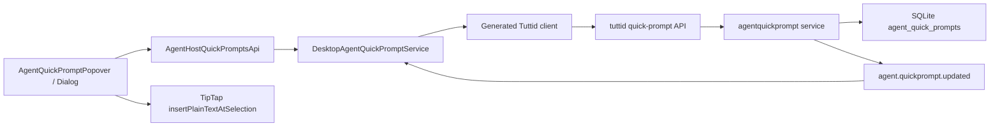

# Introduction

实现已在 `codex/feature-quick-prompt-library` 完成，并通过 changed-aware checks、daemon build、
定向竞态/冲突测试和三路独立代码审查。TASK-033 中涉及真实桌面窗口的视觉与双窗口人工验收仍应在
合并前由桌面环境执行；其余实现和自动化验证项已完成。

本文基于 `origin/main` 的提交 `deed78c73ce9c5b3da1cd3223a81805dffc6bfea`
设计。目标是在 Agent 输入框底部、Handoff/Provider 入口之后加入“快捷提示词”入口：
用户从固定高度的 Popover 中搜索并选择提示词，选择后把正文插入当前输入框选区；用户也可以新增、
编辑和删除提示词。该能力作为开发者功能交付，`agent.quickPromptLibrary` 默认关闭；用户必须先在
“设置 → 开发者”显式开启，入口才会出现。

交互采用“选择与管理分层”的方案：Popover 只承担浏览、搜索、选择和管理入口；新增/编辑使用
Dialog，删除使用 ConfirmationDialog。这样既保留高频选择动作的轻量感，又避免在 400px 左右的
Popover 中放入长文本表单、键盘和错误状态，降低焦点管理与误操作风险。

所有浮层、表单、按钮、滚动容器、菜单和图标必须复用现有 `@tutti-os/ui-system` 公共导出。
本功能不新增 UI primitive，不深层导入 UI System 源文件，也不使用原生 `button`、自制 overlay、
自制 scroll container 或新图标替代已有组件。

推荐的数据流如下：

提示词库是设备级、与 workspace 和会话无关的用户数据。它由 tuttid 持久化；
`AgentActivityRuntime` 继续只管理 Session/Turn/Interaction 等 canonical activity，不接收提示词库状态。

## 1. Requirements & Constraints

- **REQ-001**: 在 Composer Footer 左侧组内，把快捷提示词入口放在 Handoff/Provider 入口之后、
  Plan/Goal 等状态徽标之前，与截图标注位置一致；宿主没有 quick-prompts capability 或开发者功能开关关闭时隐藏入口。
- **REQ-002**: 入口使用 UI System `Button`、`Tooltip` 和现有 `FileTextIcon`；普通宽度显示图标和
  “提示词”，紧凑布局只显示图标但保留可访问名称和 Tooltip。
- **REQ-003**: 选择器使用 UI System `Popover`，向上打开并左对齐；内容宽度 400px、高度 420px，
  同时受 Radix available-height 约束，在小窗口中允许整体缩短但不越出视口。
- **REQ-004**: Popover 的标题、搜索框和新增按钮固定，只有列表区域使用 UI System `ScrollArea`
  滚动；列表按 `updatedAtUnixMs DESC, id ASC` 稳定排序，搜索在已加载的最多 100 条记录中匹配标题和正文。
- **REQ-005**: 每条记录的主区域用于选择；右侧独立的 UI System `DropdownMenu` 提供编辑和删除，
  避免交互元素嵌套。加载、空列表、无搜索结果和失败重试都要有明确状态。
- **REQ-006**: 新增和编辑使用 UI System `Dialog`、`Input`、`Textarea`、`Button`；标题和正文均为必填，
  表单不自动保存。新增与编辑共用一个表单组件，编辑时载入实体快照和版本号。
- **REQ-007**: 删除使用 UI System `ConfirmationDialog` 的 destructive tone，确认文案包含提示词标题；
  删除前后不得把提示词正文写入日志、Toast、事件或分析埋点。
- **REQ-008**: Popover 与新增/编辑/删除 Dialog 互斥。进入管理 Dialog 时保留搜索词、滚动位置和来源记录；
  Dialog 关闭后返回原 Popover，上次新增或编辑成功的记录获得焦点但不会自动插入。
- **REQ-009**: 选择提示词时，用 TipTap 当前 selection 替换被选文本或在光标处插入纯文本，保留原有
  mention、附件和其他富文本节点；完成后关闭 Popover、恢复编辑器焦点且不自动发送。
- **REQ-010**: 快捷提示词为设备级数据，不绑定 workspace、项目、provider、Agent target 或会话；
  所有 Workspace AgentGUI 和 standalone Agent window 通过同一个宿主 capability 使用它。
- **REQ-011**: tuttid 提供 list/create/update/delete API；标题 trim 后 1–80 个 Unicode code point，
  正文保持换行和内部空白但 trim 后不得为空，UTF-8 最大 32 KiB，设备最多 100 条。
- **REQ-012**: 每条记录包含 `id`、`title`、`content`、`version`、`createdAtUnixMs` 和
  `updatedAtUnixMs`；服务端生成稳定 UUID，版本从 1 开始，每次成功编辑加 1。
- **REQ-013**: 编辑和删除携带 `expectedVersion`。实体不存在返回 404，版本过期返回 409；客户端保留
  Dialog 中的草稿，刷新最新列表并提示用户重新确认，不静默覆盖其他窗口的修改。
- **REQ-014**: 成功写操作发布全局 `agent.quickprompt.updated` 失效事件，事件只包含 `promptId`、
  `changeKind`、`version` 和 `occurredAtUnixMs`，不包含标题或正文；其他窗口收到后合并/coalesce 一次 list 刷新。
- **REQ-015**: 所有用户可见文案加入 AgentGUI 的 `en` 和 `zh-CN` locale，由现有 label projection 注入；
  不在组件和桌面 adapter 中硬编码文案，中文 UI 文案末尾不加句号。
- **REQ-016**: 键盘路径完整：入口可聚焦，Popover 打开后聚焦搜索框，上下键移动列表，Enter 选择，
  Escape 逐层关闭，Dialog 保存后焦点返回管理来源；每个 icon-only action 有可访问名称。
- **REQ-017**: 在现有“设置 → 开发者”增加“快捷提示词”UI System `Switch`。feature flag key 固定为
  `agent.quickPromptLibrary`，catalog default 为 `false`；key 缺失、旧版 preferences 或读取失败都按关闭处理。
- **REQ-018**: 开关通过现有 desktop preferences 保存并订阅 `preferences.desktop.updated`；开启后当前窗口即时显示入口并在首次打开时 lazy load，
  关闭后所有窗口即时关闭已打开的 Popover/Dialog、隐藏入口并禁止新的 list/mutation，但保留已存提示词数据。
- **SEC-001**: 提示词正文视为潜在敏感数据，只存在于 SQLite、HTTP 响应和当前 renderer 内存；
  不进入 event stream payload、诊断日志、analytics、错误 developer message 或 crash breadcrumb。
- **SEC-002**: API 复用 daemon 现有本地认证/监听边界和标准错误响应；服务层在持久化前完成长度、
  空白、数量与版本校验，不能只依赖前端校验。
- **SEC-003**: desktop Host adapter 在 feature flag 关闭时 fail closed：不触发 quick-prompt list/create/update/delete；
  UI 中已经排队但尚未发出的 mutation 必须取消，已经提交到 daemon 的请求按 authoritative response 收口但不重新显示入口。
- **CON-001**: 使用 UI System 公共入口 `@tutti-os/ui-system` 和 `@tutti-os/ui-system/icons`；
  采用现有 `Popover`、`Dialog`、`ConfirmationDialog`、`ScrollArea`、`Input`、`Textarea`、`Button`、
  `DropdownMenu`、`Tooltip`、`Spinner`、`FileTextIcon`、`AddIcon`、`EditIcon`、`DeleteIcon`、
  `MoreHorizontalIcon` 和 `SearchIcon`，不得 DIY 同类能力。
- **CON-002**: 业务布局可通过 `className` 设定 400×420 尺寸和 flex/min-height，但颜色、边框、阴影、
  圆角、焦点态和 destructive tone 必须来自 UI System 语义 token/variant。
- **CON-003**: 不修改 `packages/ui/system` 源码、metadata 或 storyboard；若实现时发现既有组件缺少
  必要能力，先停下并单独评审 UI System 扩展，不能在 AgentGUI 内复制 primitive。
- **CON-004**: 不把提示词库放入 `AgentActivityRuntime`、workspace engine、Session/Turn、
  desktop preferences、localStorage 或组件 module-global cache。
- **CON-005**: 第一版不包含目录/标签/拖拽排序、变量模板、团队/云同步、导入导出、默认内置提示词、
  快捷键、自动发送和提示词使用统计。
- **CON-006**: 延续仓库分层：OpenAPI 与 event definition 先行；tuttid 负责业务规则和 durable state；
  desktop 只做 transport/capability adapter；AgentGUI 负责呈现和编辑器交互。
- **CON-007**: feature flag 复用现有 `desktop_preferences.feature_flags_json`、DesktopFeatureFlags map、
  `setFeatureFlags()` 和 preferences event；不得为该开关新增 SQLite column/table、单独 migration 或 localStorage key。

## 2. Implementation Steps

### Implementation Phase 1 — 固化领域、OpenAPI 与事件契约

- **GOAL-001**: 先建立设备级 quick-prompt 的唯一领域语言和生成式协议，避免 UI、desktop 与 daemon
  各自定义不兼容 DTO。

| Task     | Description                                                                                                                                                                                                                                                                                           | Completed | Date |
| -------- | ----------------------------------------------------------------------------------------------------------------------------------------------------------------------------------------------------------------------------------------------------------------------------------------------------- | --------- | ---- |
| TASK-001 | 在 `services/tuttid/biz/agentquickprompt/model.go` 定义实体、create/update/delete input、稳定排序规则和共享 sentinel errors；实体正文不实现 `Stringer`，错误中不拼接 content。                                                                                                                        |           |      |
| TASK-002 | 在 `services/tuttid/api/openapi/tuttid.v1.yaml` 增加设备级 `/v1/agent-quick-prompts` GET/POST 与 `/v1/agent-quick-prompts/{promptId}` PUT/DELETE。List 返回 `{ prompts }`，create 返回 201 entity，update 返回 200 entity，delete 返回 204；mutation body 带完整 title/content 或 `expectedVersion`。 |           |      |
| TASK-003 | 为 400/404/409/503 定义并复用现有标准 API error response；把 malformed body/ID、field/limit validation、not found、version conflict 和 service unavailable 映射为稳定错误码与字段参数。                                                                                                               |           |      |
| TASK-004 | 新增 `packages/events/protocol/definitions/agent/quickprompt.updated.event.json`，声明 topic `agent.quickprompt.updated`、version 1、server-to-client、global scope 和不含正文的失效 payload；在 eventstream catalog 中注册对应 topic/validator。                                                     |           |      |
| TASK-005 | 运行 `pnpm generate:api` 与 `pnpm generate:event-protocol`，提交生成的 Go server types、TypeScript client types/operations、event TypeScript validators/types 和 Go protocol；生成文件只由脚本更新。                                                                                                  |           |      |

### Implementation Phase 2 — 实现 tuttid 持久化、服务与 API

- **GOAL-002**: 让 quick-prompt 成为 tuttid 独立、可并发保护、可测试的 durable product state。

| Task     | Description                                                                                                                                                                                                                                                        | Completed | Date |
| -------- | ------------------------------------------------------------------------------------------------------------------------------------------------------------------------------------------------------------------------------------------------------------------ | --------- | ---- |
| TASK-006 | 在 workspace SQLite migrations 中加入 `agent_quick_prompts` 表：`id TEXT PRIMARY KEY`、`title TEXT NOT NULL`、`content TEXT NOT NULL`、`version INTEGER NOT NULL CHECK(version >= 1)`、created/updated timestamps，并为 `updated_at_unix_ms DESC, id ASC` 建索引。 |           |      |
| TASK-007 | 在 `services/tuttid/data/workspace/store.go` 增加窄 `AgentQuickPromptStore` contract，并在 `sqlite_agent_quick_prompts.go` 实现 list/count/create/update/delete。Update/Delete 使用 `WHERE id = ? AND version = ?`，事务内区分 not-found 与 conflict。             |           |      |
| TASK-008 | 为 migration、排序、100 条上限边界、Unicode 标题、32 KiB 正文、版本递增、冲突、删除和数据库 reopen 持久性增加 SQLite tests；不得在失败输出中打印 content fixture。                                                                                                 |           |      |
| TASK-009 | 新增 `services/tuttid/service/agentquickprompt/service.go`，注入 Store、Clock、ID generator 与窄 Publisher；集中执行 trim/长度/数量/version 规则，数据库 commit 成功后再发布失效事件，publisher 失败只记录不含正文的结构化 warning，不能回滚已提交数据。           |           |      |
| TASK-010 | 新增 `services/tuttid/service/eventstream/agent_quick_prompt.go` publisher，并扩展 catalog/parity tests；event 只作为 refresh hint，HTTP/SQLite entity 仍是 authoritative state。                                                                                  |           |      |
| TASK-011 | 新增 `services/tuttid/api/daemon_agent_quick_prompts.go` 与 handler tests，完成 generated DTO 与 domain 的显式映射、nil body/service guard、标准状态码和敏感数据错误测试。                                                                                         |           |      |
| TASK-012 | 在 `services/tuttid/api/daemon.go` 的 `DaemonAPI` 增加窄 service interface，在 `services/tuttid/wiring.go` 从 workspace store 构建 service/publisher 并注入 API；保持 desktop、HTTP、eventstream 细节在 service 领域之外。                                         |           |      |

### Implementation Phase 3 — 建立 desktop service 与 AgentHost capability

- **GOAL-003**: 为所有 AgentGUI surface 提供同一份可订阅快照，同时保持 shared AgentGUI 不依赖
  generated tuttid client 或 Electron。

| Task     | Description                                                                                                                                                                                                                                                                                | Completed | Date |
| -------- | ------------------------------------------------------------------------------------------------------------------------------------------------------------------------------------------------------------------------------------------------------------------------------------------ | --------- | ---- |
| TASK-013 | 在 `packages/agent/gui/host/agentHostApi.ts` 增加可选 `AgentHostQuickPromptsApi`：`ensureLoaded`、`getSnapshot`、`subscribe`、`create`、`update`、`remove`；把 capability 从 `AgentHostInputApi` 明确投影到 `AgentHostRuntimeApi`，不经 legacy agentSessions。                             |           |      |
| TASK-014 | Snapshot 使用 `idle/loading/ready/error` 状态、immutable prompts、error、revision 和 pending mutation IDs；shared contract 只表达产品能力，不导入 tuttid generated types。                                                                                                                 |           |      |
| TASK-015 | 新增 feature-local `DesktopAgentQuickPromptService` 及接口，使用 generated `TuttidClient` 完成 HTTP CRUD，用 `useSyncExternalStore` 兼容的 subscribe/getSnapshot 发布 committed snapshot；首次打开 lazy load，重复打开复用内存快照，显式 retry 强制刷新。                                  |           |      |
| TASK-016 | desktop service 订阅 `agent.quickprompt.updated`，忽略本窗口已应用的等价 mutation，其他/未知 mutation 以 single-flight 方式 coalesce 列表刷新；dispose 时释放事件订阅，错误时保留最后成功列表并标记 refresh error。                                                                        |           |      |
| TASK-017 | 在 `registerWorkspaceAgentServices.ts` 注册/返回 quick-prompt service，在 workspace window service registry 中创建每个 renderer window 的单例；它不按 workspaceId 分库。把实例传给 `createDesktopAgentHostApi.ts` 并投影为 optional quickPrompts capability。                              |           |      |
| TASK-018 | 更新 `createDesktopAgentGUIWorkbenchHostInput.ts`、workbench contribution factory、workspace contribution 与 standalone Agent window 的 host-input composition 和相应 tests，从同一 registry service 注入 capability；preview/test host 未提供 capability 时保持原行为且入口不渲染。       |           |      |
| TASK-019 | 在 `apps/desktop/src/shared/featureFlags/catalog.ts` 导出 `AGENT_QUICK_PROMPT_LIBRARY_FLAG = "agent.quickPromptLibrary"`，加入 `FEATURE_FLAG_DEFINITIONS` 的 `developer` group 且 default `false`；扩展 catalog tests，验证 missing/false/true 三种解析。                                  |           |      |
| TASK-020 | 在 `WorkspaceDeveloperSettingsSection.tsx` 按现有 developer flag row 复用 UI System `Switch`，从 pending feature flags 读取值并调用 `settingsService.changeFeatureFlags` 保存；在 shared `en`/`zh-CN` locale 添加 label、description 和保存失败文案。                                      |           |      |
| TASK-021 | 让 `DesktopAgentQuickPromptService` 组合 desktop preferences 可观察状态：Host snapshot 增加 `enabled`，同时订阅 preferences 与 quick-prompt data；disabled 时不加载/不 mutation，true→false 时发布 snapshot 使 AgentGUI 关闭 disclosure，false→true 时只显示入口、保持首次打开 lazy load。 |           |      |

### Implementation Phase 4 — 实现 Composer 选择、管理与插入体验

- **GOAL-004**: 用既有 UI System primitive 完成固定高度选择器和独立管理 Dialog，并把选择结果安全写回 TipTap。

| Task     | Description                                                                                                                                                                                                                                                                                                             | Completed | Date |
| -------- | ----------------------------------------------------------------------------------------------------------------------------------------------------------------------------------------------------------------------------------------------------------------------------------------------------------------------- | --------- | ---- |
| TASK-022 | 在 Composer 下创建 `quickPrompts/` 垂直模块，增加 `useAgentQuickPromptLibrary.ts` controller，统一管理 capability snapshot、feature-enabled gate、search、popover/dialog mode、return focus、selected entity/version、pending state 和 toast/error translation。                                                        |           |      |
| TASK-023 | 实现 `AgentQuickPromptPopover.tsx`：UI System `PopoverContent` 使用 `side="top" align="start" sideOffset={8}`、`w-[400px] h-[420px] max-h-[var(--radix-popover-content-available-height)]`；header/search 固定，`ScrollArea` 使用 `min-h-0 flex-1`。                                                                    |           |      |
| TASK-024 | Popover row 使用独立 UI System selection `Button` 与 `DropdownMenu` trigger `Button`，避免 button-in-button；菜单复用 system icons，删除项使用 destructive variant。补齐 loading、empty、no-result、stale/error-with-retry 和 mutation-disabled 状态。                                                                  |           |      |
| TASK-025 | 实现 `AgentQuickPromptEditorDialog.tsx`，复用 Dialog/Input/Textarea/Button；宽度不超过 560px，正文编辑区最小高度 240px，显示 80 code-point 与 32 KiB 校验，提交中锁定重复 mutation，API 失败保留草稿。                                                                                                                  |           |      |
| TASK-026 | 用 `ConfirmationDialog` 实现删除确认。controller 保证 Popover/Dialog 互斥，并在管理完成或取消后恢复原 search/scroll/focus；409 时保留草稿、刷新实体并显示冲突说明。                                                                                                                                                     |           |      |
| TASK-027 | 给 `ComposerFooter.tsx` 增加 `quickPromptControl?: ReactNode` 组合槽并放在 Handoff/Provider 之后，业务状态留在 `AgentComposer` 垂直模块中，避免把 CRUD props 铺满 Footer；补充 composition test 保护位置、公共 UI imports 和 trigger nesting。                                                                          |           |      |
| TASK-028 | 扩展 `AgentRichTextEditorHandle` 与 `useAgentRichTextEditorHandle.ts`，增加 `insertPlainTextAtSelection(text)`；用现有 `plainTextToAgentRichTextInlineContent` 和 TipTap chain 替换 selection，设置 skip-user-content-event meta，并返回新的 prompt text 供 controlled composer 同步。                                  |           |      |
| TASK-029 | 打开 quick-prompt Popover 前关闭 slash/mention palette、status/review disclosure；选择后插入、不发送、关闭 disclosure 并 focus editor。开关变为 disabled 时同步关闭 quick-prompt disclosure。为 selection replacement、换行、emoji、mention/attachment preservation 和 disabled composer 编写 editor/controller tests。 |           |      |
| TASK-030 | 在 `AgentGUINode.labels.ts` 与 `en.agentGui.ts`、`zh-CN.agentGui.ts` 增加入口、标题、搜索、空态、表单、删除、冲突、重试和成功/失败文案；所有 quick-prompt 组件只消费 labels。                                                                                                                                           |           |      |

### Implementation Phase 5 — 验证边界、文档与回归

- **GOAL-005**: 验证 API、跨窗口同步、UI System 合规、焦点和现有 Composer disclosure 不回归。

| Task     | Description                                                                                                                                                                                                                                                                        | Completed | Date |
| -------- | ---------------------------------------------------------------------------------------------------------------------------------------------------------------------------------------------------------------------------------------------------------------------------------- | --------- | ---- |
| TASK-031 | 更新 `docs/architecture/agent-gui-node.md` 和 `docs/architecture/agent-activity-packages.md`：quick-prompts 是 developer-gated optional Host capability 与 daemon product state，不属于 ActivityRuntime；记录 shared GUI、desktop adapter、preferences gate、tuttid 的所有权边界。 |           |      |
| TASK-032 | 先运行 `pnpm check:changed -- --dry-run` 检查 changed-aware lanes；实现稳定后仅运行一次最终 `pnpm check:changed`，并只为 dry-run 未覆盖的 OpenAPI/event generation check 或定向 package tests 增补命令。                                                                           |           |      |
| TASK-033 | 人工验证默认关闭、设置即时开关、workspace 与 standalone 两种 Agent window、窄窗口 available-height、长列表滚动、键盘导航、Dialog 往返、跨窗口 create/edit/delete、daemon 重启持久性和 conflict 恢复；确认选择永不自动发送。                                                        |           |      |
| TASK-034 | 审计变更：AgentGUI 新代码不得出现深层 UI System imports、Radix 直引、原生交互元素或正文日志；`packages/ui/system` 应保持无 diff，feature flag 不新增 DB schema，生成文件与 schema 校验保持一致。                                                                                   |           |      |

## 3. Alternatives

- **ALT-001**: 在 Popover 内直接新增/编辑。拒绝：长正文、校验、异步错误和键盘软输入会挤压固定高度列表，
  也让 Popover 同时承担瞬时选择与持久编辑两种焦点模型。
- **ALT-002**: 所有操作都放进一个大型管理 Dialog。拒绝：高频“选一个并填入”需要额外一步，偏离输入框附近的
  快捷入口目标；Dialog 适合低频管理，不适合作为每次选择的必经路径。
- **ALT-003**: 使用 inline editable list。拒绝：行内 Textarea、保存/取消、行菜单和滚动焦点互相竞争，
  且在 400px 宽 Popover 中很难满足长文本编辑与可访问性。
- **ALT-004**: 存到 localStorage。拒绝：生命周期绑定 renderer/profile，无法由 tuttid 统一持久化和多窗口一致更新，
  也绕过仓库对 durable product state 的所有权规则。
- **ALT-005**: 扩展 desktop preferences JSON。拒绝：提示词正文可能较大且敏感，整对象读写会扩大冲突与事件 payload，
  无法提供实体级 version/CRUD。
- **ALT-006**: 把提示词放进 AgentActivityRuntime。拒绝：它不是 Session/Turn/Interaction canonical activity，
  会污染 workspace engine 并让设备级数据错误地按 workspace 复制。
- **ALT-007**: 为本功能新增 PromptPicker/Modal/VirtualList primitive。拒绝：现有 Popover、Dialog、
  ConfirmationDialog、ScrollArea 和表单组件已经覆盖需求；第一版最多 100 条，不需要 virtualization。
- **ALT-008**: 选择后自动发送。拒绝：提示词可能需要补变量、附上下文或修改；填入后由用户确认更安全且符合请求。
- **ALT-009**: 把入口默认开放，或放进面向所有用户的通用设置。拒绝：第一版仍需验证数据模型、编辑器插入与多窗口行为；
  先用默认关闭的 developer flag 控制暴露，稳定后再通过删除 gate 正式发布，避免形成长期双重设置。

## 4. Dependencies

- **DEP-001**: `@tutti-os/ui-system` 保持现有 Popover、Dialog、ConfirmationDialog、ScrollArea、
  DropdownMenu、Input、Textarea、Button、Tooltip、Spinner 与 system icons 公共导出。
- **DEP-002**: Agent rich-text editor 继续使用 TipTap，并保留 `plainTextToAgentRichTextInlineContent` 和
  controlled `onChange` 同步路径。
- **DEP-003**: tuttid workspace SQLite store 是设备级 daemon 数据库，启动时会执行 append-only migrations。
- **DEP-004**: `pnpm generate:api` 根据 `tuttid.v1.yaml` 生成 Go/TypeScript bindings，
  `pnpm generate:event-protocol` 生成 event TypeScript/Go contracts。
- **DEP-005**: desktop 的 `TuttidEventStreamClient` 支持订阅新的 global server-to-client topic，并能在
  workspace 与 standalone renderer host composition 中复用。
- **DEP-006**: 现有 AgentHost provider/context 会把 optional `AgentHostInputApi` 通过
  `toAgentHostRuntimeApi` 投影给 AgentGUI，缺失 capability 的 hosts 可继续工作。
- **DEP-007**: desktop preferences 已提供 `feature_flags_json`、`DesktopFeatureFlags`、`setFeatureFlags()`、
  optimistic store 和 `preferences.desktop.updated` 跨窗口同步，能够承载默认关闭的 developer flag 而不改 schema。

## 5. Files

- **FILE-001**: `services/tuttid/biz/agentquickprompt/model.go` — 领域实体、inputs、校验常量和 errors。
- **FILE-002**: `services/tuttid/data/workspace/migrations_agent_quick_prompts.go` — 新表与索引 migration。
- **FILE-003**: `services/tuttid/data/workspace/migrations.go` — 注册 append-only migration。
- **FILE-004**: `services/tuttid/data/workspace/store.go` — 窄 store interface。
- **FILE-005**: `services/tuttid/data/workspace/sqlite_agent_quick_prompts.go` — SQLite CRUD 与并发 fence。
- **FILE-006**: `services/tuttid/data/workspace/sqlite_agent_quick_prompts_test.go` — 数据与 migration tests。
- **FILE-007**: `services/tuttid/service/agentquickprompt/service.go` — 业务规则、CRUD orchestration 与 publish-after-commit。
- **FILE-008**: `services/tuttid/service/agentquickprompt/service_test.go` — service validation/conflict/publisher tests。
- **FILE-009**: `services/tuttid/service/eventstream/agent_quick_prompt.go` — 失效事件 publisher。
- **FILE-010**: `services/tuttid/service/eventstream/catalog.go` — topic/validator 注册。
- **FILE-011**: `services/tuttid/service/eventstream/agent_quick_prompt_test.go` — payload privacy 与 catalog tests。
- **FILE-012**: `packages/events/protocol/definitions/agent/quickprompt.updated.event.json` — event source contract。
- **FILE-013**: `packages/events/protocol/src/generated/*` 与 `services/tuttid/api/events/generated/protocol.gen.go` — 脚本生成 event contracts。
- **FILE-014**: `services/tuttid/api/openapi/tuttid.v1.yaml` — quick-prompt REST schema/paths/errors。
- **FILE-015**: `services/tuttid/api/generated/*` 与 `packages/clients/tuttid-ts/src/generated/*` — 脚本生成 API bindings。
- **FILE-016**: `packages/clients/tuttid-ts/src/tuttidClient.ts` — 如生成器未提供 façade，则增加窄 CRUD methods。
- **FILE-017**: `services/tuttid/api/daemon_agent_quick_prompts.go` — HTTP/domain mapping。
- **FILE-018**: `services/tuttid/api/daemon_agent_quick_prompts_test.go` — handler/error/privacy tests。
- **FILE-019**: `services/tuttid/api/daemon.go` — service port。
- **FILE-020**: `services/tuttid/wiring.go` — store/service/publisher/API wiring。
- **FILE-021**: `packages/agent/gui/host/agentHostApi.ts` — optional shared Host capability and DTOs。
- **FILE-022**: `apps/desktop/src/renderer/src/features/workspace-agent/services/agentQuickPromptService.interface.ts` — desktop DI contract。
- **FILE-023**: `apps/desktop/src/renderer/src/features/workspace-agent/services/internal/desktopAgentQuickPromptService.ts` — snapshot、CRUD、event refresh。
- **FILE-024**: `apps/desktop/src/renderer/src/features/workspace-agent/services/internal/desktopAgentQuickPromptService.test.ts` — state/event/conflict tests。
- **FILE-025**: `apps/desktop/src/renderer/src/features/workspace-agent/services/registerWorkspaceAgentServices.ts` — service registration/lifecycle。
- **FILE-026**: `apps/desktop/src/renderer/src/features/workspace-agent/services/createDesktopAgentHostApi.ts` — Host projection。
- **FILE-027**: `apps/desktop/src/renderer/src/features/workspace-agent/services/createDesktopAgentHostApi.test.ts` — projection tests。
- **FILE-028**: `apps/desktop/src/renderer/src/features/workspace-agent/services/createDesktopAgentGUIWorkbenchHostInput.ts` — workbench composition。
- **FILE-029**: `apps/desktop/src/renderer/src/app/windows/workspace/createWorkspaceWindowContainer.ts`、`features/workspace-workbench/services/internal/contributions/agentGuiWorkbenchContributionFactory.ts`、`features/workspace-workbench/services/internal/workspaceAgentGuiContribution.ts` 与 `features/workspace-workbench/ui/StandaloneAgentWindow.tsx` — 同一 DI 实例的 workspace/standalone 接线与 dispose。
- **FILE-030**: `packages/agent/gui/agent-gui/agentGuiNode/composer/quickPrompts/useAgentQuickPromptLibrary.ts` — UI controller。
- **FILE-031**: `packages/agent/gui/agent-gui/agentGuiNode/composer/quickPrompts/AgentQuickPromptPopover.tsx` — 选择/搜索/列表管理入口。
- **FILE-032**: `packages/agent/gui/agent-gui/agentGuiNode/composer/quickPrompts/AgentQuickPromptEditorDialog.tsx` — 新增/编辑表单。
- **FILE-033**: `packages/agent/gui/agent-gui/agentGuiNode/composer/quickPrompts/AgentQuickPromptPopover.spec.tsx` — UI System、键盘与状态 tests。
- **FILE-034**: `packages/agent/gui/agent-gui/agentGuiNode/composer/ComposerFooter.tsx` 与 composition spec — trigger slot 与布局保护。
- **FILE-035**: `packages/agent/gui/agent-gui/agentGuiNode/composer/AgentComposer.tsx`、`AgentComposerView.tsx`、相关 types — controller/slot/disclosure composition。
- **FILE-036**: `packages/agent/gui/agent-gui/agentGuiNode/agentRichText/AgentRichTextEditor.types.ts` 与 `useAgentRichTextEditorHandle.ts` — selection insertion API。
- **FILE-037**: `packages/agent/gui/agent-gui/agentGuiNode/agentRichText/AgentRichTextEditor.spec.tsx` — 富文本保留与插入 tests。
- **FILE-038**: `packages/agent/gui/agent-gui/agentGuiNode/AgentGUINode.labels.ts` — typed UI labels。
- **FILE-039**: `packages/agent/gui/app/renderer/i18n/locales/en.agentGui.ts` 与 `zh-CN.agentGui.ts` — 本地化文案。
- **FILE-040**: `docs/architecture/agent-gui-node.md` 与 `docs/architecture/agent-activity-packages.md` — ownership/data-flow 文档。
- **FILE-041**: `apps/desktop/src/shared/featureFlags/catalog.ts` 与现有 catalog test — 新 developer flag、默认值和解析测试。
- **FILE-042**: `apps/desktop/src/renderer/src/features/workspace-workbench/ui/WorkspaceDeveloperSettingsSection.tsx` 与相关 settings test — UI System Switch、pending/disabled/save 路径。
- **FILE-043**: `apps/desktop/src/shared/i18n/locales/en.ts` 与 `zh-CN.ts` — 开发者设置的快捷提示词 flag 文案。
- **FILE-044**: `apps/desktop/src/renderer/src/features/desktop-preferences/services/internal/desktopPreferencesService.test.ts` — flag 持久化、optimistic rollback 与 preferences event 后的 authoritative state 测试；无需修改 SQLite migration 文件。

## 6. Testing

- **TEST-001**: OpenAPI/event generation check 成功，生成文件无手工差异，新增 topic 在 TypeScript 和 Go catalog 中一致。
- **TEST-002**: Go unit/integration tests 覆盖 list/create/update/delete、validation、100 条上限、UUID/时间注入、版本冲突、
  publish-after-commit、publisher failure 和 SQLite reopen。
- **TEST-003**: API handler tests 覆盖 201/200/204、empty body、malformed ID、field/limit validation、404、409、503；断言响应错误与日志
  不包含提示词正文。
- **TEST-004**: desktop service tests 覆盖 lazy load、single-flight、optimistic pending marker、成功快照、失败保留旧数据、
  自窗口去重、跨窗口 event coalescing、dispose 和 conflict refresh。
- **TEST-005**: AgentGUI component tests 覆盖 capability 缺失隐藏、入口位置、420px/available-height 布局、ScrollArea、搜索排序、
  行按钮不嵌套、Dialog 往返、删除确认、retry 与 disabled states。
- **TEST-006**: Rich editor tests 覆盖空输入插入、光标中间插入、替换选区、多行/emoji、existing mention/attachment preservation、
  focus restore、controlled change 和不触发 submit。
- **TEST-007**: Accessibility tests 覆盖入口/行菜单/编辑/删除的 accessible name、Tab 顺序、Arrow/Enter/Escape、Dialog focus trap
  和 destructive confirmation；鼠标与键盘均可完成完整流程。
- **TEST-008**: Disclosure regression 覆盖 quick-prompt、slash、mention、status 和 review 同时最多打开一个，Popover/Dialog portal
  不被 composer overflow 裁切。
- **TEST-009**: 人工双窗口测试：窗口 A 新增/编辑/删除后窗口 B 自动刷新；并发编辑触发冲突且不丢草稿；daemon 重启后数据仍在。
- **TEST-010**: 运行 changed-aware dry-run 后执行所选定向 lanes，并以一次最终 `pnpm check:changed` 收口；确认
  `packages/ui/system` 无 diff，package business files 均小于 800 行。
- **TEST-011**: Feature gate tests 覆盖 key 缺失默认关闭、显式 false、显式 true、保存失败回滚、跨窗口 preferences event、
  无重启即时显示/隐藏，以及关闭时 Popover/Dialog 被关闭且不再发出 list/mutation。
- **TEST-012**: Database migration audit 断言 feature flag 仅写入现有 `desktop_preferences.feature_flags_json`，
  quick-prompt 数据表 migration 之外没有新增 preference column/table；关闭与重新开启不会删除已保存提示词。

## 7. Risks & Assumptions

- **RISK-001**: Radix Popover 与 Dialog 连续切换可能造成焦点跳回 trigger 或触发 outside-dismiss。通过单一 controller 状态机、
  互斥 mode 和显式 return-focus target 解决，并用键盘 tests 固化。
- **RISK-002**: 编辑器 selection 在用户打开 Popover 后可能因焦点迁移而丢失。打开前捕获 TipTap selection bookmark，选择时校验
  editor 仍可用并恢复该 selection；若文档在期间改变，则退化为当前光标处插入而不是错误覆盖。
- **RISK-003**: 多窗口事件与本地 mutation response 可能造成重复刷新或旧响应覆盖新快照。desktop service 使用 request generation、
  single-flight invalidation 和 committed revision，只提交最新 generation 的结果。
- **RISK-004**: 420px 固定高度在小窗口或输入法候选区附近不可用。以固定目标高度配合 Radix available-height max 降级，列表仍是唯一滚动区。
- **RISK-005**: 32 KiB×100 的极端列表响应约 3.2 MiB，首次打开可能有延迟。第一版数量可控并 lazy load；若真实数据证明有性能问题，
  后续再引入摘要 list + detail fetch，而不是预先增加协议复杂度。
- **RISK-006**: 提示词可能包含秘密，renderer 内存和本地 SQLite 仍有暴露面。第一版遵循现有本地 daemon 信任边界，禁止 telemetry/log/event；
  数据库加密或 OS credential storage 不在本功能内暗示提供。
- **RISK-007**: 共享 AgentGUI 可能运行在不支持新 API 的 host。capability 为 optional，组件 fail-closed 隐藏；desktop version skew 通过
  503/404 capability probe 进入 unavailable 状态，不影响 Composer 基础功能。
- **RISK-008**: 用户在编辑 Dialog 中关闭 feature flag 时可能误以为草稿已保存。监听 gate transition 后先取消未发 mutation、关闭 Dialog，
  使用不含正文的提示说明功能已关闭；已经收到 daemon 成功响应的数据仍保留，下次开启可见。
- **ASSUMPTION-001**: “快捷提示词”是用户自建的设备级个人库，不需要账户级或团队级同步。
- **ASSUMPTION-002**: 第一版最大 100 条足以支持固定高度搜索选择，不需要分页或虚拟列表。
- **ASSUMPTION-003**: 选择语义是替换当前文本 selection；没有 selection 时在当前/捕获光标处插入，不覆盖整个 Composer 草稿。
- **ASSUMPTION-004**: 入口在所有支持 quickPrompts capability 的 provider/permission mode 下可用，但当 composer hard-disabled 时入口 disabled。
- **ASSUMPTION-005**: Developer flag 只控制桌面端能力暴露和网络调用，不删除 API/schema 或已有 quick-prompt rows；正式发布时通过移除 gate
  将默认行为切为开启，而不是迁移每个用户的 flag 值。

## 8. Related Specifications / Further Reading

- `AGENTS.md`
- `packages/agent/gui/AGENTS.md`
- `apps/desktop/AGENTS.md`
- `services/tuttid/AGENTS.md`
- `packages/ui/system/agent/tutti-ui-system/SKILL.md`
- `packages/ui/system/agent/tutti-ui-system/references/use-existing-component.md`
- `docs/architecture/agent-gui-node.md`
- `docs/architecture/agent-activity-packages.md`
- `docs/conventions/testing.md`
- `packages/agent/gui/agent-gui/agentGuiNode/composer/ComposerFooter.tsx`
- `packages/agent/gui/host/agentHostApi.ts`
- `apps/desktop/src/renderer/src/features/workspace-agent/services/createDesktopAgentHostApi.ts`
- `services/tuttid/api/openapi/tuttid.v1.yaml`
- `services/tuttid/service/eventstream/catalog.go`
